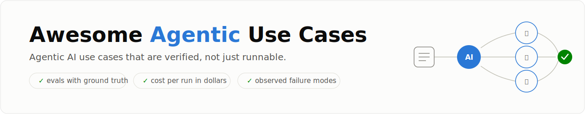
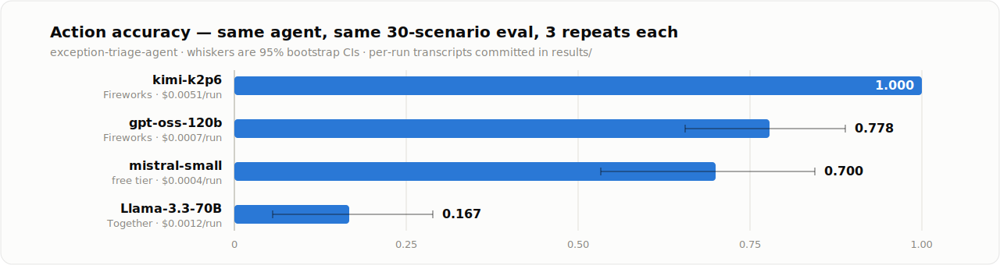

<picture>
  <source media="(prefers-color-scheme: dark)" srcset="docs/assets/banner-dark.svg">
  
</picture>

<p align="center">
  <a href="https://github.com/immu4989/awesome-agentic-usecases/actions/workflows/ci.yml"></a>
  
  
  
</p>

<p align="center">
  <a href="#four-models-one-agent">Results</a> ·
  <a href="#use-cases">Use cases</a> ·
  <a href="#industries">Industries</a> ·
  <a href="#what-verified-means-here">The verification bar</a> ·
  <a href="#quick-start">Quickstart</a> ·
  <a href="CONTRIBUTING.md">Contribute</a>
</p>

Most agent demos prove an agent *can run once*. Almost none prove it *works*: how often
it gets the right answer, what a run costs in dollars, and where it breaks. Every use
case here ships with the harness that proves it — an eval set with programmatic ground
truth, cost measured from token usage, results across repeated runs (agents are
stochastic; n=1 proves nothing), and failure modes that were **observed, not
hypothesized**. All of it runs end-to-end on synthetic data with one command, and the
model backends include free tiers, so reproducing any result costs nothing.

<picture>
  <source media="(prefers-color-scheme: dark)" srcset="docs/assets/stats-dark.svg">
  
</picture>

## Four models, one agent

The flagship comparison, from the [logistics exemplar](logistics-supply-chain/exception-triage-agent/):
same agent, same 30 scenarios, 3 repeats per model — reproducible on free tiers.

<picture>
  <source media="(prefers-color-scheme: dark)" srcset="docs/assets/results-dark.svg">
  
</picture>

The ranking is the least interesting part. **The four models fail in four different
ways**, and only the failure breakdown tells you what you'd actually be deploying:

- 🥇 `kimi-k2p6` solved it — 90/90 — and the transcripts show *how*: it searched the
  policy KB twice per ticket, the exact retrieval step every other model fumbled. It
  buys that reliability at 13× the cost and 3× the latency of `gpt-oss-120b`.
- 🕳️ `gpt-oss-120b` investigates everything, then occasionally **never commits a
  decision** — all the evidence, no output, 6 runs out of 90.
- 📜 `mistral-small` investigates correctly, then misjudges policy — in one scenario it
  **cites the $2,000 escalation policy in its own reasoning, then violates it**, three
  repeats out of three.
- 🧩 `Llama-3.3-70B` fails on mechanics: 66/90 submissions were **missing the required
  `action` field**, and 17/90 skipped investigation entirely.

Every failure has a reproducing scenario id in
[FAILURE_MODES.md](logistics-supply-chain/exception-triage-agent/FAILURE_MODES.md).

## Use cases

| Use case | Industry | Capability | The question it answers |
|---|---|---|---|
| [🎫 exception-triage-agent](logistics-supply-chain/exception-triage-agent/) | Logistics | `investigate` `decide` | Which resolution queue should each stuck-shipment ticket go to, which can resolve themselves, and which need a human? |
| [🧑‍🍳 shift-coverage-triage-agent](retail-workforce/shift-coverage-triage-agent/) | Retail & Workforce | `investigate` `decide` | When crew call out, what's the compliant fill — overtime, borrow, run short, or escalate — under labor-law caps the ticket never mentions? |
| [🚨 alert-triage-agent](security-operations/alert-triage-agent/) | Security Ops | `investigate` `decide` | Which queue does each security alert belong in, which can safely auto-close, and which need incident response now? |
| [🚩 fraud-alert-triage-agent](financial-services-fraud/fraud-alert-triage-agent/) | Financial Services | `investigate` `decide` | Which fraud queue does each transaction alert belong in, which release, which block, and which need the fraud team now? |
| [🎞️ release-qc-triage-agent](media-streaming/release-qc-triage-agent/) | Media & Streaming | `investigate` `decide` | When QC flags an asset before premiere, who owns the defect and what happens to the release — waive, redeliver, fix in house, delay, or escalate? |
| [💸 refund-resolution-agent](customer-support/refund-resolution-agent/) | Customer Support | `plan` `act` `human-in-loop` | **The agent that acts.** Can it resolve a refund end to end — verifying identity first, avoiding payouts it cannot claw back, and handing off when policy says it must? |
| [🔧 refund-guarded](customer-support/refund-guarded/) | Customer Support | `intervention A/B` | **Does our own advice work?** Tool-layer enforcement gained 49 points for free. The prompt nudge doubled the failure it was written to fix. |
| [👥 refund-crew](customer-support/refund-crew/) | Customer Support | `multi-agent` | **Does orchestration help?** Three agents on the exact task one agent already solved, same scenarios, same gold. The controlled comparison almost nobody publishes. |
| [📟 oncall-watch-agent](it-operations/oncall-watch-agent/) | IT Ops & DevOps | `watch` `decide` | **The agent that waits.** Telemetry arrives a minute at a time and it cannot see ahead. Can it tell a real regression from a blip that heals itself, without crying wolf or sleeping through the outage? |

Every use case is tagged by what the agent *does*: `predict` · `decide` · `plan` ·
`act` · `watch` · `investigate`, plus architecture (`single-agent` / `multi-agent` /
`human-in-loop`).

Each use case is verified across multiple models on free API tiers. Seven findings that
only a per-use-case harness surfaces:

- **There is no best model.** Every model tested wins on one use case and loses on
  another — gpt-oss-120b leads security triage and trails on retail scheduling and fraud;
  mistral-small is the *best router* on fraud and the worst at deciding what to do next.
- **Not every task is solvable.** The logistics exemplar has a perfect 90/90 model; the
  best model on retail scheduling tops out at 0.82.
- **Agents err in one direction — but the direction is a model property, not a law.** On
  fraud, three of four models over-call fraud on benign transactions and never the
  reverse; `Qwen3.7-Plus` breaks the pattern with zero such errors. The bias an accuracy
  score implies away is real, common, and fixable by model choice.
- **How you word a rule changes whether it is obeyed.** In media, *every* model honoured
  the caption rule — zero violations — while missing the ordinary thresholds beside it in
  the same knowledge base. The obeyed rule was the one written as a legal obligation
  rather than a number.
- **Agents obey ordering rules and ignore prohibitions.** Once an agent can *act*, this
  splits sharply: across 270 runs of the refund agent, no model ever moved money before
  verifying identity — while one model issued a forbidden refund in 15 of 15 runs in
  *every* archetype where refunding was banned. Put prohibitions in the tool layer, not
  the prompt.
- **A safety metric can be passed by not looking.** On the watch agent, two models scored
  a perfect 1.000 on "never paged a quiet window" — by quitting after ~4 of the 20
  minutes of telemetry and missing a third of real incidents. Restraint and absence are
  indistinguishable unless you also measure whether the agent looked.
- **Multi-agent amplifies whatever the model already does.** The same crew, on the same
  task, moved one model up 8 points and another down 60 — and never beat the best single
  agent. Orchestration is a corrective for a weak model and a tax on a strong one, and
  which you get is only knowable from a single-agent baseline.
- **Fix the environment, not the instructions.** We tested our own advice. Enforcing
  prohibitions in the tool layer gained **+0.489** at no measurable cost; a prompt
  paragraph telling the model to finish **doubled** the stalls it was written to fix. And
  the guarded free-tier model beat both a larger model and the three-agent crew.

## Industries

| Shipping now | Next waves |
|---|---|
| 🚛 [Logistics](logistics-supply-chain/) · 🛒 [Retail & Workforce](retail-workforce/) · 🛡️ [Security Ops](security-operations/) · 💳 [Financial Services](financial-services-fraud/) · 🎬 [Media & Streaming](media-streaming/) · 🎧 [Customer Support](customer-support/) · 🖥️ [IT Ops & DevOps](it-operations/) | 🏥 Healthcare · ⚖️ Legal & Compliance · 🏭 Manufacturing |

<details>
<summary><b>Full 16-industry roadmap</b></summary>
<br>

| # | Industry | Status |
|---|---|---|
| 1 | 🚛 Logistics & Supply Chain | ✅ Shipping |
| 2 | 🛒 Retail & Workforce | ✅ Shipping |
| 3 | 🛡️ Security Operations | ✅ Shipping |
| 4 | 💳 Financial Services & Fraud | ✅ Shipping |
| 5 | 🎬 Media & Streaming | ✅ Shipping |
| 6 | 🎧 Customer Support & Success | ✅ Shipping |
| 7 | 🖥️ IT Ops & DevOps | ✅ Shipping |
| 8 | 🏥 Healthcare & Life Sciences | 📋 Roadmap |
| 9 | ⚖️ Legal & Compliance | 📋 Roadmap |
| 10 | 🏭 Manufacturing & Industrial | 📋 Roadmap |
| 11 | 🧾 Insurance | 📋 Roadmap |
| 12 | 👥 HR & Recruiting | 📋 Roadmap |
| 13 | 📈 Sales & Marketing | 📋 Roadmap |

| 14 | ⚡ Energy & Utilities | 📋 Roadmap |
| 15 | 🏗️ Real Estate & Construction | 📋 Roadmap |
| 16 | 🎓 Education | 📋 Roadmap |

</details>

## What "verified" means here

Five rules, no exceptions — the full reasoning lives in [VERIFICATION.md](VERIFICATION.md):

|  | Rule |
|---|---|
| 1️⃣ | **Runs from a clean clone with one command** — no API key needed for the mock backend |
| 2️⃣ | **≥20 scenarios with programmatic ground truth**, committed and reproducible by seed |
| 3️⃣ | **Cost per run in dollars**, computed from actual token usage, never estimated |
| 4️⃣ | **n≥3 repeated runs with bootstrap CIs** — single-run agent numbers are noise |
| 5️⃣ | **≥3 observed failure modes**, each with a reproducing input |

## Quick start

```bash
git clone https://github.com/immu4989/awesome-agentic-usecases
cd awesome-agentic-usecases
pip install -e harness -e logistics-supply-chain/exception-triage-agent

# Full eval on the built-in deterministic mock model — no API key, no cost
exception-triage-agent eval --backend mock

# Real-model eval on a free tier — $0 actual spend
export MISTRAL_API_KEY=...
exception-triage-agent eval --backend mistral --repeats 3
```

One OpenAI-compatible backend covers **Mistral · Groq · Gemini · Cerebras (GLM) ·
DeepSeek · Together · Fireworks**, plus a native `anthropic` backend — so every use
case can be verified on free tiers before anyone spends a dollar, and adding a new
model to the comparison is one flag.

## Contributing

New use cases are welcome if they clear the [verification bar](VERIFICATION.md) —
see [CONTRIBUTING.md](CONTRIBUTING.md). Link-list additions aren't a fit; this isn't
a link list.

If this repo saved you an eval harness, a ⭐ helps others find it.

---

<p align="center">Apache-2.0 · built by <a href="https://github.com/immu4989">@immu4989</a> · classic-ML companions: <a href="https://github.com/immu4989/Logistics_UseCases">Logistics_UseCases</a> · <a href="https://github.com/immu4989/retail-workforce-analytics">retail-workforce-analytics</a></p>
