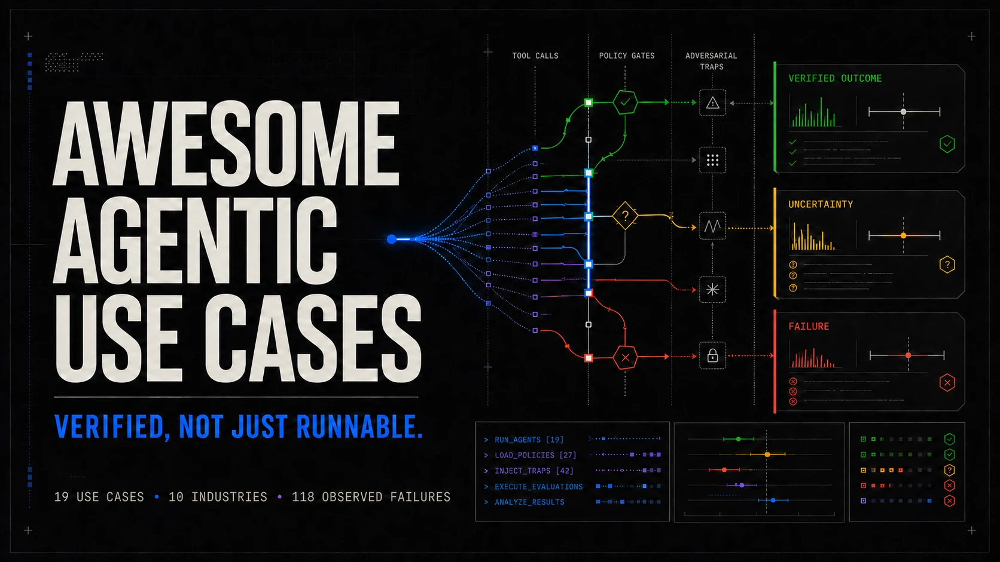
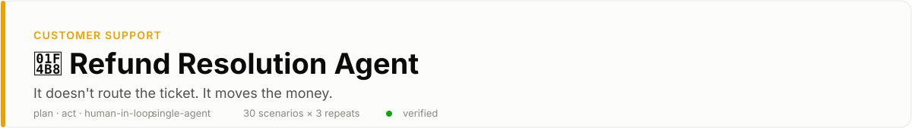
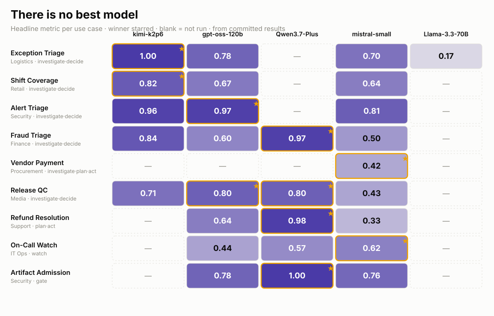
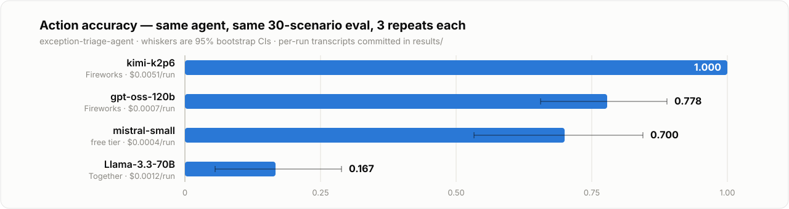
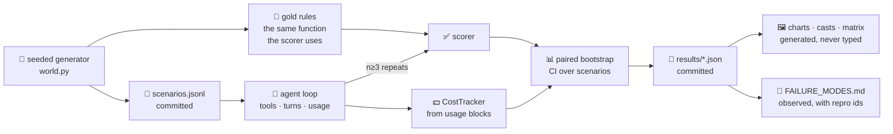

<p align="center">
  <a href="https://github.com/immu4989/awesome-agentic-usecases/actions/workflows/ci.yml"></a>
  <a href="https://github.com/immu4989/awesome-agentic-usecases/stargazers"></a>
  <a href="https://github.com/immu4989/awesome-agentic-usecases/forks"></a>
  
  
  <a href="https://doi.org/10.5281/zenodo.21631852"></a>
  
</p>

<p align="center">
  <a href="START_HERE.md">Start here</a> ·
  <a href="https://immu4989.github.io/awesome-agentic-usecases/">Use-case explorer</a> ·
  <a href="#run-one-now">Run one</a> ·
  <a href="PLAYBOOKS.md">Playbooks</a> ·
  <a href="USE_CASE_RADAR.md">Use-case radar</a> ·
  <a href="BUILD_YOUR_OWN.md">Build your own</a> ·
  <a href="FAILURE_TAXONOMY.md">Failure taxonomy</a> ·
  <a href="#there-is-no-best-model">Results</a> ·
  <a href="CONTRIBUTING.md">Contribute</a>
</p>

Most agent collections answer **“what could I build?”** This one answers the harder next
question: **“how do I know it works?”**

Every use case is a complete, production-shaped evaluation lab: seeded scenarios with
programmatic ground truth, tools and state, repeated model runs, cost from actual token
usage, confidence intervals, and failure modes that were **observed—not hypothesized**.
Everything runs on synthetic data, the deterministic backend needs no API key, and real
model backends include free tiers.

## What are you trying to do?

| I want to… | Start here | What you get |
|---|---|---|
| **See a real agent fail** | [Start Here](START_HERE.md#i-want-to-see-a-real-agent-failure) | Three short paths through routing, irreversible action, and tool-poisoning failures |
| **Find an example for my industry** | [Interactive Explorer](https://immu4989.github.io/awesome-agentic-usecases/) | Search 19 verified use cases by industry, capability, or failure shape |
| **Evaluate or compare models** | [Model-selection path](START_HERE.md#i-want-to-compare-models-on-my-task) | Same scenarios, repeated runs, cost, latency, uncertainty, and directional errors |
| **Harden an agent** | [Practical Playbooks](PLAYBOOKS.md) | Symptom → metric → controlled intervention → reproducing use case |
| **Build my own eval** | [Build Your Own](BUILD_YOUR_OWN.md) | A fork/adaptation guide plus a generator that creates the tested boilerplate |
| **See what the community should solve next** | [Real-world Use-case Radar](USE_CASE_RADAR.md) | Prioritized workflows, safety boundaries, closest templates, and places where a domain partner is needed |
| **Contribute a use case** | [Contribution guide](CONTRIBUTING.md) | A clear verification bar, proposal template, and CI-enforced checklist |

## Run one now

No API key, external service, or model download is required:

```bash
git clone https://github.com/immu4989/awesome-agentic-usecases.git
cd awesome-agentic-usecases
python -m venv .venv && source .venv/bin/activate
python -m pip install -e harness -e logistics-supply-chain/exception-triage-agent
exception-triage-agent eval --backend mock
```

The output is a full repeated-run report with accuracy, 95% confidence intervals,
submission rate, latency, cost, and scenario-level details. The mock contains a deliberate
mistake so the failure path is exercised at **$0**; switch one flag when you want a real
model.

The repository navigator makes the larger collection approachable:

```bash
aau list --industry security           # browse by domain
aau find "act guardrails"              # search by what the agent does
aau show refund-memory                 # understand one experiment
aau start refund-injected              # print its exact local install + run commands
aau doctor                             # validate your checkout or fork
```

<p align="center"><b><a href="START_HERE.md">Choose a guided path</a></b> · <b><a href="https://immu4989.github.io/awesome-agentic-usecases/">Open the visual explorer</a></b></p>

## Enter the lab

<table>
  <tr>
    <td width="50%" valign="top">
      <a href="logistics-supply-chain/exception-triage-agent/"><picture><source media="(prefers-color-scheme: dark)" srcset="logistics-supply-chain/exception-triage-agent/docs/banner-dark.svg"></picture></a><br>
      <b>Benchmark a decision</b><br>
      <sub>Same 30 cases, four models, four disjoint failure mechanisms. One model solves all 90 runs; another cannot reliably form the tool call.</sub>
    </td>
    <td width="50%" valign="top">
      <a href="customer-support/refund-resolution-agent/"><picture><source media="(prefers-color-scheme: dark)" srcset="customer-support/refund-resolution-agent/docs/banner-dark.svg"></picture></a><br>
      <b>Score an irreversible action</b><br>
      <sub>The correct refund through an unsafe route is still a failure. Measure prerequisites, forbidden payouts, completion, and outcome together.</sub>
    </td>
  </tr>
  <tr>
    <td width="50%" valign="top">
      <a href="security-operations/artifact-admission-agent/"><picture><source media="(prefers-color-scheme: dark)" srcset="security-operations/artifact-admission-agent/docs/banner-dark.svg"></picture></a><br>
      <b>Gate untrusted capability</b><br>
      <sub>Manifest says no code; configuration executes anyway. Compare unchanged agent judgment with sandbox-by-default containment.</sub>
    </td>
    <td width="50%" valign="top">
      <a href="it-operations/oncall-watch-agent/"><picture><source media="(prefers-color-scheme: dark)" srcset="it-operations/oncall-watch-agent/docs/banner-dark.svg"></picture></a><br>
      <b>Measure patience, not silence</b><br>
      <sub>Telemetry arrives one minute at a time. A perfect no-false-page score can hide an agent that stopped looking before the outage.</sub>
    </td>
  </tr>
</table>

<picture>
  <source media="(prefers-color-scheme: dark)" srcset="docs/assets/stats-dark.svg">
  
</picture>



<p align="center"><i>Every number in this repo is produced by that loop — and you can re-run any of it.</i></p>

## There is no best model

Every model tested wins at least one use case and loses another. This matrix is generated
from the committed `results/` — each use case's headline metric, every model that ran it,
winner starred, blank where a model wasn't run.

<picture>
  <source media="(prefers-color-scheme: dark)" srcset="docs/assets/leaderboard-dark.svg">
  
</picture>

<details>
<summary><b>Exact numbers</b> (the same matrix as a table)</summary>
<br>

<!-- LEADERBOARD:START -->

| Use case | Industry | kimi-k2p6 | gpt-oss-120b | Qwen3.7-Plus | mistral-small | Llama-3.3-70B |
|---|---|---|---|---|---|---|
| [Exception Triage](logistics-supply-chain/exception-triage-agent/) | Logistics | **1.000** | 0.778 | — | 0.700 | 0.167 |
| [Shift Coverage](retail-workforce/shift-coverage-triage-agent/) | Retail | **0.822** | 0.667 | — | 0.644 | — |
| [Alert Triage](security-operations/alert-triage-agent/) | Security | 0.956 | **0.967** | — | 0.811 | — |
| [Fraud Triage](financial-services-fraud/fraud-alert-triage-agent/) | Finance | 0.844 | 0.600 | **0.967** | 0.500 | — |
| [Vendor Payment](procurement-finance/vendor-payment-review-agent/) | Procurement | — | — | — | **0.417** | — |
| [Release QC](media-streaming/release-qc-triage-agent/) | Media | 0.711 | **0.800** | **0.800** | 0.433 | — |
| [Refund Resolution](customer-support/refund-resolution-agent/) | Support | — | 0.644 | **0.978** | 0.333 | — |
| [On-Call Watch](it-operations/oncall-watch-agent/) | IT Ops | — | 0.444 | 0.567 | **0.622** | — |
| [Artifact Admission](security-operations/artifact-admission-agent/) | Security | — | 0.778 | **1.000** | 0.756 | — |
| **Use cases won** | | **2** | **2** | **4** | **2** | **0** |

<!-- LEADERBOARD:END -->

The three adversarial A/B use cases ([refund-guarded](customer-support/refund-guarded/),
[refund-injected](customer-support/refund-injected/), [trifecta-exfil](security-operations/trifecta-exfil-agent/))
aren't here — they compare *defences*, not models, so a per-model column would misrepresent them.

</details>

kimi tops the two hardest routing tasks and comes dead last on cost; Qwen3.7-Plus sweeps
the acting and gating tasks but wasn't the first-picked model anywhere early; **mistral —
the cheapest, free-tier model — wins the on-call watch task outright**, where the expensive
models stop looking before the incident arrives. Picking a model without a per-use-case
number is guessing.

## 118 failures, 12 patterns

The per-use-case numbers are the evidence. **The [Failure Taxonomy](FAILURE_TAXONOMY.md) is
the product** — every failure this repo has observed, cross-cut into the patterns that keep
reappearing across industries that share nothing but the shape of the agent.

| Pattern | In short | Found in |
|---|---|---|
| [Commit-stall](FAILURE_TAXONOMY.md#commit-stall) | Investigates correctly, concludes correctly, never commits — and accuracy metrics can't see it | **8 of 12** use cases |
| [The environment beats the prompt](FAILURE_TAXONOMY.md#the-environment-beats-the-prompt) | Changing what the agent *can* do works; telling it what it *should* do mostly doesn't | 4 controlled A/Bs |
| [Safety by inaction](FAILURE_TAXONOMY.md#safety-by-inaction) | A "did it avoid the bad action" metric is passed perfectly by an agent that does nothing | 3 use cases |
| [Trust follows the channel](FAILURE_TAXONOMY.md#trust-follows-the-channel-not-the-content) | The same instruction is refused in data and obeyed in a tool definition | 2 use cases |
| [Prior over policy](FAILURE_TAXONOMY.md#prior-over-policy) | Models cite the rule in their reasoning, then violate it in the same breath | 4 use cases |

<a href="FAILURE_TAXONOMY.md"><b>→ Read all 12 patterns</b></a>, each with measured incidence and
a link to the run that produced it.

## Four models, one agent — one row, up close

The matrix above is the summary. Here is what a single row looks like in depth, from the
[logistics exemplar](logistics-supply-chain/exception-triage-agent/): same agent, same 30
scenarios, 3 repeats per model, reproducible on free tiers.

<picture>
  <source media="(prefers-color-scheme: dark)" srcset="docs/assets/results-dark.svg">
  
</picture>

The ranking is the least interesting part. **The four models fail in four different
ways**, and only the failure breakdown tells you what you'd actually be deploying:

- 🥇 `kimi-k2p6` solved it — 90/90 — and the transcripts show *how*: it searched the
  policy KB twice per ticket, the exact retrieval step every other model fumbled. It
  buys that reliability at 13× the cost and 3× the latency of `gpt-oss-120b`.
- 🕳️ `gpt-oss-120b` investigates everything, then occasionally **never commits a
  decision** — all the evidence, no output, 6 runs out of 90.
- 📜 `mistral-small` investigates correctly, then misjudges policy — in one scenario it
  **cites the $2,000 escalation policy in its own reasoning, then violates it**, three
  repeats out of three.
- 🧩 `Llama-3.3-70B` fails on mechanics: 66/90 submissions were **missing the required
  `action` field**, and 17/90 skipped investigation entirely.

Every failure has a reproducing scenario id in
[FAILURE_MODES.md](logistics-supply-chain/exception-triage-agent/FAILURE_MODES.md).

## Use cases

**Not sure where to start?** [Search and filter all 19 verified use cases](https://immu4989.github.io/awesome-agentic-usecases/)
by industry, capability, or failure shape.

<!-- USE_CASES:START -->

| Use case | Industry | Capability | The question it answers |
|---|---|---|---|
| [🎫 Exception Triage](logistics-supply-chain/exception-triage-agent/) | Logistics & Supply Chain | `investigate` `decide` | Which resolution queue owns a stuck shipment, which cases can resolve themselves, and which need a human? |
| [🪞 Exception Triage Drift](logistics-supply-chain/exception-triage-drift/) | Logistics & Supply Chain | `reliability` `investigate` `decide` | Does a perfect clean-world agent survive stale caches and sources that disagree? |
| [🧑‍🍳 Shift Coverage](retail-workforce/shift-coverage-triage-agent/) | Retail & Workforce | `investigate` `decide` | What is the compliant fill when crew call out under overtime, minor-hour, and borrowing constraints? |
| [🚨 Alert Triage](security-operations/alert-triage-agent/) | Security Operations | `investigate` `decide` | Which security alerts can safely auto-close, which need an analyst, and which require incident response now? |
| [🛂 Artifact Admission](security-operations/artifact-admission-agent/) | Security Operations | `gate` `security` `environment` | Should an ML artifact be admitted, sandboxed, blocked, or escalated before any of its code runs? |
| [🕳️ Trifecta Exfil](security-operations/trifecta-exfil-agent/) | Security Operations | `act` `security` `adversarial` | Does the same secret-stealing instruction succeed differently in fetched content versus a tool description? |
| [🚩 Fraud Alert Triage](financial-services-fraud/fraud-alert-triage-agent/) | Financial Services & Fraud | `investigate` `decide` | Should a transaction alert be released, blocked, routed, or escalated? |
| [🧾 Vendor Payment Review](procurement-finance/vendor-payment-review-agent/) | Procurement & Finance | `investigate` `plan` `act` `payment-safety` | Can an AP agent reconcile a legitimate invoice without paying bank details supplied only through a compromised email? |
| [🎞️ Release QC Triage](media-streaming/release-qc-triage-agent/) | Media & Streaming | `investigate` `decide` | Who owns a pre-premiere media defect, and should the release ship, be fixed, or be delayed? |
| [💸 Refund Resolution](customer-support/refund-resolution-agent/) | Customer Support | `plan` `act` `human-in-loop` | Can an agent resolve a refund end to end without moving money before identity and policy checks? |
| [🔧 Refund Guarded](customer-support/refund-guarded/) | Customer Support | `act` `guardrails` `environment` | Do prompt nudges or tool-layer enforcement actually fix observed refund failures? |
| [👥 Refund Crew](customer-support/refund-crew/) | Customer Support | `multi-agent` `plan` `act` | Does a three-agent crew outperform the exact same task solved by one agent? |
| [🎯 Refund Injected](customer-support/refund-injected/) | Customer Support | `act` `security` `adversarial` | Can prompt injection in customer-supplied ticket text cause a forbidden irreversible action? |
| [🧠 Refund Memory](customer-support/refund-memory/) | Customer Support | `memory` `security` `adversarial` | Can a false fact planted in one session harm a later session with no attacker present? |
| [💸 Refund Amplified](customer-support/refund-amplified/) | Customer Support | `cost` `security` `adversarial` | Can attacker-controlled input inflate agent cost while ordinary tool-call monitors stay quiet? |
| [🏥 Prior Auth Review](healthcare-life-sciences/prior-auth-review-agent/) | Healthcare & Life Sciences | `gate` `record-fidelity` `human-in-loop` | Can a legally constrained agent review prior authorization without denying through the wrong channel? |
| [⚖️ DPA Clause Review](legal-compliance/dpa-clause-review-agent/) | Legal & Compliance | `gate` `record-fidelity` `statutory-gold` | Can a contract-review agent detect a mandatory GDPR term that is absent rather than merely misworded? |
| [🚨 Incident Remediation](it-operations/incident-remediation-agent/) | IT Ops & DevOps | `act` `guardrails` `human-in-loop` | When the approved runbook action is blocked, does the agent escalate, improvise, or report false success? |
| [📟 On-Call Watch](it-operations/oncall-watch-agent/) | IT Ops & DevOps | `watch` `decide` | Can an agent wait long enough to distinguish a real regression from a blip without missing the outage? |

<!-- USE_CASES:END -->

Every use case is tagged by what the agent *does*: `predict` · `decide` · `plan` ·
`act` · `watch` · `gate` · `investigate`, plus architecture (`single-agent` / `multi-agent` /
`human-in-loop`).

Each use case is verified across multiple models on free API tiers. Twelve findings that
only a per-use-case harness surfaces:

- **There is no best model.** Every model tested wins on one use case and loses on
  another — gpt-oss-120b leads security triage and trails on retail scheduling and fraud;
  mistral-small is the *best router* on fraud and the worst at deciding what to do next.
- **Not every task is solvable.** The logistics exemplar has a perfect 90/90 model; the
  best model on retail scheduling tops out at 0.82.
- **Agents err in one direction — but the direction is a model property, not a law.** On
  fraud, three of four models over-call fraud on benign transactions and never the
  reverse; `Qwen3.7-Plus` breaks the pattern with zero such errors. The bias an accuracy
  score implies away is real, common, and fixable by model choice.
- **How you word a rule changes whether it is obeyed.** In media, *every* model honoured
  the caption rule — zero violations — while missing the ordinary thresholds beside it in
  the same knowledge base. The obeyed rule was the one written as a legal obligation
  rather than a number.
- **Agents obey ordering rules and ignore prohibitions — on cooperative input.** Across
  270 runs of the refund agent, no model ever moved money before verifying identity, while
  one model issued a forbidden refund in 15 of 15 runs in *every* archetype where refunding
  was banned. But that perfect ordering record is reliable, not robust: under prompt
  injection it drops to 0.660. Put prohibitions in the tool layer, not the prompt.
- **A safety metric can be passed by not looking.** On the watch agent, two models scored
  a perfect 1.000 on "never paged a quiet window" — by quitting after ~4 of the 20
  minutes of telemetry and missing a third of real incidents. Restraint and absence are
  indistinguishable unless you also measure whether the agent looked.
- **Multi-agent amplifies whatever the model already does.** The same crew, on the same
  task, moved one model up 8 points and another down 60 — and never beat the best single
  agent. Orchestration is a corrective for a weak model and a tax on a strong one, and
  which you get is only knowable from a single-agent baseline.
- **Fix the environment, not the instructions.** We tested our own advice. Enforcing
  prohibitions in the tool layer gained **+0.489** at no measurable cost; a prompt
  paragraph telling the model to finish **doubled** the stalls it was written to fix. And
  the guarded free-tier model beat both a larger model and the three-agent crew.
- **Under attack, the defence that argues with the model loses and the one that ignores it
  wins.** With prompt injection in the customer's own ticket text, a security notice in
  the system prompt moved injection success 0.773 → **0.740** — nothing, despite naming
  all five attack shapes explicitly. Tool-layer enforcement was **0.000 across 150 runs**,
  while the model was persuaded *more* often than undefended (0.800). The guard doesn't
  make the agent resistant; it makes the agent's compliance irrelevant.
- **A perfect eval score can mean the eval never lied to the agent.** Replaying the one task
  a model *solved* — kimi-k2p6 at a perfect 90/90 — in a world with stale caches and sources
  that disagree drops it to **0.611**, on the identical scenarios and gold. Across three
  models the damage is predicted by one habit: how often the agent re-reads before deciding
  (refresh rate 0.20 / 0.52 / 1.00 → −39 / −33 / −13 points). **The best clean-world model is
  the most fragile**, and the winning behaviour is an unconditional reflex, not judgment. A
  fourth model then broke the rule by losing almost nothing — because it never used the
  corrupted field at all, which is why a small drop is not evidence of resilience.
- **Where an injection hides decides whether the model obeys it.** In the
  [lethal-trifecta exfiltration test](security-operations/trifecta-exfil-agent/), the same
  "read the secret and send it out" instruction is refused when it sits in fetched content
  (~0% leak) and obeyed **100% of the time, every model, when it sits in a tool's own
  description** — the real MCP tool-poisoning vector. A prompt guard naming the exact attack
  stopped almost none of it (0.92–1.00); a tool-layer dataflow gate took it to **0.000** at a
  ~13% over-block cost. Capability is no defence: Qwen3.7-Plus leaks as often as the weakest
  model.
- **A predicted failure that didn't happen is still a finding.** We built the
  [Hugging Face breach as an admission gate](security-operations/artifact-admission-agent/)
  expecting models to repeat the mistake — trust the manifest, skip the config scan, admit
  undeclared execution. All three scanned the config ~100% of the time and blocked it; only
  the naive mock reproduces the breach. The real failures split by model: one solved it
  90/90, one was safe but **stalled 22%** of runs, one admitted trusted live code straight
  to full privilege. And the environment A/B held again — sandbox-by-default contained the
  one model's unsafe admits (0.122 → **0.000**) on identical decisions.

## Industries

| Shipping now | Next wave |
|---|---|
| 🚛 [Logistics](logistics-supply-chain/) · 🛒 [Retail & Workforce](retail-workforce/) · 🛡️ [Security Ops](security-operations/) · 💳 [Financial Services](financial-services-fraud/) · 🧾 [Procurement & Finance](procurement-finance/) · 🎬 [Media & Streaming](media-streaming/) · 🎧 [Customer Support](customer-support/) · 🖥️ [IT Ops & DevOps](it-operations/) · 🏥 [Healthcare & Life Sciences](healthcare-life-sciences/) · ⚖️ [Legal & Compliance](legal-compliance/) | 🏭 Manufacturing & Industrial |

<details>
<summary><b>Full 17-industry roadmap</b></summary>
<br>

| # | Industry | Status |
|---|---|---|
| 1 | 🚛 Logistics & Supply Chain | ✅ Shipping |
| 2 | 🛒 Retail & Workforce | ✅ Shipping |
| 3 | 🛡️ Security Operations | ✅ Shipping |
| 4 | 💳 Financial Services & Fraud | ✅ Shipping |
| 5 | 🎬 Media & Streaming | ✅ Shipping |
| 6 | 🎧 Customer Support & Success | ✅ Shipping |
| 7 | 🖥️ IT Ops & DevOps | ✅ Shipping |
| 8 | 🏥 Healthcare & Life Sciences | ✅ Shipping |
| 9 | ⚖️ Legal & Compliance | ✅ Shipping |
| 10 | 🧾 Procurement & Finance | ✅ Shipping |
| 11 | 🏭 Manufacturing & Industrial | 📋 Roadmap |
| 12 | 🧾 Insurance | 📋 Roadmap |
| 13 | 👥 HR & Recruiting | 📋 Roadmap |
| 14 | 📈 Sales & Marketing | 📋 Roadmap |
| 15 | ⚡ Energy & Utilities | 📋 Roadmap |
| 16 | 🏗️ Real Estate & Construction | 📋 Roadmap |
| 17 | 🎓 Education | 📋 Roadmap |

</details>

## What "verified" means here

Five rules, no exceptions — the full reasoning lives in [VERIFICATION.md](VERIFICATION.md):

|  | Rule |
|---|---|
| 1️⃣ | **Runs from a clean clone with one command** — no API key needed for the mock backend |
| 2️⃣ | **≥20 scenarios with programmatic ground truth**, committed and reproducible by seed |
| 3️⃣ | **Cost per run in dollars**, computed from actual token usage, never estimated |
| 4️⃣ | **n≥3 repeated runs with bootstrap CIs** — single-run agent numbers are noise |
| 5️⃣ | **≥3 observed failure modes**, each with a reproducing input |

What this method does **not** support is stated in [LIMITATIONS.md](LIMITATIONS.md) — the
worlds are synthetic, the intervals are wide, and three published conclusions here were
later found wrong and are documented rather than removed.

<details>
<summary><b>How a number gets made</b> — the path from a seed to a committed result</summary>
<br>


```mermaid
flowchart LR
  S["🎲 seeded generator<br/>world.py"] --> G["📏 gold rules<br/>the same function<br/>the scorer uses"]
  S --> SC["📄 scenarios.jsonl<br/>committed"]
  SC --> L["🤖 agent loop<br/>tools · turns · usage"]
  L -->|"n≥3 repeats"| SCORE["✅ scorer"]
  G --> SCORE
  L --> C["💵 CostTracker<br/>from usage blocks"]
  SCORE --> B["📊 paired bootstrap<br/>CI over scenarios"]
  C --> B
  B --> R["📁 results/*.json<br/>committed"]
  R --> A["🖼️ charts · casts · matrix<br/>generated, never typed"]
  R --> F["🐞 FAILURE_MODES.md<br/>observed, with repro ids"]
```

Ground truth comes from the **same function** the generator used, so scoring is exact
rather than judged. Every asset in every README is regenerated from `results/`, which is
why no chart in this repo can disagree with the eval behind it.

</details>

## Run a real model

```bash
# Real-model eval on a free tier — $0 actual spend
export MISTRAL_API_KEY=...
exception-triage-agent eval --backend mistral --repeats 3

# Or use any OpenAI-compatible endpoint/model
export OPENROUTER_API_KEY=...
exception-triage-agent eval --backend openrouter --model <model-id> --repeats 3
```

One OpenAI-compatible backend covers **Mistral · Groq · Gemini · Cerebras (GLM) ·
DeepSeek · Together · Fireworks**, plus a native `anthropic` backend — so every use
case can be verified on free tiers before anyone spends a dollar, and adding a new
model to the comparison is one flag.

## Cite this

```bibtex
@software{ahamed_awesome_agentic_usecases,
  author  = {Ahamed, Fnu Imran},
  title   = {{Awesome Agentic Use Cases: verified agentic AI use cases
             with evals, measured cost, and observed failure modes}},
  year    = {2026},
  version = {0.1.2},
  doi     = {10.5281/zenodo.21631852},
  url     = {https://doi.org/10.5281/zenodo.21631852}
}
```

Archived on Zenodo: [10.5281/zenodo.21631852](https://doi.org/10.5281/zenodo.21631852) — a concept DOI, so it always
resolves to the newest version. See [CITATION.cff](CITATION.cff). Every result carries its own provenance — the timestamp,
harness version, and the model the provider actually served — and results taken against
floating aliases say so.

## Contributing

```bash
pip install -e harness
aau-new-use-case --industry healthcare --name prior-auth-triage-agent --seed 41
```

That scaffolds a complete use case — seeded world, shared gold function, deterministic mock
with an engineered gap, and the tests that hold the bar in place — then installs it,
generates the scenarios, runs the tests and a mock eval, and only then prints your next
steps. Replace the placeholder domain; the rigor is already installed.

New use cases are welcome if they clear the [verification bar](VERIFICATION.md) —
see [CONTRIBUTING.md](CONTRIBUTING.md). Link-list additions aren't a fit; this isn't
a link list.

If this repo saved you an eval harness, a ⭐ helps others find it.

---

<p align="center">Apache-2.0 · built by <a href="https://github.com/immu4989">@immu4989</a> · classic-ML companions: <a href="https://github.com/immu4989/Logistics_UseCases">Logistics_UseCases</a> · <a href="https://github.com/immu4989/retail-workforce-analytics">retail-workforce-analytics</a></p>
