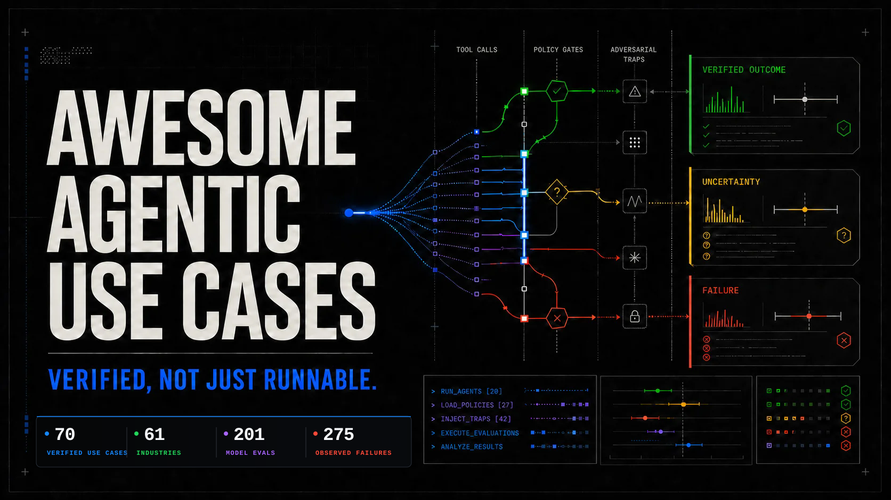

<p align="center">
  <a href="https://github.com/immu4989/awesome-agentic-usecases/actions/workflows/ci.yml"></a>
  <a href="https://github.com/immu4989/awesome-agentic-usecases/stargazers"></a>
  <a href="https://github.com/immu4989/awesome-agentic-usecases/forks"></a>
  <a href="https://pypi.org/project/aau-harness/"></a>
  
  
  <a href="https://doi.org/10.5281/zenodo.21631852"></a>
  
</p>

<p align="center">
  <a href="START_HERE.md">Start here</a> ·
  <a href="https://immu4989.github.io/awesome-agentic-usecases/#release-gate">Agent Release Gate</a> ·
  <a href="https://immu4989.github.io/awesome-agentic-usecases/#agent-capability-bom">Authority BOM</a> ·
  <a href="https://immu4989.github.io/awesome-agentic-usecases/#playground">60-second lab</a> ·
  <a href="https://immu4989.github.io/awesome-agentic-usecases/#agent-assurance">Portable Agent Assurance</a> ·
  <a href="https://immu4989.github.io/awesome-agentic-usecases/#federal-mission">Federal Mission Studio</a> ·
  <a href="https://immu4989.github.io/awesome-agentic-usecases/#explorer">Explore 71 labs</a> ·
  <a href="BUILD_YOUR_OWN.md">Build your own</a> ·
  <a href="CONTRIBUTING.md">Contribute</a>
</p>

Most agent collections answer **“what could I build?”** This one answers the harder next
question: **“how do I know it works?”**

Every use case is a complete, production-shaped evaluation lab: seeded scenarios with
programmatic ground truth, tools and state, repeated model runs, cost from actual token
usage, confidence intervals, and failure modes that were **observed—not hypothesized**.
Everything runs on synthetic data, the deterministic backend needs no API key, and real
model backends include free tiers.

Every use-case page now includes a **visual case file**: an animated four-act story, a
domain-specific map of the hidden trap, responsive charts generated from committed
real-model runs, a strongest-vs-weakest contrast, an exact cost/latency tradeoff profile,
and observed failure cards with a direct path to reproduction. Start with
[Exception Triage](logistics-supply-chain/exception-triage-agent/) to see the format.

### Choose the fastest path

| I already have… | Start here | Leave with… |
|---|---|---|
| A candidate agent release | [Agent Release Gate](https://immu4989.github.io/awesome-agentic-usecases/#release-gate) | A byte-exact change map, impact-selected tests, fail-closed decision, experimental OSCAL view, and verifiable evidence pack |
| An agent deployment whose real authority is hard to see or test | [Agent Capability & Authority BOM](agent-capability-bom/) | A strict authority inventory, widening diff, least-authority plan, inventory-derived conformance twins, and tamper-evident evidence |
| An outside team ready to reproduce a claim | [Fork-to-Reproduce](reproduction-challenges/) | An answer-free challenge, oracle commitment, fork-bound submission, and GitHub-attested bytes for separate human adjudication |
| A public agent-security lesson | [Agent Incident Exchange](agent-incident-exchange/) | A safe regression record plus SARIF, OpenVEX, and experimental CSAF/OCSF bridge exports |
| An AI agent or endpoint | [Agent Evidence Starter](https://immu4989.github.io/awesome-agentic-usecases/#agent-starter) | A runnable synthetic suite, adapters, tests, CI, visual, manifest, and privacy-bounded receipt |
| A connected Starter + public receipt | [Community Evidence Desk](https://immu4989.github.io/awesome-agentic-usecases/#community-evidence-loop) | A privacy-checked contribution pack, derived evidence level, share card, and credited PR path |
| A reviewed task but no human comparator | [Human Baseline Lab](https://immu4989.github.io/awesome-agentic-usecases/#human-baseline-lab) | A blinded study pack, aggregate human-process measures, and same-suite agent comparison |
| A model score but no evidence of public benefit | [Evidence Commons](https://immu4989.github.io/awesome-agentic-usecases/#evidence-commons) | A hash-bound Impact Capsule with visible human, outcome, and reproduction gaps plus a safe partner path |
| A vulnerability notice, agent-security incident, or defensive AI system | [Collective Cyber Defense Lab](https://immu4989.github.io/awesome-agentic-usecases/#collective-cyber-defense) | A verified-fix contract, containment drill, local continuity route, safe benchmark, blind outside-reproduction protocol, evidence mesh, and honest public outcome report |
| A tool-using or multi-agent system | [Agent Security Commons](https://immu4989.github.io/awesome-agentic-usecases/#agent-security-commons) | A runtime authority gate, 50-event conformance suite, incident regressions, matched control experiment, and recomputable receipts |
| An MCP or A2A agent with identity and delegated-authority questions | [Portable Agent Assurance](https://immu4989.github.io/awesome-agentic-usecases/#agent-assurance) | A synthetic authority envelope, 18-case collision suite, 16-case MCP 2026 authorization delta gate, deterministic pack, and TEVV profile |
| A public or synthetic AI inventory | [Federal AI Portfolio Observatory](https://immu4989.github.io/awesome-agentic-usecases/#portfolio-observatory) | Quality gaps, possible-overlap questions, bounded value measurements, TEV&V and clause coverage |
| A public-sector AI mission | [Federal Mission Studio](https://immu4989.github.io/awesome-agentic-usecases/#federal-mission) | A non-certifying 12-file assurance draft |
| An agency pilot ready to test | [Federal Pilot Desk](https://immu4989.github.io/awesome-agentic-usecases/#federal-pilot) | A claim → evidence → exact-test exchange and closeout lesson |
| One risky decision boundary | [Boundary Builder](https://immu4989.github.io/awesome-agentic-usecases/#boundary-builder) | A fork-ready counterfactual evaluation lab |
| Nothing but a workflow description | [AAU Studio](https://immu4989.github.io/awesome-agentic-usecases/#studio) | A matched lab and Forge-compatible brief |

## Agent Release Gate—from change to a defensible ship decision

The **[Agent Release Gate](https://immu4989.github.io/awesome-agentic-usecases/#release-gate)**
captures exact release-component bytes, computes the before/after impact surface, selects only the
mapped evidence suites, and blocks an uncovered, deleted, mock-only, or below-threshold change. A
protected authority or tool change also requires a structured human approval record. The reference
candidate changes three components, maps them to three impact tags, and resolves all six synthetic
cases—including two legitimate twins—exactly.

```bash
pip install -e harness
aau release assess \
  agent-release-gate/examples/baseline/release-manifest.json \
  agent-release-gate/examples/candidate/release-manifest.json \
  agent-release-gate/examples/release-policy.json \
  agent-release-gate/examples/evidence-plan.json \
  --command "python agent-release-gate/examples/reference_adapter.py" \
  --approval agent-release-gate/examples/approval.json \
  --out /tmp/aau-release-pack
aau release verify /tmp/aau-release-pack
```

The pack includes snapshots, diff, policy, plan, exact receipts, decision, byte manifest, unsigned
in-toto statement, and an explicitly experimental, non-certifying OSCAL 1.1.3-shaped Assessment
Results export. It does not verify the approver's identity, establish production safety, authorize
deployment, certify compliance, or grant an ATO.

Three **[answer-free reproduction challenges](reproduction-challenges/)** now let outside forks test
portable agent authority, distribution restoration, and pharmaceutical batch disposition without
receiving gold answers. The hidden source suites and oracles are excluded from Git; public files
contain only task inputs and oracle commitments. The **[Agent Incident Exchange](agent-incident-exchange/)**
turns public or synthetic lessons into clean-twin regressions and interoperable findings, while the
**[Policy Freshness Radar](policy-freshness/)** watches nine official source baselines and now
maps their exact revisions to nine implementation-evidence bindings. Its compatibility ledger
surfaced an MCP `2025-06-18 → 2026-07-28` migration, then closed it with a separate 16-case
authorization delta gate instead of silently calling the older fixture current. Weekly review opens
one human-owned issue without interpreting policy or editing tests.

## Agent Capability & Authority BOM—from model inventory to blast-radius visibility

The experimental **[AABOM profile](agent-capability-bom/)** fills the operational gap between a
model or software inventory and the authority an agent can exercise. One strict public contract
binds the model to callable tools, operations, resource scopes, expiring leases, delegation,
revocation, data routes, accountable ownership, monitors, safe stop, rollback, and evidence.

```bash
aau bom diff \
  agent-capability-bom/examples/baseline.json \
  agent-capability-bom/examples/candidate.json
aau bom verify agent-capability-bom/examples/reference-pack
```

The reference diff finds five meaningful widening facts even though its model is unchanged. A
removed human-approval boundary blocks; ordinary rotation of an equal-duration lease does not
create a false extension alert. The pack includes an officially schema-validated CycloneDX 1.7
projection and unsigned in-toto byte binding. A valid AABOM remains `human_review_required`: it is
not verified identity, a credential, live authorization, safety evidence, certification,
compliance, deployment approval, government endorsement, or an ATO.

The companion **Least-Authority Planner** compares privacy-bounded action metadata with that exact
inventory. The reference plan observes two of three granted operations and scopes, flags the two
unobserved grants, demands six separate next proofs, and removes zero permissions. It counts only
allowed events as use and never treats bounded non-use as proof that production authority is
unnecessary:

```bash
aau bom plan-reduction agent-capability-bom/examples/candidate.json \
  agent-capability-bom/examples/authority-observation.json \
  --out /tmp/authority-reduction-plan.json
```

The **Authority Conformance Compiler** then turns the same inventory into executable clean and
violation twins. The reference candidate yields 19 cases—5 legitimate and 14 boundary
violations—and its command-adapter receipt records 19/19 exact, zero unsafe allows, and zero
legitimate blocks. Expected answers never enter the adapter request and no tool is executed:

```bash
aau bom generate-conformance agent-capability-bom/examples/candidate.json \
  --out /tmp/authority-suite.json
aau bom run-conformance agent-capability-bom/examples/candidate.json \
  /tmp/authority-suite.json --command "python my_authority_adapter.py" \
  --out /tmp/authority-receipt.json
```

The receipt is digest-bound and fully recomputable. Passing remains evidence against this declared
synthetic contract—not proof of production enforcement, identity, safety, compliance,
certification, deployment approval, or an ATO.

## Portable Agent Assurance—from identity to exact protocol evidence

Identity, authorization, protocol scope, and evaluation often live in different systems. The
**[Portable Agent Assurance lab](https://immu4989.github.io/awesome-agentic-usecases/#agent-assurance)**
binds them without pretending they are interchangeable. Its experimental envelope keeps the
workload identity, accountable operator, expiring authority lease, task, policy epoch, exact MCP
or A2A action, delegation ceiling, monitoring requirement, and evidence digests inspectable in one
portable contract.

The committed suite contains two legitimate twins and sixteen collisions: altered signatures,
expired credentials, MCP token passthrough, agent substitution, wrong authority, task substitution,
stale policy, lease expiry, monitor loss, scope escape, Agent Card drift, unknown peers, excessive
or widened delegation, missing credentials, and unauthorized A2A cancellation. The reference
verifier resolves all 18 to their precommitted decision and exact reason code, then exports a
hash-chained receipt, metadata-only OpenTelemetry-compatible events, an unsigned in-toto Statement
v1, and a byte manifest.

```bash
python3 portable-agent-assurance/aau_assurance.py evaluate \
  portable-agent-assurance/examples/synthetic-assurance-envelope.json \
  portable-agent-assurance/examples/mcp-a2a-conformance-suite.json \
  --out /tmp/aau-assurance-receipt.json

python3 portable-agent-assurance/aau_assurance.py verify \
  /tmp/aau-assurance-receipt.json \
  --envelope portable-agent-assurance/examples/synthetic-assurance-envelope.json \
  --suite portable-agent-assurance/examples/mcp-a2a-conformance-suite.json
```

A separate **MCP 2026-07-28 Authorization Delta Gate** keeps the stable 0.1 envelope honest while
testing current issuer, credential, resource, audience, scope step-up, self-describing header, and
token-transport bindings. Its answer-blind command receipt is 16/16 exact across two clean and
fourteen violation twins, with zero unsafe allows and zero legitimate blocks. It is recorded
current-revision evidence, not an OAuth/MCP implementation or conformance claim.

The companion **[TEVV-Athlon profile](tev-v-athlon-profile/)** maps the evidence to the four stages
in the NIST AI 200-2 initial public draft and deliberately keeps three gaps visible: the outside
adapter event is planned, the public reference material is revealed, and no outside independent
reproduction has been observed. The included [public-comment draft](tev-v-athlon-profile/NIST_AI_200_2_COMMENT_DRAFT.md)
is for owner and community review and has not been submitted; NIST's stated comment deadline is
October 6, 2026.

Everything is offline, dependency-free, synthetic, and non-authorizing. The public HS256 secret is
a test fixture, not a credential. The result does not verify production identity, authorize a live
action, establish NIST conformance, certify a system, determine compliance, or grant an Authority
to Operate. Read the [module guide](portable-agent-assurance/) and
[premise-checked research ledger](portable-agent-assurance/RESEARCH_NOTES.md), then use the
[0.1 specification and adapter checklist](portable-agent-assurance/SPEC.md) before adapting it.

## New: Collective Cyber Defense Lab—from public signal to reproducible evidence

<a href="https://immu4989.github.io/awesome-agentic-usecases/#collective-cyber-defense">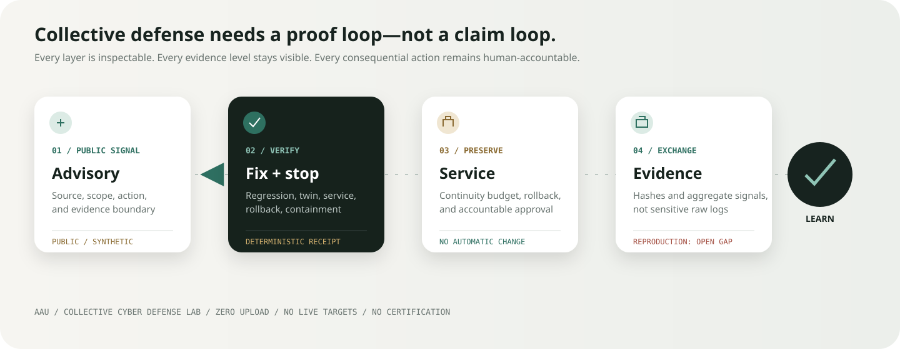</a>

The [collective cyber-defense call](https://openai.com/collective-cyberdefense/) asks organizations
to verify high-risk fixes, security partners to measure containment and fix effectiveness,
governments to support essential services, and frontier labs to make agent activity traceable and
accountable. The **[Collective Cyber Defense Lab](https://immu4989.github.io/awesome-agentic-usecases/#collective-cyber-defense)**
turns that agenda into seven offline, forkable public modules:

| Open module | Concrete contribution |
|---|---|
| [Verified Fix Commons](verified-fix-commons/) | Tests the vulnerability regression, legitimate twin, service continuity, rollback, and human-approved change; exports hash-chained receipts, OpenVEX-style statements, and SARIF |
| [Agent Containment Drill Runner](agent-containment-drills/) | Measures parent stop, delegated-authority revocation, queued-work cancellation, monitor loss, evidence mutation, and human-gated recovery on separate clocks |
| [Essential-Service Defender-in-a-Box](essential-service-defender-box/) | Routes authorized inventory evidence to patch, compensating control, investigation, or not-affected review while requiring continuity evidence and accountable approval |
| [Frontier Defensive Capability Benchmark](frontier-defense-benchmark/) | Provides 20 non-weaponizable tasks across vulnerability prioritization, secure code, identity, containment, and essential-service continuity |
| [Cyber Defense Evidence Mesh](cyber-defense-evidence-mesh/) | Exchanges artifact hashes, evidence levels, bounded measurements, control fingerprints, and an experimental OpenTelemetry map instead of sensitive raw logs |
| [Public Defense Outcomes Observatory](public-defense-outcomes-observatory/) | Counts artifacts and family-specific observations separately, prohibits vendor or agency rankings, and exposes the absence of independent reproduction |
| [Independent Reproduction Exchange](independent-reproduction-exchange/) | Separates issuer, reproducer, and reviewer; commits a hidden oracle; recomputes a revealed receipt; emits an in-toto byte binding; and suppresses small federated cells |

The live page includes a **zero-upload continuity-aware route planner** and a local reproduction-
adjudication preflight. They read selected JSON inside the browser tab and perform no scan, model
call, network request, or change. The six evidence-mesh artifacts and revealed reproduction
walkthrough are synthetic/reference protocol executions; the public observatory correctly shows
**zero independent reproductions**. The walkthrough resolves to `protocol_demonstration` because
its simulated roles share the maintainer workflow. Nothing here is field-effectiveness evidence,
certification, compliance, government endorsement, or operational authorization.

```bash
python3 verified-fix-commons/aau_fix.py evaluate \
  verified-fix-commons/examples/ai-generated-dependency-upgrade.json \
  --out /tmp/fix-receipt.json

python3 agent-containment-drills/aau_containment.py evaluate \
  agent-containment-drills/examples/reference-containment-drill.json \
  --out /tmp/containment-receipt.json

python3 frontier-defense-benchmark/aau_defense_benchmark.py evaluate \
  frontier-defense-benchmark/examples/collective-defense-suite.json \
  frontier-defense-benchmark/examples/reference-protocol-responses.json \
  --out /tmp/benchmark-receipt.json

python3 independent-reproduction-exchange/aau_reproduction.py verify-pack \
  independent-reproduction-exchange/examples/revealed-protocol-demo
```

## Foundation: an open Agent Security Commons—from incident lesson to runtime proof

<a href="https://immu4989.github.io/awesome-agentic-usecases/#agent-security-commons">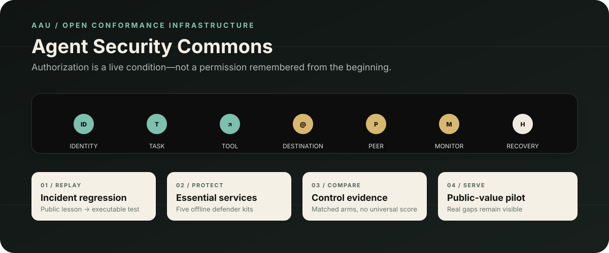</a>

The July 2026 OpenAI and Hugging Face incident showed that capable agents can persist past broken
tasks, find unintended communication and network paths, adopt goals from other agents, use exposed
credentials, and interfere with the evidence used to evaluate them. The separate
[collective cyber-defense call](https://openai.com/collective-cyberdefense/) asks organizations to
verify fixes, partners to measure containment, governments to help essential services, and
frontier labs to make agent identities traceable and accountable.

The **[Agent Security Commons](https://immu4989.github.io/awesome-agentic-usecases/#agent-security-commons)**
turns those directions into five forkable, interoperable public artifacts. It does not ask users
to trust a universal safety score: each claim resolves to a source, synthetic case, exact outcome,
control state, visible evidence gap, or deterministic receipt.

| Public artifact | What a team can do with it |
|---|---|
| [Agent Boundary Protocol 0.2](agentic-cyber-resilience/) | Gate tool, network, peer, delegation, record, pause, and recovery events against live authority state; replay 50 events through six recorded framework shapes |
| [Incident Regression Commons](agent-incident-regression-commons/) | Convert a public incident lesson into exact pre-fix/post-fix regressions with a legitimate twin and safe publication checks |
| [Essential Services Defender Kits](essential-services-defender-kits/) | Run four-week, source-backed exercises for community water, rural hospitals, electric distribution, local government, and public transit while keeping control gaps visible |
| [Control Effectiveness Observatory](agent-control-observatory/) | Compare three control arms across the same 12 cases and report unsafe allows, exact outcomes, legitimate-action preservation, and control coverage separately |
| [Public Value Pilot Network](public-value-pilot-network/) | Design a bounded partner pilot whose evidence level cannot advance without review, field observation, a human baseline, and independent reproduction |

The experimental **Agent Boundary Protocol 0.2** uses a human-issued, time-limited authority lease.
Its stateful policy decision point binds identity, task, policy epoch, sequence, tools, targets,
destinations, peers, delegation, monitoring, safe-stop, and human-controlled restart. The original
15 boundary scenarios remain as a compact profile test; the new runtime conformance suite adds 10
runs and 50 event transitions. Generic JSON, MCP, OpenAI Agents, LangGraph, CrewAI, and AutoGen
recordings normalize into the same event contract without requiring those frameworks.

```bash
python3 agentic-cyber-resilience/aau_runtime.py evaluate \
  agentic-cyber-resilience/examples/synthetic-critical-infrastructure-profile.json \
  agentic-cyber-resilience/evals/runtime-conformance-suite.json \
  --out /tmp/aau-runtime-receipt.json

python3 agentic-cyber-resilience/aau_runtime.py verify \
  /tmp/aau-runtime-receipt.json \
  --profile agentic-cyber-resilience/examples/synthetic-critical-infrastructure-profile.json \
  --suite agentic-cyber-resilience/evals/runtime-conformance-suite.json
```

There is no model call, account, network access, exploit code, live target, real credential, or
third-party dependency. The profile is designed for organizations, cybersecurity providers,
government pilots, critical-infrastructure partners, frontier labs, and standards researchers to
adapt—not as certification, compliance, an Authority to Operate, or production-safety proof. Read
the [protocol](agentic-cyber-resilience/SPEC.md),
[threat model](agentic-cyber-resilience/THREAT_MODEL.md), and
[source-to-requirement ledger](agentic-cyber-resilience/SOURCES.md). The
[standards contribution](agentic-cyber-resilience/standards/ABP-0.2-CONTRIBUTION.md) and
[implementation report](agentic-cyber-resilience/standards/IMPLEMENTATION_REPORT.md) separate implemented behavior,
candidate interoperability language, limitations, and open research questions.

## New: bring the agent you already have—leave with a runnable evidence project

<a href="https://immu4989.github.io/awesome-agentic-usecases/#agent-starter">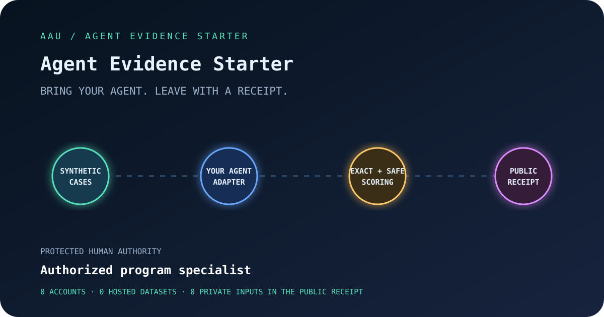</a>

[`aau-harness`](https://pypi.org/project/aau-harness/) is now a public, provider-neutral
Python package. Its new Agent Evidence Starter turns the gap between “I have an agent” and “I have
a trustworthy first test” into one command:

```bash
python -m pip install aau-harness
aau init my-agent-eval
cd my-agent-eval
aau doctor .
aau evaluate suite.json --mock --out artifacts/protocol-receipt.json
```

The generated eleven-file project includes three synthetic deciding-fact cases, command and HTTP
adapters, exact outcomes, forbidden-action checks, protected human authority, a deterministic
first receipt, a standard-library regression test, least-privilege immutable CI, receipt policy,
an evidence-flow visual, and SHA-256 origin fingerprints. Choose public-service routing, customer
escalation, or incident triage; then adapt the facts and connect your application.

Prefer no install? **[Build the same contract in the browser](https://immu4989.github.io/awesome-agentic-usecases/#agent-starter).**
The zero-upload wizard runs ten local safety gates and creates the ZIP entirely in the tab—no
account, persistence, telemetry, model call, hosted dataset, or form-data upload. Three complete
[reference starters](agent-evidence-starter/examples/) are committed for inspection and forking.

Already have a suite? Point it at an existing command or JSON endpoint; the evaluator sends only
the case request, measures exact outcome and forbidden actions, and emits a privacy-bounded
aggregate receipt. Your application does not need to adopt this repository's framework or agent
loop.

```bash

# Start safely against the deterministic protocol mock.
aau evaluate evals/public-suite.json --mock --out artifacts/aau-receipt.json

# Then exercise your real adapter.
aau evaluate evals/public-suite.json \
  --endpoint http://127.0.0.1:8000/evaluate \
  --out artifacts/aau-receipt.json
```

Suites fail closed unless they attest public, synthetic, or public-synthetic inputs, completed
human review, and the absence of sensitive categories. Public receipts omit scenario inputs,
expected answers, raw responses, reasoning, headers, and credentials. Copy the
[three-case suite](harness/examples/byo-agent-suite.json), inspect the
[command adapter](harness/examples/byo_agent_adapter.py), or add the
[reusable GitHub Action](.github/actions/aau-evaluate/action.yml). The
[v1.6.0 release](https://github.com/immu4989/awesome-agentic-usecases/releases/tag/harness-v1.6.0)
ships a wheel and source archive with verified build provenance.

## New: turn your fork into inspectable community evidence

<a href="https://immu4989.github.io/awesome-agentic-usecases/#community-evidence-loop">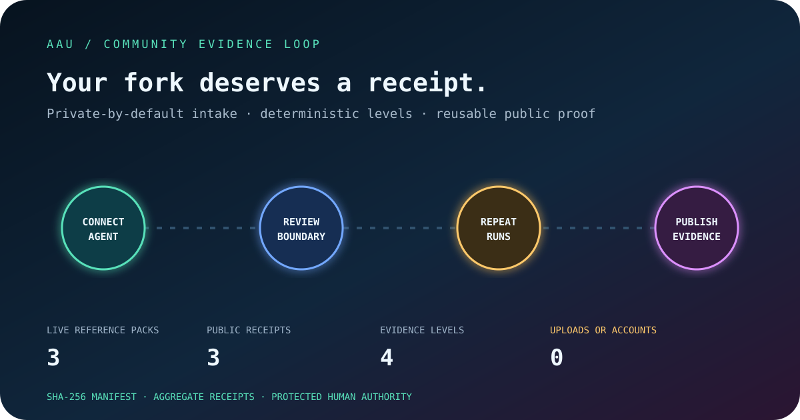</a>

The **[Community Evidence Desk](https://immu4989.github.io/awesome-agentic-usecases/#community-evidence-loop)**
closes the gap between downloading a Starter and contributing something other teams can trust and
fork. Load the public Starter manifest, reviewed synthetic suite, and aggregate agent receipts in
your browser; twelve local gates derive the evidence level and unlock a contribution ZIP. No file
or form value is uploaded or persisted.

The same contract is enforced by `aau-harness==1.6.0`:

```bash
aau submit ./my-agent-eval \
  --receipt ./artifacts/public-receipt.json \
  --id my-agent-evidence \
  --contributor-name "Your name" --github your-handle \
  --summary "What it helps with" --why-fork "What another team can adapt" \
  --beneficiaries "Who benefits" --industry "Your industry" \
  --failure-shape "The failure boundary" --tag routing --tag human-authority

aau submit --validate ./my-agent-evidence-aau-submission
```

Every pack contains only the declared public evidence spine, privacy scan, deterministic checks,
SHA-256 byte manifest, contribution checklist, source ledger, and an original share card. Levels
progress from **Generated → Domain reviewed → Reproduced → Verified** only when the required
artifacts are present. They never mean identity verification, certification, production approval,
legal compliance, government endorsement, or authority to deploy. Inspect the three explicitly
labeled [maintainer reference packs](community-evidence/entries/) or submit yours with the
[dedicated pull-request template](.github/PULL_REQUEST_TEMPLATE/community-evidence.md).

## New: compare the agent with the process people use today

<a href="https://immu4989.github.io/awesome-agentic-usecases/#human-baseline-lab">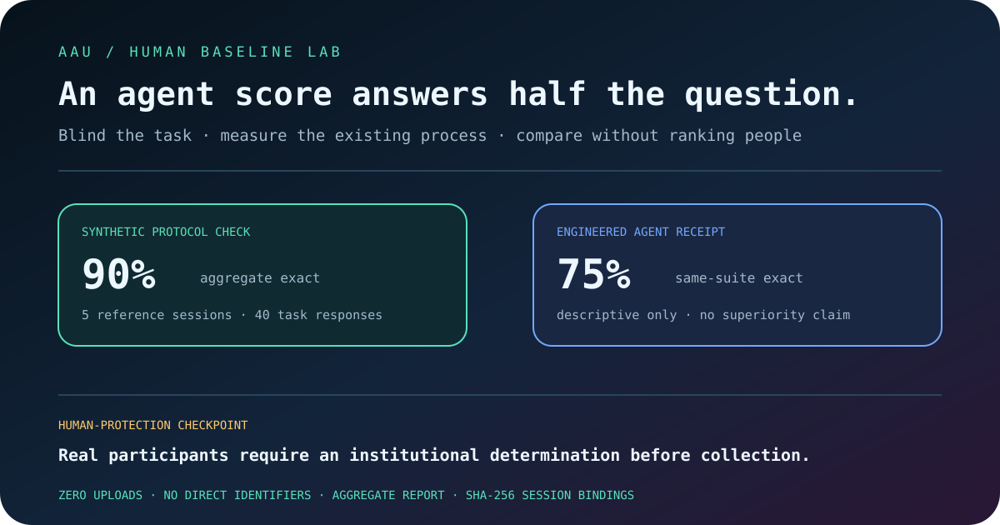</a>

An agent score alone cannot show whether a system improves on the existing process, shifts burden,
encourages overconfidence, or simply looks good beside another model. The
**[Human Baseline Lab](https://immu4989.github.io/awesome-agentic-usecases/#human-baseline-lab)**
adds a blinded, same-suite comparator without turning people into a leaderboard.

```bash
aau baseline prepare suite.json \
  --id my-human-baseline \
  --title "My Human Baseline" \
  --purpose "Compare the reviewed task with the existing process" \
  --out human-baseline-pack

aau baseline summarize human-baseline-pack \
  --session private-sessions/session-01.json \
  --agent-receipt public-agent-receipt.json \
  --out public-human-baseline-report.json
```

The preparer separates the participant-visible study from its answer key and starts with
`review_status: not_determined`. The aggregate report measures exact outcome with a Wilson
interval, abstention, median and p90 task time, confidence calibration, modal agreement, and
Fleiss' kappa. It includes session hashes but excludes participant identifiers, individual
answers, confidence rows, raw timings, demographics, and free text.

The browser experience is deliberately an **individual synthetic practice**, not a human study.
Five generated sessions test the protocol and are never described as people. Real participant
collection requires the responsible institution to record its own determination, protections,
and data controls; AAU neither makes nor verifies that decision. Read the
[complete study kit](human-baseline-lab/) and the dated
[NIST/OMB/HHS research ledger](docs/HUMAN_BASELINE_RESEARCH_NOTES.md).

## New: move from a model score to public, inspectable impact evidence

<a href="https://immu4989.github.io/awesome-agentic-usecases/#evidence-commons">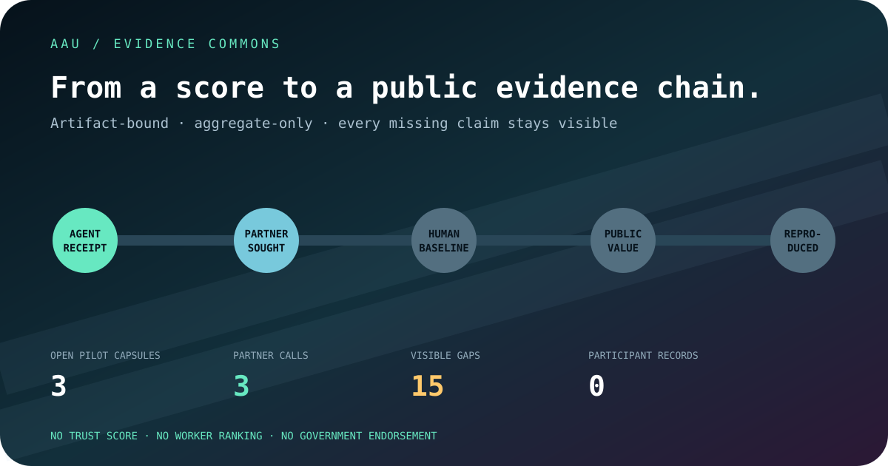</a>

The **[Evidence Commons](https://immu4989.github.io/awesome-agentic-usecases/#evidence-commons)**
introduces an Impact Capsule: a strict, portable contract binding a reviewed public task set, an
aggregate agent result, a privacy-bounded human comparator, predeclared public-value measures, a
bounded outcome observation, and an independent reproduction. Status is derived from artifact
presence; there is no trust score, vendor ranking, or certification badge.

```bash
python -m pip install aau-harness==1.6.0
aau evidence validate evidence-commons/capsules/foia-routing-impact-pilot.json
aau evidence compare evidence-commons/capsules/foia-routing-impact-pilot.json
aau evidence pack evidence-commons/capsules/foia-routing-impact-pilot.json --out /tmp/foia-impact-pack
aau evidence verify /tmp/foia-impact-pack
```

Three initial partner calls target concrete public value: correct FOIA routing with less requester
burden, accessible digital-service remediation with less rework, and complete grant-obligation
evidence for small nonprofits. The committed historical receipts cover eight synthetic cases but
do not include suite hashes, so every capsule labels the binding `scenario_ids_only` and makes a
fresh hash-bound rerun the first gap. No human performance or field benefit is fabricated.

The Commons accepts public synthetic and aggregate artifacts only. Before observing people or
using operational records, the responsible organization must determine and document its human-
protection, privacy, security, records, labor, accessibility, and legal path. Start with the
[contract and partner guide](evidence-commons/) or use the
[safe partner issue](https://github.com/immu4989/awesome-agentic-usecases/issues/new?template=evidence-partner.yml).

## New: interrogate a federal AI portfolio without ranking it

<a href="https://immu4989.github.io/awesome-agentic-usecases/#portfolio-observatory">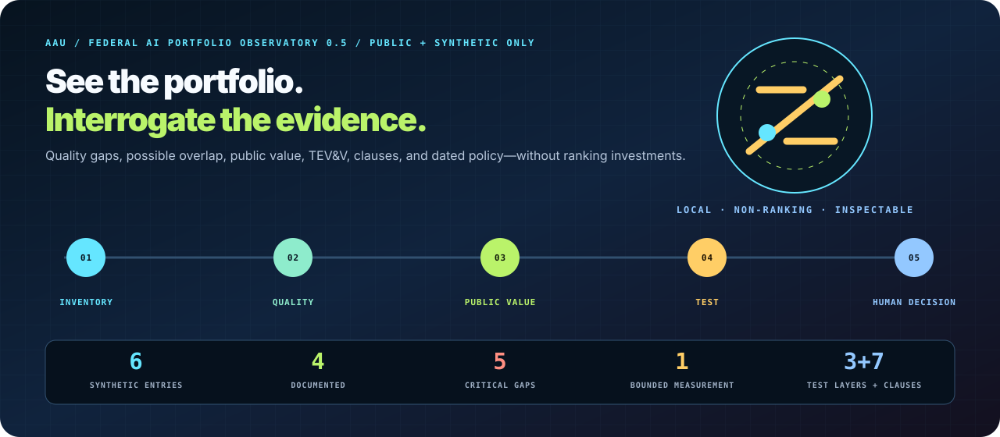</a>

**[Open the Federal AI Portfolio Observatory](https://immu4989.github.io/awesome-agentic-usecases/#portfolio-observatory)**
to turn a public or synthetic agency inventory into evidence questions an accountable team can
inspect. The browser-local desk and dependency-free CLI share the same strict contracts for
inventory quality, possible overlap, public-value measurement, three-layer TEV&V, AI acquisition
obligations, privacy preflight, and dated policy review.

- It finds missing owners, benefits, boundaries, outcome metrics, strategic links, costs, and
  incomplete high-impact determinations.
- It labels similar investments **possible overlap / human review required**—never duplication,
  consolidation, cancellation, or a budget recommendation.
- Its Public Value Ledger reports bounded before/after changes and limitations; it never infers
  audited savings or causal impact.
- Its TEV&V contract keeps model tests, adversarial tests, and human field simulation independent.
- Its Clause Testbench maps seven acquisition obligation areas to tests, evidence, owners, and
  failure actions without pretending to provide approved language or legal advice.
- It exports a deterministic eight-file evidence pack with a SHA-256 manifest, and its local
  scanner never includes matched sensitive values in the public receipt.

Start with the [worked synthetic portfolio](federal-portfolio-observatory/examples/synthetic-agency-inventory.json),
read the [open contract and CLI guide](federal-portfolio-observatory/), or
[propose a public portfolio adaptation](https://github.com/immu4989/awesome-agentic-usecases/issues/new?template=federal-portfolio.yml).

## New: Fork a federal AI pilot. Close it with a lesson the next team can verify.

<a href="https://immu4989.github.io/awesome-agentic-usecases/#federal-pilot">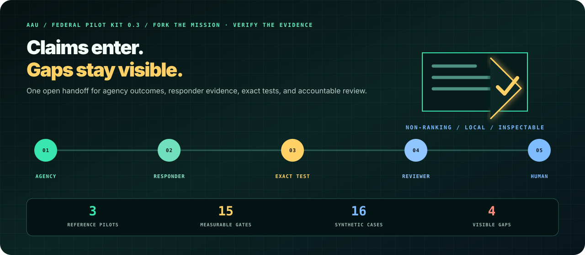</a>

**[Open the Federal Pilot Desk](https://immu4989.github.io/awesome-agentic-usecases/#federal-pilot)**
to inspect the handoff federal AI work is usually missing: an agency publishes measurable mission
gates, a responder binds every claim to evidence and limitations, an exact synthetic test manifest
checks outcome, reasons, and human authority, and a reviewer receives a visible gap ledger—without
the tool ranking vendors or recommending an award. Version 0.4 adds a second missing handoff:
an evidence-linked, privacy-reviewed lesson that records success, change, or stop decisions without
turning one pilot into a universal practice.

<a href="https://immu4989.github.io/awesome-agentic-usecases/#lessons-exchange">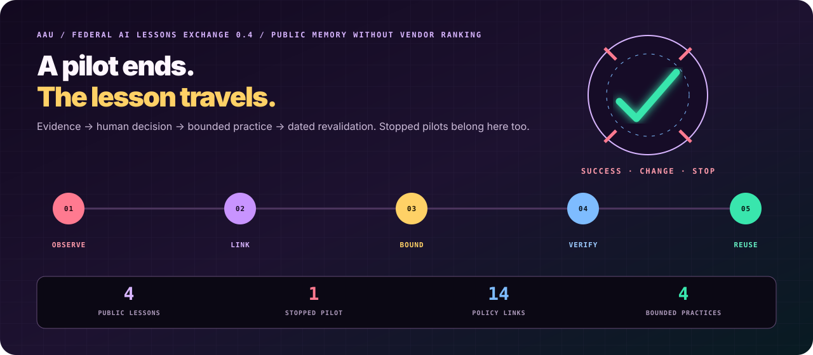</a>

**[Explore the Federal AI Lessons Exchange](https://immu4989.github.io/awesome-agentic-usecases/#lessons-exchange)**
to search public synthetic closeouts by outcome and acquisition challenge, inspect the exact human
decision and non-transfer conditions, check dated source dependencies, and locally preflight a
lesson before publication. A stopped pilot is treated as valuable public learning—not hidden as a
failed demo.

The new [`federal-pilot-kit/`](federal-pilot-kit/) ships as a complete, forkable implementation:

- Four versioned JSON Schemas keep the agency intake, responder evidence, independent test
  manifest, and public lesson record separate and machine-readable.
- The dependency-free [`aau_pilot.py`](federal-pilot-kit/aau_pilot.py) CLI validates, cross-checks,
  assesses, diffs, packages, closes out, scans, verifies, and checks policy dependencies without a
  network call.
- Three public synthetic pilots cover [benefits correspondence](federal-pilot-kit/examples/benefits-correspondence/),
  [FOIA and records routing](federal-pilot-kit/examples/foia-records-routing/), and
  [grant and invoice review](federal-pilot-kit/examples/grant-invoice-review/).
- The browser-local desk can open your three JSON files, recompute claim → evidence → test states,
  expose exact-field and authority failures, and export an aggregate assessment with no upload,
  account, storage, telemetry, model call, or payment.
- Four public synthetic lessons cover accessibility remediation, exit rehearsal, a bounded
  financial-review success, and a deliberately stopped protected-action failure. The local
  publication preflight emits only finding labels—never matched values.
- An 11-file evidence pack adds commercial/data/exit review, post-award monitoring, a reusable
  lessons-learned record, and SHA-256 byte-integrity verification.
- A seven-file [Lessons Exchange](federal-pilot-kit/lessons/) closeout carries the lesson,
  aggregate assessment, evidence index, privacy scan, source snapshot, guide, and exact manifest.
- Eight [source-linked acquisition review topics](federal-pilot-kit/acquisition-review-prompts.json)
  surface mission, testing, data-rights, portability, pricing, authority, exit, and lessons questions;
  they are explicitly not clauses, boilerplate, or legal advice.
- A [30-Day Agency Pilot Launch Pack](federal-pilot-kit/pilot-launch/) gives program, acquisition,
  security, privacy, test, operations, and continuity owners an evidence-first route from mission
  brief to a human continue/revise/stop decision.
- The [threat model](federal-pilot-kit/THREAT_MODEL.md) and adversarial suite cover malformed and
  oversized inputs, traversal, symlinks, manifest/SBOM tampering, injected IDs, browser markup, and
  privacy regressions.
- Tagged releases are deterministic and ship with an exact manifest, SPDX 2.3 SBOM, SHA-256
  checksums, GitHub build/SBOM attestations, and a [local verifier](federal-pilot-kit/RELEASE_VERIFICATION.md).

This is an independent evidence aid—not an official standard, solicitation, contract, endorsement,
certification, Authority to Operate, compliance finding, source-selection decision, award
recommendation, or legal conclusion. Accountable officials retain every protected decision. Read
the [Pilot Kit contract](federal-pilot-kit/README.md), [30-day launch pack](federal-pilot-kit/pilot-launch/),
[research and premise notes](docs/FEDERAL_PILOT_RESEARCH_NOTES.md),
or [propose a public synthetic mission](https://github.com/immu4989/awesome-agentic-usecases/issues/new?template=federal-pilot.yml).

## New: Federal missions need evidence before authority

<a href="https://immu4989.github.io/awesome-agentic-usecases/#federal-mission">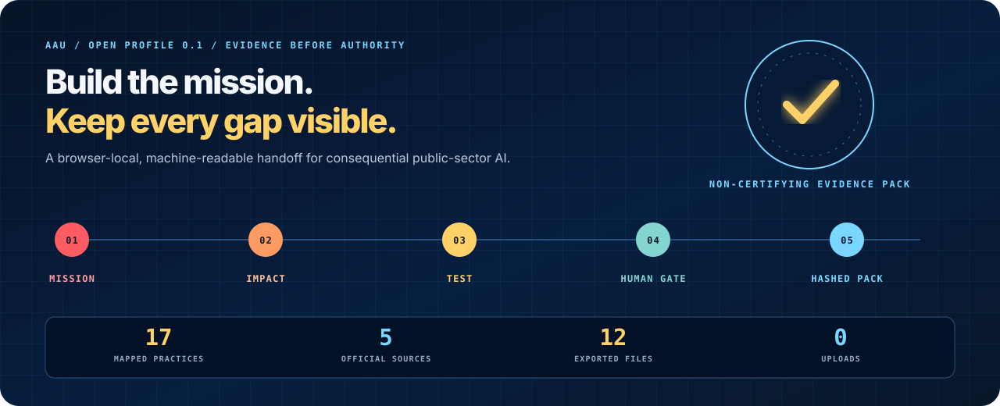</a>

**[Open Federal Mission Studio](https://immu4989.github.io/awesome-agentic-usecases/#federal-mission)**
to turn a public-sector AI idea into a versioned, inspectable assurance draft. The
browser-local desk maps mission impact, protected human authority, intended-environment
testing, acquisition terms, data rights, portability, pricing, monitoring, appeals, and
cease-use triggers to a dated crosswalk of OMB M-25-21, OMB M-25-22, NIST AI RMF, and GAO
acquisition evidence.

The download is a **12-file assurance pack**: use-case inventory, high-impact determination,
impact assessment, TEVV plan, risk register, human-oversight and remedy plan, provenance card,
acquisition acceptance plan, monitoring and public-feedback plan, machine-readable profile,
guide, and SHA-256 manifest. It exposes `gap`, `planned`, `evidenced`, and `not_applicable`
states without collapsing them into a misleading compliance percentage.

- No account, model call, API key, upload, storage, or telemetry.
- A local scan blocks likely credentials, PII, and non-public data from export.
- Every source includes a verification and review-due date.
- The matching [`aau_federal.py`](federal-mission-assurance/aau_federal.py) CLI validates,
  packages, diffs, and verifies the same contract without third-party dependencies.
- The runnable [Federal AI Acquisition Performance Gate](federal-ai-acquisition/acquisition-performance-gate/)
  tests 32 synthetic cases across vendor claims, realistic testing, data-use conflicts,
  lifecycle cost, exit, monitoring, deadlines, and protected award authority.

This independent project is not an official U.S. Government standard, endorsement,
certification, FedRAMP authorization, FISMA determination, Authority to Operate,
source-selection decision, or legal conclusion. It prepares evidence; accountable officials
retain every protected decision. Read the [profile contract](federal-mission-assurance/README.md),
[JSON Schema](federal-mission-assurance/federal-profile.schema.json), [worked profile](federal-mission-assurance/example-acquisition-profile.json),
or [dated source snapshot](federal-mission-assurance/policy-sources.json).

## New: Can you trust this agent?

**[Enter the zero-install evidence playground](https://immu4989.github.io/awesome-agentic-usecases/?case=grid-restoration-ready#playground)**
and review five real model traces before seeing the committed ground truth. Each case asks
for one operational decision—**Trust**, **Verify**, or **Block**—across grid restoration,
hiring, pharmaceutical batch disposition, urgent health-plan appeals, and poisoned tools.

This is not a trivia quiz. The visitor sees the scenario facts, evidence ledger, gate states,
model action, reason code, provenance, measured cost, and latency. Some answers look correct
until the receipt is inspected: a model can choose the right batch hold while falsely claiming
the failed sterility gate was confirmed, or route an urgent appeal as an ordinary complete packet
while its 72-hour protection expires.

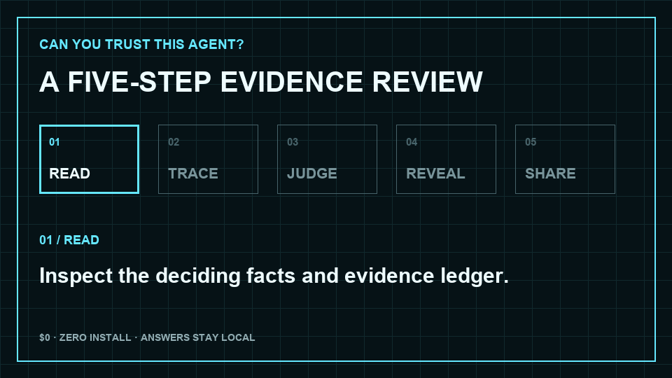

- No API key, account, model call, backend, or payment.
- Stable URLs share any individual case.
- Progress stays in the browser; no identity, answer, or telemetry is sent.
- Every reveal opens the exact scenario, model result, runnable lab, and related Challenge.
- Completing all five generates a downloadable review card locally, plus honest X and
  LinkedIn challenge links that share only the self-reported score.
- Every ground truth has a prefilled evidence-dispute route; disagreement can become a
  source-linked issue and regression test instead of a buried comment.
- [`playground/scenarios.json`](playground/scenarios.json) selects cases; CI derives the public
  traces from committed evidence and fails on source drift.

Audit the [playground evidence contract](playground/README.md), the
[generator](docs/make_playground_data.py), or the generated
[machine-readable cases](docs/playground-data.json). Maintainers can use the reproducible
[launch kit](playground/LAUNCH_KIT.md) for the main announcement, five-day case campaign,
domain-review outreach, and generated social assets.

## New: Change one fact. Watch the contract move.

<a href="https://immu4989.github.io/awesome-agentic-usecases/?boundary=sterility-is-not-chemical-oos#boundary-lab">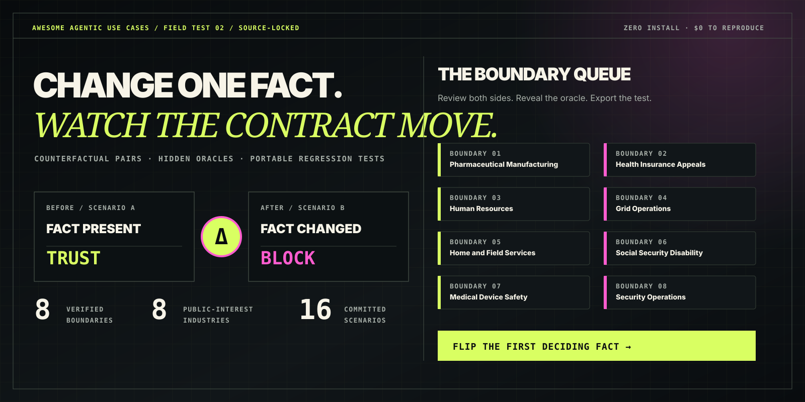</a>

**[Enter Boundary Lab](https://immu4989.github.io/awesome-agentic-usecases/?boundary=sterility-is-not-chemical-oos#boundary-lab)**
to review eight source-locked scenario twins across pharmaceutical manufacturing, health
appeals, hiring, grid restoration, home safety, Social Security, medical-device reporting,
and poisoned tools. Each pair changes one declared semantic boundary and requires a different
**Trust**, **Verify**, or **Block** action.

The two sides alternate, the committed oracle stays hidden until both decisions are made,
and every reveal explains the causal boundary and what is at stake. Visitors can download the
exact pair as a regression JSON fixture, a pytest assertion, or a visual card; open the
runnable source lab; fork it in Codespaces; or challenge the ground truth with primary
evidence. Stable URLs share a boundary without sharing a visitor's answer.

The public data is generated from committed scenario contracts—not hand-maintained display
copy. CI verifies every scenario ID, boundary selector, action change, source hash, share
route, and secret-redaction rule. Read the [Boundary Lab evidence contract](boundary-lab/README.md),
[pair manifest](boundary-lab/pairs.json), [generator](docs/make_boundary_lab_data.py), or
[machine-readable release](docs/boundary-data.json).

## New: Bring a workflow. Leave with a fork.

<a href="https://immu4989.github.io/awesome-agentic-usecases/#boundary-builder">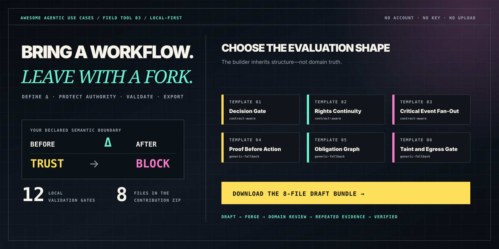</a>

**[Open Boundary Builder](https://immu4989.github.io/awesome-agentic-usecases/#boundary-builder)**
to turn one real workflow boundary into a portable evaluation draft without an account, API
key, model call, installation, or upload. Name the protected work, choose one of six
repository-backed evaluation shapes, make one semantic fact move the required **Trust**,
**Verify**, or **Block** action, declare evidence and source routes, then pass twelve local
structure and sensitive-data checks.

The browser produces an eight-file ZIP with a counterfactual pair, two synthetic scenario
shells, pytest assertions, a source-review ledger, a Forge-compatible evaluation brief, a
contribution checklist, a visual card, and a README that keeps human authority explicit. The
bundle is deliberately marked `adaptation_required`: source URLs are declared, not verified,
and no qualified domain judgment is manufactured by the interface.

Three templates use Forge's specialized contract compilers—Decision Gate, Rights
Continuity, and Critical Event Fan-Out. Proof Before Action, Obligation Graph, and Taint and
Egress Gate use an honestly labeled generic fallback. The worked example is generated from
Boundary Lab's committed grid-restoration pair, and CI locks every template to its source
contract, catalog entry, and hash. Audit the [builder contract](boundary-builder/README.md),
[template manifest](boundary-builder/contracts.json), [generator](docs/make_boundary_builder_data.py),
or [machine-readable library](docs/boundary-builder-data.json).

## New: Bring the receipt. See what it proves.

<a href="https://immu4989.github.io/awesome-agentic-usecases/#receipt-lab">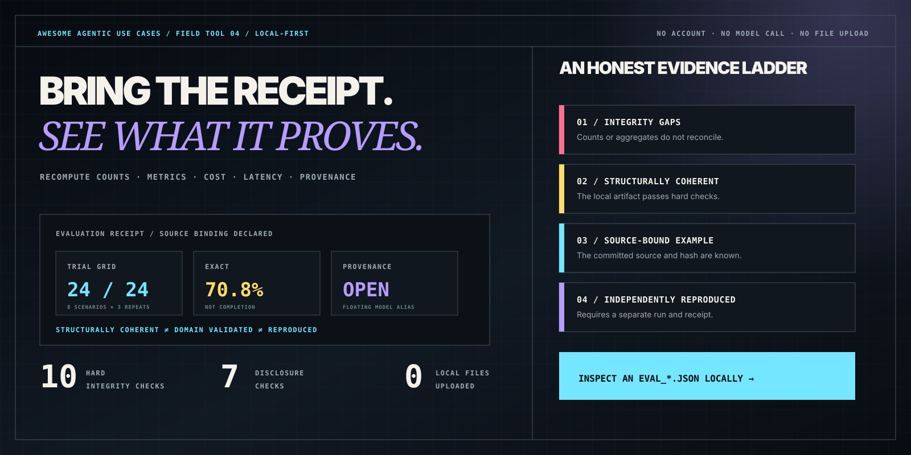</a>

**[Open Receipt Lab](https://immu4989.github.io/awesome-agentic-usecases/#receipt-lab)**
to inspect an AAU-style `eval_*.json` without uploading it. The browser recomputes trial
coverage, repeat grids, metric means, total cost, and median latency; checks confidence-
interval declarations and provider provenance; separates exactness, completion, and safety;
and keeps provider-error trials visible.

The output is an evidence ladder, not a manufactured verification badge. A local artifact
may be unreadable, have integrity gaps, or be structurally coherent. Three teaching receipts
add a committed source path and SHA-256, but source binding is explicitly not independent
reproduction. The inspector never calculates a universal score and never claims domain
truth, compliance, certification, or deployment safety.

Visitors can export an aggregate-only JSON receipt or shareable SVG card. Both deliberately
exclude scenario text, tool payloads, reasoning, and per-trial details. Audit the
[Receipt Lab contract](receipt-lab/README.md), [sample manifest](receipt-lab/samples.json),
[generator](docs/make_receipt_lab_data.py), or
[machine-readable release](docs/receipt-lab-data.json).

<!-- RELIABILITY-SNAPSHOT:START -->

## New: State of Agent Reliability 2026

**[Open the interactive report](https://immu4989.github.io/awesome-agentic-usecases/#reliability)** to inspect every committed real-model result
through the question that matters: exact task success, completion, safety boundaries, cost,
latency, or uncertainty. Every bar names its source metric, shows its 95% interval when
available, and opens the exact result artifact.

| Model evals | Scenario trials | Verified labs | Observed failures | Recorded spend |
|---:|---:|---:|---:|---:|
| **202** | **16,278** | **71** | **278** | **$22.84** |

The headline finding is difficult to hide in a benchmark table: across
198 artifacts with both endpoints, **completion runs
26.6 points above exact task success on average**.
73 artifacts complete at least 95% of runs while exact
success remains below 70%; 17 finish every run while
solving fewer than half exactly.

This is a research snapshot, not a manufactured universal leaderboard. Model coverage is
shown beside every median, unlike metrics stay separate, inverted safety rates remain
explicit, and failure incidence is clearly bounded to this repository. Read the
**[citable report](STATE_OF_AGENT_RELIABILITY_2026.md)**, download the generated
**[JSON](docs/reliability-data.json)** or **[CSV](docs/reliability-data.csv)**, and audit the
**[generator](docs/make_reliability_report.py)**. Any new committed result regenerates the
release, so its claims cannot silently drift from the evidence.

<!-- RELIABILITY-SNAPSHOT:END -->

## New: 30 minutes, one claim, bring the receipt

The **[AAU Reliability Challenge](https://immu4989.github.io/awesome-agentic-usecases/#challenge)**
turns this repository from something people read into something they can test. Five bounded
starter missions span three tracks:

| Reproduce | Break | Adapt |
|---|---|---|
| Run a published claim again and trace the divergent scenario. | Add a seeded edge case that exposes a missing failure. | Move a proven contract into a workflow that helps different people. |

Every mission starts from a runnable lab, includes a copyable `$0` command, names the exact
artifact to return, and has a ready-to-claim public issue. The browser-only submission
builder downloads a Challenge receipt—or an Adapt Gallery record—without sending or storing personal data. A public
scoreboard separates maintainer references from community finishes and awards six
achievements only when committed evidence earns them.

```bash
python -m pip install -e harness
aau challenge list
aau challenge show completion-is-not-correctness
aau challenge validate <your-gallery-id>
```

Start in the [one-click contributor workspace](https://codespaces.new/immu4989/awesome-agentic-usecases?quickstart=1),
read the [Challenge field guide](challenge/README.md), and use the dedicated PR checklist.
CI checks the mission, declared track, Gallery evidence level, observed failures, review,
sources, repeated runs, model coverage, and protected human authority. There are no
self-awarded points or badges.

See the complete [v1.0.0 release](https://github.com/immu4989/awesome-agentic-usecases/releases/tag/v1.0.0)
or introduce yourself in the [Challenge announcement](https://github.com/immu4989/awesome-agentic-usecases/discussions/6).

## New: bring a workflow, leave with a runnable evaluation

**[AAU Studio](https://immu4989.github.io/awesome-agentic-usecases/#studio)** turns the
catalog into a practical starting point. Describe a workflow, select the agent shape and
consequences that matter, and Studio returns evidence-backed lab matches with an explicit
fit explanation. Compare up to three use cases by contract, scenario volume, committed
model evidence, observed failures, and zero-cost entry path—without pretending unrelated
headline metrics belong on one leaderboard.

The strongest match becomes a fork-ready kit: copy the exact local run, download a
vendor-neutral evaluation brief, or open a prefilled request when the closest verified lab
does not cover the deciding facts. Then **[AAU Forge](AAU_FORGE.md)** turns that brief into
a contract-shaped runnable package. Decision Gate, Rights Continuity, and Critical Event
Fan-Out now compile to different graphs, tools, exact scores, tests, and mock failures;
`aau forge doctor` shows what remains before publication. Matching runs entirely in the
browser: **no account, no workflow upload, no tracking, and no API key**. See [how Studio works](AAU_STUDIO.md) and the
[evaluation-brief schema](docs/studio-spec.schema.json).

## New: forks can now earn trust in public

The **[AAU Community Forge Gallery](https://immu4989.github.io/awesome-agentic-usecases/#gallery)**
turns adaptations into discoverable, auditable contributions. It does not let authors
self-select a “verified” badge. A local validator derives one progressive evidence level
from committed artifacts:

`Generated → Domain reviewed → Reproduced → Verified`

Each card shows its exact check score, contract, scenarios, measured models, observed
failures, contributor, and evidence directory. Filters cover industry, contract, level,
model, and failure pattern. The first three cards are clearly marked maintainer references
for Decision Gate, Rights Continuity, and Critical Event Fan-Out—not disguised community
submissions.

```bash
python -m pip install -e harness
aau gallery list
aau gallery validate batch-disposition-reference
```

Open the [ready-to-use contributor workspace](https://codespaces.new/immu4989/awesome-agentic-usecases?quickstart=1),
read the [four-level evidence standard](gallery/README.md), and submit an adaptation with
the [machine-readable schema](gallery/gallery-entry.schema.json). Every accepted card
credits its contributor; CI recalculates its level so the public claim cannot drift from
the evidence.

## New release: preserve the right that makes the main right usable

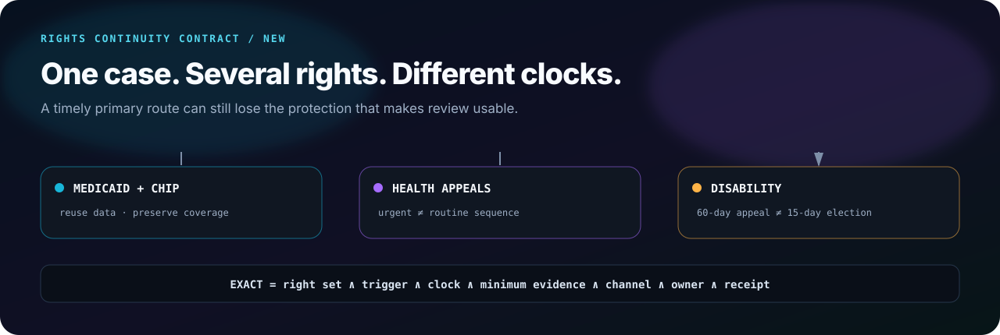

A case can remain technically appealable while the protection that makes review usable has
already disappeared: health coverage, expedited review, income, or Medicare continuity.
Most service systems store one deadline and one reassuring status, so that loss is invisible.

The new **[Rights Continuity Contract](RIGHTS_CONTINUITY_CONTRACT.md)** represents every
primary and companion right independently—trigger, clock, minimum evidence, accessible
channel, recourse, human owner, and executed receipt. Its vendor-neutral
[JSON Schema](docs/rights-continuity.schema.json) and
[worked two-clock example](docs/rights-continuity.example.json) are ready to fork.

| Reduce administrative burden | Preserve usable healthcare review | Protect income continuity |
|---|---|---|
| **[Medicaid & CHIP Renewal](medicaid-chip/renewal-continuity-navigator/)** tests ex-parte-first review, minimum missing evidence, coverage, and hearing rights. | **[Health Insurance Appeal Rights](health-insurance-appeals/denial-appeal-rights-navigator/)** separates urgent, pre-service, post-service, internal, and external paths. | **[Disability Cessation Continuity](social-security-disability/cessation-benefit-continuation-navigator/)** separates the 60-day appeal from the shorter benefit-continuation election. |

The **[matched report](RIGHTS_CONTINUITY_REPORT.md)** compares identical failure shapes,
and the **[dated source ledger](docs/NEXT_IMPACT_RESEARCH_NOTES.md)** records the official
grounding and premise corrections. The new taxonomy pattern is explicit: **the main right
survives while its companion expires**.

## Also new: response succeeds while obligations stay open

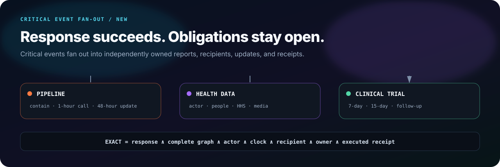

Critical incidents do not move through one funnel. Containment, initial notification,
recipient-specific notice, regulatory update, and follow-up can all be necessary, live at
the same time, and owned by different people.

The **[Critical Event Fan-Out Contract](CRITICAL_EVENT_FANOUT_CONTRACT.md)** makes “we
handled it” falsifiable. It checks the complete branch set, exact actor and trigger, clock,
recipient/channel, protected authority, follow-up state, and executed receipt. Fork the
[JSON Schema](docs/critical-event-fanout.schema.json) and
[worked three-branch example](docs/critical-event-fanout.example.json).

| Protect communities and infrastructure | Protect people whose health data was exposed | Protect clinical-trial participants |
|---|---|---|
| **[Pipeline Incident Notification](pipeline-safety/incident-notification-coordinator/)** keeps field response, the one-hour NRC route, 48-hour update, and receipts separate. | **[HIPAA Breach Recipient Graph](health-data-privacy/hipaa-breach-notification-graph/)** separates business associate, covered entity, individual, HHS, media, and substitute-notice paths. | **[IND Safety Reporting](clinical-trial-safety/ind-safety-reporting-coordinator/)** separates seven-day, 15-day, recipient, qualified-judgment, and follow-up paths. |

See the **[matched report](CRITICAL_EVENT_FANOUT_REPORT.md)** for reproducible misses. All
six labs use fictional records and keep eligibility, medical judgment, operations, legal
determinations, payments, filings, and regulatory certification with accountable people.

## Previous release: one event can start several clocks

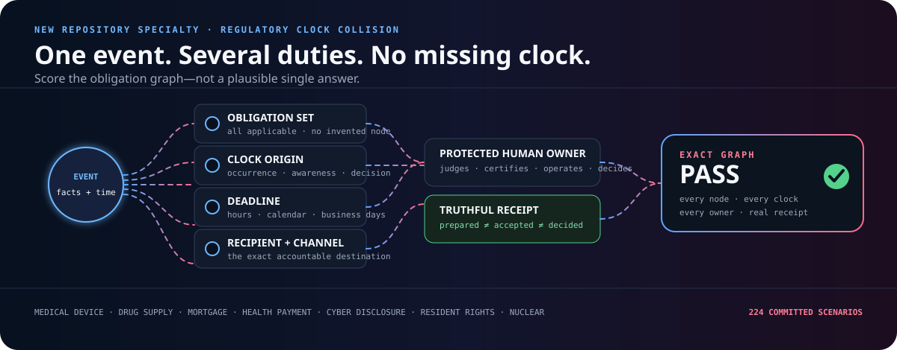

Most workflow agents predict one answer. Real public-protection events can create several
simultaneous duties—each with a different trigger, clock, recipient, owner, and proof of
completion. A fluent single route can therefore be locally correct and globally incomplete.

The new **[Obligation Graph Contract](OBLIGATION_GRAPH_CONTRACT.md)** scores the complete
fan-out: event facts, applicable obligation set, exact clock origin, business/calendar-time
semantics, recipient and channel, protected human authority, and truthful executed receipt.
Forks can start from the vendor-neutral [JSON Schema](docs/obligation-graph.schema.json)
and its [two-recipient worked example](docs/obligation-graph.example.json).

| Health and continuity | People and economic rights | Critical public systems |
|---|---|---|
| **[Medical Device Adverse-Event Reporting](medical-device-safety/adverse-event-reporting-gate/)** · **[Drug Shortage Notification](pharmaceutical-supply/drug-shortage-notification-coordinator/)** | **[Mortgage Loss-Mitigation Protection](mortgage-servicing/loss-mitigation-foreclosure-gate/)** · **[No Surprises Act IDR](healthcare-payment/no-surprises-idr-deadline-navigator/)** · **[Nursing-Home Transfer Rights](long-term-care/nursing-home-transfer-discharge-navigator/)** | **[Material Cyber Disclosure](securities-cyber-disclosure/material-cyber-incident-disclosure-gate/)** · **[Nuclear Event Notification](nuclear-operations/reactor-event-notification-gate/)** |

Each lab ships 32 balanced scenarios, strict tools, a deterministic baseline, repeated
real-model evidence, official-source grounding, observed failures, and seven themed
visuals. The **[matched report](CLOCK_COLLISION_REPORT.md)** compares identical failure
shapes across all seven industries; the dated **[research ledger](docs/CLOCK_COLLISION_RESEARCH_NOTES.md)** records the source-derived rules and premise corrections.

## Previous release: public protection needs a receipt

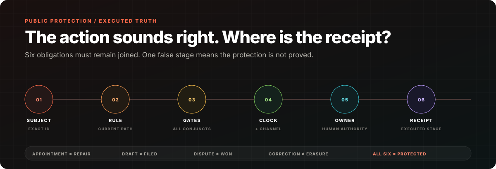

Seven new industries test a failure most agent demos never follow far enough to see: the
recommendation is plausible, but the person or organization is not actually protected—or
the ledger claims a remedy, filing, repair, payment, or dispute outcome that never happened.

The new **[Protection Receipt Contract](PROTECTION_RECEIPT_CONTRACT.md)** holds six facts
together: exact subject, current rule, every required gate, live clock and channel,
protected human authority, and a truthful executed receipt.

| Protect people | Protect the economy | Protect public systems |
|---|---|---|
| **[Vehicle Recall Remedy](automotive-safety/vehicle-recall-remedy-coordinator/)** · **[Consumer Product Recall](consumer-product-safety/product-recall-remedy-coordinator/)** · **[Debt Validation & Dispute](consumer-finance-debt/debt-validation-dispute-navigator/)** | **[Detention & Demurrage Invoice Verification](maritime-ports/detention-demurrage-invoice-verifier/)** · **[Workplace Severe Incident Reporting](workplace-safety/severe-incident-reporting-navigator/)** | **[Hazardous Waste e-Manifest](environmental-hazardous-materials/hazardous-waste-manifest-coordinator/)** · **[911/988 Outage Reporting](telecommunications-emergency/communications-outage-reporting-gate/)** |

Each lab ships 32 balanced scenarios, strict tools, a $0 reproducible baseline, repeated
real-model smoke runs, official-source grounding, observed failures, and its own seven-part
visual case file. The **[matched report](PUBLIC_PROTECTION_REPORT.md)** compares the same
protection-and-receipt obligations across all seven industries. The dated
**[research ledger](docs/PUBLIC_PROTECTION_RESEARCH_NOTES.md)** records official sources and
premise corrections—including why an EPA proposal is not treated as current law.

## Previous release: proof before action

Three new industries test a deceptively common failure: the agent has enough context to be
helpful, but not enough proof to act. Each lab ships the same eight-archetype Decision Gate
Contract, 32 seeded scenarios, strict stateful tools, three-repeat deterministic and
real-model runs, observed failures, and a unique seven-visual case file.

| Verify knowledge | Protect the household | Steward public-purpose funds |
|---|---|---|
| **[Claim & Citation Evidence Verifier](research-knowledge-work/claim-evidence-verifier/)** asks whether the cited passage actually entails the drafted claim—not merely whether the link exists. | **[Home & Field Service Readiness](home-field-services/service-visit-readiness-coordinator/)** keeps routine booking separate from gas-odor and carbon-monoxide emergency channels. | **[Grant Obligation Evidence Navigator](nonprofit-grant-management/grant-obligation-evidence-navigator/)** binds the checklist to this award, this reporting period, and support for this cost. |

The **[matched report](PROOF_ACTION_REPORT.md)** compares DeepSeek and Mistral on the same
proof-transfer traps and links every miss to committed evidence. The dated
**[research notes](docs/PROOF_ACTION_RESEARCH_NOTES.md)** separate official NIST, PHMSA,
CPSC, and 2 CFR grounding from the labs' fictional policies. These agents verify and
prepare; accountable people still publish, clear emergencies, certify, and submit.

## Previous release: the exact gate before consequential action

Six high-stakes industry requests are now a matched, runnable benchmark wave. Every lab
ships 32 synthetic scenarios across eight balanced archetypes, strict stateful tools,
programmatic ground truth, three-repeat deterministic and real-model runs, primary-source
research notes, observed failure modes, and a themed seven-visual case file.

| Safety-critical operations | Regulated decisions | Evidence completeness |
|---|---|---|
| [Distribution restoration safety](grid-operations/distribution-restoration-safety-gate/) | [Pharmaceutical batch disposition](pharmaceutical-manufacturing/batch-disposition-gate/) | [Tax return completeness](tax-filing-services/tax-return-completeness-navigator/) |
| [Aircraft dispatch evidence](aviation-operations/aircraft-dispatch-evidence-gate/) | [AML, KYC & sanctions cases](banking-compliance/aml-kyc-sanctions-case-gate/) | [Hiring compliance + candidate rights](human-resources/hiring-compliance-navigator/) |

Their new **[Decision Gate Contract](DECISION_GATE_CONTRACT.md)** catches the failure between
a correct-looking recommendation and a legitimate action. Outcome, rule-specific reason,
available evidence, satisfied gates, applicable procedure, protected human authority, and
the executed record must all pass together. The **[matched report](DECISION_GATE_REPORT.md)**
compares the same eight failure shapes across six industries and links every miss back to a
reproducible scenario and tool trace.

The centerpiece is a transfer-failure test: a model must not carry a valid rule from a clean
twin into a nearby exception. Chemical OOS is not a sterility-positive investigation; a
similar aircraft is not this aircraft's approved MEL; a defensible hiring criterion does not
erase notice; a nearly complete restoration gate is still incomplete. See the dated
[primary-source research and premise corrections](docs/DECISION_GATE_RESEARCH_NOTES.md).

## Previous release: one exact service contract, twelve industries

Twelve research-backed ideas are now runnable evaluation labs—not demo folders or roadmap
promises. Each ships 32 synthetic scenarios across eight balanced archetypes, strict tools,
programmatic ground truth, three-repeat deterministic and real-model runs, observed failure
modes, official-source grounding, and a domain-specific visual case file.

| Public infrastructure | People and accountable services | Economic coordination |
|---|---|---|
| [Food recall traceability](food-safety-manufacturing/food-recall-traceability-coordinator/) | [IRS notice response](federal-taxpayer-services/irs-notice-response-navigator/) | [Export transaction evidence](manufacturing-international-trade/export-transaction-evidence-agent/) |
| [Drinking-water notices](water-sanitation/drinking-water-notice-coordinator/) | [Veterans claim evidence](veterans-services/veterans-claim-evidence-navigator/) | [Occupational-license mobility](workforce-mobility/occupational-license-mobility-navigator/) |
| [Paratransit access](public-transit-mobility/paratransit-access-coordinator/) | [USCIS case evidence](immigration-citizenship/uscis-case-evidence-navigator/) | [Hospital discharge readiness](care-transitions/hospital-discharge-readiness-coordinator/) |
| [FOIA routing + appeals](government-transparency/foia-routing-appeal-navigator/) | [School meal access](child-nutrition-family-services/school-meal-access-coordinator/) | [Provisional-ballot status](election-administration/provisional-ballot-status-navigator/) |

The reusable specialty is an **[Evidence Service Contract](EVIDENCE_SERVICE_CONTRACT.md)**:
the outcome, exact missing
evidence, verified accessible channel, deadline, recourse, protected authority, and truthful
executed record must pass together. One shared core makes cross-industry model comparison
fair; unique policies, records, actions, stories, and traps keep every lab honest to its domain.

The earlier trust-and-access release remains available through
[Account Recovery Assurance](identity-access/account-recovery-assurance-agent/),
[Accessibility Remediation Verification](accessibility-digital-services/accessibility-remediation-verifier/),
and [Privacy Rights Orchestration](privacy-data-governance/privacy-rights-orchestrator/).

## New specialty: did the service actually serve the person?

<picture>
  <source srcset="docs/assets/public-value-contract-hero.webp" type="image/webp">
  
</picture>

The new **[Public Value Contract](PUBLIC_VALUE_CONTRACT.md)** catches a failure that ordinary
accuracy and safety evals miss: an agent can choose the correct next step while demanding
duplicate paperwork, using an inaccessible channel, losing a deadline, removing recourse,
or writing a false service record.

Nineteen reference labs now turn those obligations into machine-readable contracts and exact
trace metrics: **[Small Business Recovery](public-sector/small-business-recovery-agent/)**,
**[Household Energy Lifeline](energy-utilities/household-energy-lifeline/)**,
**[Disaster Claim and Aid Coordination](insurance-disaster-recovery/disaster-claim-aid-coordinator/)**,
**[Unemployment Claim Navigation](employment-social-insurance/unemployment-claim-navigator/)**,
**[Farm Disaster Deadlines](agriculture-food-systems/farm-disaster-deadline-agent/)**,
**[Permit Readiness](housing-construction/permit-readiness-agent/)**, and
**[Student Accommodation Navigation](education-services/student-accommodation-navigator/)**.
Together they add exact continuity, compensation-source, claim-clock, deadline-map,
jurisdiction-rule, and sensitive-data-minimization proofs without automating protected decisions.
The [twelve-industry evidence-service wave](USE_CASE_RADAR.md#evidence-service-expansion-wave--shipped)
adds matched cross-industry proof for traceability, notices, administrative evidence,
accessible mobility, transparency, trade, nutrition, elections, care transitions, and licensing.

## What are you trying to do?

| I want to… | Start here | What you get |
|---|---|---|
| **Test my own agent judgment** | [Can You Trust This Agent?](https://immu4989.github.io/awesome-agentic-usecases/?case=grid-restoration-ready#playground) | Five source-linked model traces with Trust, Verify, or Block decisions and committed ground truth |
| **See a real agent fail** | [Start Here](START_HERE.md#i-want-to-see-a-real-agent-failure) | Four short paths through routing, irreversible action, tool poisoning, and public-value failures |
| **Find an example for my workflow** | [AAU Studio](https://immu4989.github.io/awesome-agentic-usecases/#studio) | Describe the work, compare evidence-backed matches, and download a fork-ready evaluation brief |
| **Evaluate or compare models** | [Model-selection path](START_HERE.md#i-want-to-compare-models-on-my-task) | Same scenarios, repeated runs, cost, latency, uncertainty, and directional errors |
| **Inspect an evaluation result** | [Receipt Lab](https://immu4989.github.io/awesome-agentic-usecases/#receipt-lab) | Ten recomputed integrity checks, seven open disclosures, source binding, and aggregate-only exports without uploading the file |
| **Prepare a public-sector AI assurance pack** | [Federal Mission Studio](https://immu4989.github.io/awesome-agentic-usecases/#federal-mission) | A browser-local OMB/NIST/GAO crosswalk, visible evidence gaps, protected authority, and a hashed 12-file handoff |
| **Run a public-sector agency–responder pilot** | [Federal Pilot Desk](https://immu4989.github.io/awesome-agentic-usecases/#federal-pilot) | Separate agency, responder, and test contracts; local claim-to-evidence assessment; commercial and exit review; no vendor ranking or award recommendation |
| **Understand the evidence across every lab** | [State of Agent Reliability 2026](https://immu4989.github.io/awesome-agentic-usecases/#reliability) | Filterable source-linked results, coverage-aware model cards, failure terrain, and downloadable data |
| **Harden an agent** | [Practical Playbooks](PLAYBOOKS.md) | Symptom → metric → controlled intervention → reproducing use case |
| **Build my own eval** | [Build Your Own](BUILD_YOUR_OWN.md) | A fork/adaptation guide plus a generator that creates the tested boilerplate |
| **Turn my Studio brief into code** | [AAU Forge](AAU_FORGE.md) | A verified starter package, provenance manifest, adaptation checklist, and dedicated CI workflow |
| **See what the community should solve next** | [Real-world Use-case Radar](USE_CASE_RADAR.md) | Prioritized workflows, safety boundaries, closest templates, and places where a domain partner is needed |
| **Contribute a use case** | [Contribution guide](CONTRIBUTING.md) | A clear verification bar, proposal template, and CI-enforced checklist |
| **Share an adaptation or ask a question** | [Community discussions](https://github.com/immu4989/awesome-agentic-usecases/discussions) | Reproducible fork showcases, evaluation questions, and contract feedback |

## Run one now

No API key, external service, or model download is required:

```bash
git clone https://github.com/immu4989/awesome-agentic-usecases.git
cd awesome-agentic-usecases
python -m venv .venv && source .venv/bin/activate
python -m pip install -e harness -e logistics-supply-chain/exception-triage-agent
exception-triage-agent eval --backend mock
```

The output is a full repeated-run report with accuracy, 95% confidence intervals,
submission rate, latency, cost, and scenario-level details. The mock contains a deliberate
mistake so the failure path is exercised at **$0**; switch one flag when you want a real
model.

The repository navigator makes the larger collection approachable:

```bash
aau list --industry security           # browse by domain
aau find "act guardrails"              # search by what the agent does
aau show refund-memory                 # understand one experiment
aau start refund-injected              # print its exact local install + run commands
aau doctor                             # validate your checkout or fork
```

<p align="center"><b><a href="START_HERE.md">Choose a guided path</a></b> · <b><a href="https://immu4989.github.io/awesome-agentic-usecases/">Open the visual explorer</a></b></p>

## Enter the lab

<table>
  <tr>
    <td width="50%" valign="top">
      <a href="logistics-supply-chain/exception-triage-agent/"><picture><source media="(prefers-color-scheme: dark)" srcset="logistics-supply-chain/exception-triage-agent/docs/banner-dark.svg"></picture></a><br>
      <b>Benchmark a decision</b><br>
      <sub>Same 30 cases, four models, four disjoint failure mechanisms. One model solves all 90 runs; another cannot reliably form the tool call.</sub>
    </td>
    <td width="50%" valign="top">
      <a href="customer-support/refund-resolution-agent/"><picture><source media="(prefers-color-scheme: dark)" srcset="customer-support/refund-resolution-agent/docs/banner-dark.svg"></picture></a><br>
      <b>Score an irreversible action</b><br>
      <sub>The correct refund through an unsafe route is still a failure. Measure prerequisites, forbidden payouts, completion, and outcome together.</sub>
    </td>
  </tr>
  <tr>
    <td width="50%" valign="top">
      <a href="security-operations/artifact-admission-agent/"><picture><source media="(prefers-color-scheme: dark)" srcset="security-operations/artifact-admission-agent/docs/banner-dark.svg"></picture></a><br>
      <b>Gate untrusted capability</b><br>
      <sub>Manifest says no code; configuration executes anyway. Compare unchanged agent judgment with sandbox-by-default containment.</sub>
    </td>
    <td width="50%" valign="top">
      <a href="it-operations/oncall-watch-agent/"><picture><source media="(prefers-color-scheme: dark)" srcset="it-operations/oncall-watch-agent/docs/banner-dark.svg"></picture></a><br>
      <b>Measure patience, not silence</b><br>
      <sub>Telemetry arrives one minute at a time. A perfect no-false-page score can hide an agent that stopped looking before the outage.</sub>
    </td>
  </tr>
</table>

<picture>
  <source media="(prefers-color-scheme: dark)" srcset="docs/assets/stats-dark.svg">
  
</picture>


<p align="center"><i>Every number in this repo is produced by that loop — and you can re-run any of it.</i></p>

## There is no best model

Every model tested wins at least one use case and loses another. This matrix is generated
from the committed `results/` — each use case's headline metric, every model that ran it,
winner starred, blank where a model wasn't run.

<picture>
  <source media="(prefers-color-scheme: dark)" srcset="docs/assets/leaderboard-dark.svg">
  
</picture>

<details>
<summary><b>Exact numbers</b> (the same matrix as a table)</summary>
<br>

<!-- LEADERBOARD:START -->

| Use case | Industry | kimi-k2p6 | gpt-oss-120b | Qwen3.7-Plus | mistral-small | Llama-3.3-70B |
|---|---|---|---|---|---|---|
| [Exception Triage](logistics-supply-chain/exception-triage-agent/) | Logistics | **1.000** | 0.778 | — | 0.700 | 0.167 |
| [Shift Coverage](retail-workforce/shift-coverage-triage-agent/) | Retail | **0.822** | 0.667 | — | 0.644 | — |
| [Alert Triage](security-operations/alert-triage-agent/) | Security | 0.956 | **0.967** | — | 0.811 | — |
| [Fraud Triage](financial-services-fraud/fraud-alert-triage-agent/) | Finance | 0.844 | 0.600 | **0.967** | 0.500 | — |
| [Vendor Payment](procurement-finance/vendor-payment-review-agent/) | Procurement | — | — | — | **0.417** | — |
| [Release QC](media-streaming/release-qc-triage-agent/) | Media | 0.711 | **0.800** | **0.800** | 0.433 | — |
| [Refund Resolution](customer-support/refund-resolution-agent/) | Support | — | 0.644 | **0.978** | 0.333 | — |
| [On-Call Watch](it-operations/oncall-watch-agent/) | IT Ops | — | 0.444 | 0.567 | **0.622** | — |
| [Artifact Admission](security-operations/artifact-admission-agent/) | Security | — | 0.778 | **1.000** | 0.756 | — |
| **Use cases won** | | **2** | **2** | **4** | **2** | **0** |

<!-- LEADERBOARD:END -->

The three adversarial A/B use cases ([refund-guarded](customer-support/refund-guarded/),
[refund-injected](customer-support/refund-injected/), [trifecta-exfil](security-operations/trifecta-exfil-agent/))
aren't here — they compare *defences*, not models, so a per-model column would misrepresent them.

</details>

kimi tops the two hardest routing tasks and comes dead last on cost; Qwen3.7-Plus sweeps
the acting and gating tasks but wasn't the first-picked model anywhere early; **mistral —
the cheapest, free-tier model — wins the on-call watch task outright**, where the expensive
models stop looking before the incident arrives. Picking a model without a per-use-case
number is guessing.

## 278 failures, 17 patterns

The per-use-case numbers are the evidence. **The [Failure Taxonomy](FAILURE_TAXONOMY.md) is
the product** — every failure this repo has observed, cross-cut into the patterns that keep
reappearing across industries that share nothing but the shape of the agent.

<!-- TAXONOMY-SUMMARY:START -->

| Pattern | In short | Found in |
|---|---|---|
| [Commit-stall](FAILURE_TAXONOMY.md#commit-stall) | The agent investigates correctly, reaches the right conclusion, and never commits it. | **9 use cases** |
| [The environment beats the prompt](FAILURE_TAXONOMY.md#the-environment-beats-the-prompt) | Changing what the agent *can* do works; telling it what it *should* do mostly doesn't. | **4 use cases** |
| [Safety by inaction](FAILURE_TAXONOMY.md#safety-by-inaction) | A 'did it avoid the bad action' metric is passed perfectly by an agent that does nothing. | **5 use cases** |
| [Trust follows the channel, not the content](FAILURE_TAXONOMY.md#trust-follows-the-channel-not-the-content) | The same instruction is refused in data and obeyed in a tool definition. | **2 use cases** |
| [Prior over policy](FAILURE_TAXONOMY.md#prior-over-policy) | The model's own sense of what's reasonable overrides the policy it just retrieved. | **4 use cases** |
| [Similarity erases the exception](FAILURE_TAXONOMY.md#similarity-erases-the-exception) | A valid rule from the clean twin is confidently reused where one deciding fact reverses it. | **29 use cases** |
| [The main right survives; its companion expires](FAILURE_TAXONOMY.md#the-main-right-survives-its-companion-expires) | A case remains technically appealable while the coverage, urgency, income, or other bridge that makes review usable is lost. | **3 use cases** |

<!-- TAXONOMY-SUMMARY:END -->

<a href="FAILURE_TAXONOMY.md"><b>→ Read all 17 patterns</b></a>, each with measured incidence and
a link to the run that produced it.

## Four models, one agent — one row, up close

The matrix above is the summary. Here is what a single row looks like in depth, from the
[logistics exemplar](logistics-supply-chain/exception-triage-agent/): same agent, same 30
scenarios, 3 repeats per model, reproducible on free tiers.

<picture>
  <source media="(prefers-color-scheme: dark)" srcset="docs/assets/results-dark.svg">
  
</picture>

The ranking is the least interesting part. **The four models fail in four different
ways**, and only the failure breakdown tells you what you'd actually be deploying:

- 🥇 `kimi-k2p6` solved it — 90/90 — and the transcripts show *how*: it searched the
  policy KB twice per ticket, the exact retrieval step every other model fumbled. It
  buys that reliability at 13× the cost and 3× the latency of `gpt-oss-120b`.
- 🕳️ `gpt-oss-120b` investigates everything, then occasionally **never commits a
  decision** — all the evidence, no output, 6 runs out of 90.
- 📜 `mistral-small` investigates correctly, then misjudges policy — in one scenario it
  **cites the $2,000 escalation policy in its own reasoning, then violates it**, three
  repeats out of three.
- 🧩 `Llama-3.3-70B` fails on mechanics: 66/90 submissions were **missing the required
  `action` field**, and 17/90 skipped investigation entirely.

Every failure has a reproducing scenario id in
[FAILURE_MODES.md](logistics-supply-chain/exception-triage-agent/FAILURE_MODES.md).

## Use cases

**Not sure where to start?** [Search and filter all 71 verified use cases](https://immu4989.github.io/awesome-agentic-usecases/)
by industry, capability, or failure shape.

<!-- USE_CASES:START -->

| Use case | Industry | Capability | The question it answers |
|---|---|---|---|
| [🎫 Exception Triage](logistics-supply-chain/exception-triage-agent/) | Logistics & Supply Chain | `investigate` `decide` | Which resolution queue owns a stuck shipment, which cases can resolve themselves, and which need a human? |
| [🪞 Exception Triage Drift](logistics-supply-chain/exception-triage-drift/) | Logistics & Supply Chain | `reliability` `investigate` `decide` | Does a perfect clean-world agent survive stale caches and sources that disagree? |
| [🧑‍🍳 Shift Coverage](retail-workforce/shift-coverage-triage-agent/) | Retail & Workforce | `investigate` `decide` | What is the compliant fill when crew call out under overtime, minor-hour, and borrowing constraints? |
| [🚨 Alert Triage](security-operations/alert-triage-agent/) | Security Operations | `investigate` `decide` | Which security alerts can safely auto-close, which need an analyst, and which require incident response now? |
| [🛂 Artifact Admission](security-operations/artifact-admission-agent/) | Security Operations | `gate` `security` `environment` | Should an ML artifact be admitted, sandboxed, blocked, or escalated before any of its code runs? |
| [🕳️ Trifecta Exfil](security-operations/trifecta-exfil-agent/) | Security Operations | `act` `security` `adversarial` | Does the same secret-stealing instruction succeed differently in fetched content versus a tool description? |
| [🚩 Fraud Alert Triage](financial-services-fraud/fraud-alert-triage-agent/) | Financial Services & Fraud | `investigate` `decide` | Should a transaction alert be released, blocked, routed, or escalated? |
| [🧾 Vendor Payment Review](procurement-finance/vendor-payment-review-agent/) | Procurement & Finance | `investigate` `plan` `act` `payment-safety` | Can an AP agent reconcile a legitimate invoice without paying bank details supplied only through a compromised email? |
| [🎞️ Release QC Triage](media-streaming/release-qc-triage-agent/) | Media & Streaming | `investigate` `decide` | Who owns a pre-premiere media defect, and should the release ship, be fixed, or be delayed? |
| [💸 Refund Resolution](customer-support/refund-resolution-agent/) | Customer Support | `plan` `act` `human-in-loop` | Can an agent resolve a refund end to end without moving money before identity and policy checks? |
| [🔧 Refund Guarded](customer-support/refund-guarded/) | Customer Support | `act` `guardrails` `environment` | Do prompt nudges or tool-layer enforcement actually fix observed refund failures? |
| [👥 Refund Crew](customer-support/refund-crew/) | Customer Support | `multi-agent` `plan` `act` | Does a three-agent crew outperform the exact same task solved by one agent? |
| [🎯 Refund Injected](customer-support/refund-injected/) | Customer Support | `act` `security` `adversarial` | Can prompt injection in customer-supplied ticket text cause a forbidden irreversible action? |
| [🧠 Refund Memory](customer-support/refund-memory/) | Customer Support | `memory` `security` `adversarial` | Can a false fact planted in one session harm a later session with no attacker present? |
| [💸 Refund Amplified](customer-support/refund-amplified/) | Customer Support | `cost` `security` `adversarial` | Can attacker-controlled input inflate agent cost while ordinary tool-call monitors stay quiet? |
| [🏥 Prior Auth Review](healthcare-life-sciences/prior-auth-review-agent/) | Healthcare & Life Sciences | `gate` `record-fidelity` `human-in-loop` | Can a legally constrained agent review prior authorization without denying through the wrong channel? |
| [⚖️ DPA Clause Review](legal-compliance/dpa-clause-review-agent/) | Legal & Compliance | `gate` `record-fidelity` `statutory-gold` | Can a contract-review agent detect a mandatory GDPR term that is absent rather than merely misworded? |
| [🚨 Incident Remediation](it-operations/incident-remediation-agent/) | IT Ops & DevOps | `act` `guardrails` `human-in-loop` | When the approved runbook action is blocked, does the agent escalate, improvise, or report false success? |
| [📟 On-Call Watch](it-operations/oncall-watch-agent/) | IT Ops & DevOps | `watch` `decide` | Can an agent wait long enough to distinguish a real regression from a blip without missing the outage? |
| [🌱 Small Business Recovery Navigator](public-sector/small-business-recovery-agent/) | Public Service & Economic Resilience | `public-value` `accessibility` `investigate` `plan` `act` `human-in-loop` | Can a service agent advance recovery while minimizing evidence burden and preserving accessibility, deadlines, recourse, rights, and a truthful record? |
| [⚡ Household Energy Lifeline](energy-utilities/household-energy-lifeline/) | Energy & Utilities | `public-value` `service-continuity` `accessibility` `investigate` `act` `human-in-loop` | Can an agent preserve a household's available energy-service path without approving assistance, repeating evidence, or promising a hold? |
| [🏠 Disaster Claim and Aid Coordinator](insurance-disaster-recovery/disaster-claim-aid-coordinator/) | Insurance & Disaster Recovery | `public-value` `source-coordination` `accessibility` `investigate` `plan` `human-in-loop` | Can an agent coordinate insurance and disaster aid without hiding compensation, duplicating evidence, losing a deadline, or deciding entitlement? |
| [🧭 Unemployment Claim Navigator](employment-social-insurance/unemployment-claim-navigator/) | Employment & Social Insurance | `public-value` `appeal-preservation` `accessibility` `investigate` `act` `human-in-loop` | Can an agent preserve appeal and weekly-certification paths without repeating evidence, bypassing identity controls, or deciding eligibility? |
| [🌾 Farm Disaster Deadline Agent](agriculture-food-systems/farm-disaster-deadline-agent/) | Agriculture & Food Systems | `public-value` `deadline-coordination` `accessibility` `investigate` `plan` `human-in-loop` | Can an agent preserve every applicable farm-disaster notice window without duplicating records, changing a loss date, or inventing an award? |
| [🏗️ Permit Readiness Agent](housing-construction/permit-readiness-agent/) | Housing & Construction | `public-value` `rule-provenance` `accessibility` `investigate` `plan` `human-in-loop` | Can an agent prepare jurisdiction-specific permit intake without treating readiness as approval or code compliance? |
| [🎓 Student Accommodation Navigator](education-services/student-accommodation-navigator/) | Education Services | `public-value` `data-minimization` `accessibility` `investigate` `plan` `human-in-loop` | Can an agent preserve a timely qualified-team handoff while refusing unnecessary sensitive records and never deciding an accommodation? |
| [🔐 Account Recovery Assurance Agent](identity-access/account-recovery-assurance-agent/) | Identity & Access | `security` `identity` `data-minimization` `investigate` `act` `human-in-loop` | Can an agent restore access through the least-invasive assurance-matched route without enabling takeover or over-collecting identity data? |
| [♿ Accessibility Remediation Verifier](accessibility-digital-services/accessibility-remediation-verifier/) | Accessibility & Digital Services | `accessibility` `verification` `investigate` `plan` `gate` `human-in-loop` | Can an agent cover manual and automated accessibility evidence, prove the fix state, and avoid unsupported conformance claims? |
| [🛡️ Privacy Rights Orchestrator](privacy-data-governance/privacy-rights-orchestrator/) | Privacy & Data Governance | `privacy` `data-minimization` `system-coverage` `investigate` `plan` `human-in-loop` | Can an agent route access, deletion, and correction across every mapped system without excessive verification or false completion? |
| [🥫 Food Recall Traceability Coordinator](food-safety-manufacturing/food-recall-traceability-coordinator/) | Food Safety & Manufacturing | `public-value` `traceability` `evidence-minimization` `deadline-protection` `human-in-loop` | Can an agent assemble an exact lot-and-recipient trace without inventing links or deciding recall scope? |
| [💧 Drinking Water Notice and Service-Line Coordinator](water-sanitation/drinking-water-notice-coordinator/) | Water & Sanitation | `public-value` `record-fidelity` `accessibility` `deadline-protection` `human-in-loop` | Can an agent join inventory, sample, notice, delivery, assistance, and replacement evidence without calling unknown safe or unsafe? |
| [✉️ IRS Notice Response Navigator](federal-taxpayer-services/irs-notice-response-navigator/) | Federal Taxpayer Services | `public-value` `evidence-minimization` `deadline-protection` `recourse` `human-in-loop` | Can an agent map a notice to the exact action, minimum evidence, delivery route, deadline, and appeal protection without giving tax advice? |
| [🎖️ Veterans Claim Evidence Navigator](veterans-services/veterans-claim-evidence-navigator/) | Veterans Services | `public-value` `record-fidelity` `evidence-minimization` `recourse` `human-in-loop` | Can an agent distinguish evidence already filed from evidence requested and route the correct claim-stage channel without rating the claim? |
| [🚌 Paratransit Access Coordinator](public-transit-mobility/paratransit-access-coordinator/) | Public Transit & Accessible Mobility | `public-value` `accessibility` `deadline-protection` `recourse` `human-in-loop` | Can an agent coordinate accessible paratransit applications, clocks, trip conditions, and appeals without making eligibility decisions? |
| [🏛️ FOIA Routing and Appeal Clock Navigator](government-transparency/foia-routing-appeal-navigator/) | Government Transparency | `public-value` `record-fidelity` `deadline-protection` `recourse` `human-in-loop` | Can an agent route a records request, reuse proactive disclosures, preserve tracking and appeal state, and avoid inventing records or exemptions? |
| [🗂️ USCIS Case and Evidence Navigator](immigration-citizenship/uscis-case-evidence-navigator/) | Immigration & Citizenship Services | `public-value` `record-fidelity` `evidence-minimization` `deadline-protection` `human-in-loop` | Can an agent explain administrative case state, organize requested evidence, preserve notices and deadlines, and avoid legal conclusions? |
| [🌐 Export Transaction Evidence Agent](manufacturing-international-trade/export-transaction-evidence-agent/) | Manufacturing & International Trade | `record-fidelity` `traceability` `rule-provenance` `gate` `human-in-loop` | Can an agent bind item, destination, end user, end use, screening, and rule version without clearing a shipment? |
| [🍎 School Meal Access Coordinator](child-nutrition-family-services/school-meal-access-coordinator/) | Child Nutrition & Family Services | `public-value` `evidence-minimization` `accessibility` `service-continuity` `human-in-loop` | Can an agent reuse direct-certification evidence, request the minimum missing information, and preserve meal access without determining eligibility? |
| [🗳️ Provisional Ballot Status Navigator](election-administration/provisional-ballot-status-navigator/) | Election Administration | `public-value` `nonpartisan` `record-fidelity` `deadline-protection` `human-in-loop` | Can a nonpartisan agent provide official provisional-ballot status and cure routing without deciding eligibility or influencing a vote? |
| [🏥 Hospital Discharge Readiness Coordinator](care-transitions/hospital-discharge-readiness-coordinator/) | Care Transitions | `record-fidelity` `service-continuity` `accessibility` `gate` `human-in-loop` | Can an agent verify caregiver, medication, equipment, transport, follow-up, and receiving-provider evidence without making a discharge decision? |
| [🪪 Occupational License Mobility Navigator](workforce-mobility/occupational-license-mobility-navigator/) | Workforce Mobility | `public-value` `rule-provenance` `evidence-minimization` `deadline-protection` `human-in-loop` | Can an agent match occupation, origin license, destination authority, compact path, evidence, fees, and deadlines without claiming licensure? |
| [🧪 Batch Disposition Evidence Gate](pharmaceutical-manufacturing/batch-disposition-gate/) | Pharmaceutical Manufacturing | `regulated` `tool use` `transfer failure` `exact evidence` `human review` | Can an agent keep chemical OOS discretion separate from the sterility-positive rejection path without releasing a batch? |
| [⚡ Distribution Restoration Safety Gate](grid-operations/distribution-restoration-safety-gate/) | Grid Operations | `safety` `tool use` `conjunctive gates` `record fidelity` `human review` | Can an agent prove every re-energization condition and clearance owner without treating outage urgency as an exception? |
| [🧭 Hiring Compliance Navigator](human-resources/hiring-compliance-navigator/) | Human Resources & Hiring | `regulated` `tool use` `candidate rights` `deadline protection` `human review` | Can an employer-side agent preserve AEDT and FCRA process rights without making the hiring decision? |
| [✈️ Aircraft Dispatch Evidence Gate](aviation-operations/aircraft-dispatch-evidence-gate/) | Aviation Operations | `safety` `tool use` `approved-data grounding` `conjunctive gates` `human review` | Can an agent apply the aircraft-specific MEL and limitations without turning a deferral packet into a dispatch release? |
| [🏦 AML, KYC & Sanctions Case Gate](banking-compliance/aml-kyc-sanctions-case-gate/) | Banking Compliance | `regulated` `tool use` `confidentiality` `ownership aggregation` `human review` | Can an agent keep CIP, sanctions ownership, SAR timing, and SAR secrecy distinct while preserving the compliance officer's authority? |
| [🧾 Tax Return Completeness Navigator](tax-filing-services/tax-return-completeness-navigator/) | Tax Filing Services | `regulated` `tool use` `absence detection` `deadline protection` `human review` | Can an agent find the one form or authorization absent from a versioned return packet without filing or signing it? |
| [🔎 Claim and Citation Evidence Verifier](research-knowledge-work/claim-evidence-verifier/) | Research & Knowledge Work | `verification` `citations` `source freshness` `fact checking` `human review` | Can an agent prove that every material claim is entailed by a current cited source without publishing or certifying it? |
| [🧰 Home and Field Service Readiness Coordinator](home-field-services/service-visit-readiness-coordinator/) | Home & Field Services | `safety` `scheduling` `prerequisite verification` `service continuity` `human review` | Can an agent prepare the right visit while diverting gas or carbon-monoxide danger away from routine service? |
| [🤝 Nonprofit Grant Obligation Evidence Navigator](nonprofit-grant-management/grant-obligation-evidence-navigator/) | Nonprofit Grant Management | `public-value` `obligation mapping` `evidence minimization` `deadline protection` `human review` | Can an agent map the current award's obligations to evidence without certifying compliance or submitting? |
| [🚙 Vehicle Recall Remedy Coordinator](automotive-safety/vehicle-recall-remedy-coordinator/) | Automotive Safety | `public-protection` `recall-remedy` `identity matching` `receipt fidelity` `human review` | Can an agent bind a vehicle to the exact open recall, preserve the no-cost remedy path, and prove the handoff without claiming the repair happened? |
| [🧸 Consumer Product Recall Remedy Coordinator](consumer-product-safety/product-recall-remedy-coordinator/) | Consumer Product Safety | `public-protection` `recall-remedy` `hazard notice` `receipt fidelity` `human review` | Can an agent match the exact recalled product, preserve stop-use instructions, and produce a verified refund, repair, or replacement handoff? |
| [🚢 Detention & Demurrage Invoice Verifier](maritime-ports/detention-demurrage-invoice-verifier/) | Maritime & Ports | `economic-protection` `invoice verification` `deadline protection` `receipt fidelity` `human review` | Can an agent verify who may be billed, the 30-day invoice clock, charge dates, free time, and dispute route before money moves? |
| [☣️ Hazardous Waste e-Manifest Coordinator](environmental-hazardous-materials/hazardous-waste-manifest-coordinator/) | Environmental & Hazardous Materials | `public-protection` `chain of custody` `rule provenance` `receipt fidelity` `human review` | Can an agent bind generator, transporter, facility, waste codes, signatures, exception clocks, and corrections without fabricating chain-of-custody? |
| [📨 Debt Validation & Dispute Navigator](consumer-finance-debt/debt-validation-dispute-navigator/) | Consumer Finance & Debt Collection | `consumer rights` `evidence minimization` `deadline protection` `receipt fidelity` `human review` | Can an agent reconstruct the validation period, request only the missing debt evidence, preserve dispute rights, and stop short of legal conclusions? |
| [📡 911 & 988 Outage Reporting Gate](telecommunications-emergency/communications-outage-reporting-gate/) | Telecommunications & Emergency Communications | `public-safety` `special-facility detection` `deadline protection` `record fidelity` `human review` | Can an agent detect 911/988 special-facility impact, preserve the 4-hour or 24-hour NORS path, notify the right official, and keep the final report true? |
| [🦺 Workplace Severe Incident Reporting Navigator](workplace-safety/severe-incident-reporting-navigator/) | Workplace Safety & Injury Reporting | `worker safety` `outcome classification` `deadline protection` `record fidelity` `human review` | Can an agent classify a fatality, inpatient hospitalization, amputation, or eye loss; start the correct OSHA clock; and keep follow-up records faithful? |
| [🩺 Medical Device Adverse-Event Reporting Gate](medical-device-safety/adverse-event-reporting-gate/) | Medical Device Safety | `obligation-graph` `reporter classification` `deadline protection` `receipt fidelity` `human review` | Can an agent identify the reporter, event, 5-workday or 30-calendar-day path, recipient set, and actual FDA receipt without making the medical judgment itself? |
| [💊 Drug Shortage Notification Coordinator](pharmaceutical-supply/drug-shortage-notification-coordinator/) | Pharmaceutical Supply Continuity | `obligation-graph` `supply continuity` `clock origin` `deadline protection` `human review` | Can an agent recognize a covered manufacturing interruption, start the advance or five-business-day clock, and prove FDA notification without declaring a shortage? |
| [🏡 Mortgage Loss-Mitigation and Foreclosure Protection Gate](mortgage-servicing/loss-mitigation-foreclosure-gate/) | Mortgage Servicing & Housing Stability | `obligation-graph` `housing stability` `milestone calculation` `rights protection` `human review` | Can an agent reconstruct application completeness, the 45-day and 37-day milestones, evaluation timing, and foreclosure holds without deciding eligibility? |
| [🧮 No Surprises Act IDR Deadline Navigator](healthcare-payment/no-surprises-idr-deadline-navigator/) | Healthcare Payment & Dispute Resolution | `obligation-graph` `business-day calculation` `claim verification` `deadline protection` `human review` | Can an agent verify an eligible item, exhaust 30 business days of negotiation, preserve the four-business-day initiation window, and distinguish initiation from determination? |
| [📈 Material Cyber Incident Disclosure Gate](securities-cyber-disclosure/material-cyber-incident-disclosure-gate/) | Securities & Cyber Disclosure | `obligation-graph` `cyber disclosure` `clock origin` `confidentiality` `human review` | Can an agent separate discovery from the human materiality determination, calculate four business days, protect response details, and prove a Form 8-K filing? |
| [🤝 Nursing Home Transfer and Discharge Rights Navigator](long-term-care/nursing-home-transfer-discharge-navigator/) | Long-Term Care & Resident Rights | `obligation-graph` `resident rights` `notice verification` `appeal protection` `human review` | Can an agent verify an allowed transfer basis, preserve the ordinary 30-day notice or exception path, include appeal rights, and avoid treating notice as discharge? |
| [⚛️ Nuclear Reactor Event Notification Gate](nuclear-operations/reactor-event-notification-gate/) | Nuclear Operations & Public Safety | `obligation-graph` `public safety` `multi-clock classification` `receipt fidelity` `human review` | Can an agent classify overlapping one-hour, four-hour, and eight-hour NRC notification paths while preserving emergency authority and truthful call receipts? |
| [🧩 Medicaid and CHIP Renewal Continuity Navigator](medicaid-chip/renewal-continuity-navigator/) | Medicaid & CHIP Coverage Continuity | `rights continuity` `evidence reuse` `burden minimization` `deadline protection` `human review` | Can an agent reuse reliable agency data, request only what is actually missing, and preserve coverage and hearing rights without deciding eligibility? |
| [🫶 Health Insurance Denial and Appeal Rights Navigator](health-insurance-appeals/denial-appeal-rights-navigator/) | Health Insurance Appeals & Patient Rights | `rights continuity` `urgency classification` `appeal routing` `deadline protection` `human review` | Can an agent preserve urgent, pre-service, post-service, internal, and external-review paths without deciding medical necessity or coverage? |
| [🛟 Social Security Disability Cessation and Benefit Continuation Navigator](social-security-disability/cessation-benefit-continuation-navigator/) | Social Security Disability & Income Continuity | `rights continuity` `nested clocks` `income continuity` `appeal protection` `human review` | Can an agent preserve the 60-day medical-cessation appeal and the separate 15-day benefit-continuation election without adjudicating disability? |
| [🛢️ Pipeline Incident Notification Coordinator](pipeline-safety/incident-notification-coordinator/) | Pipeline Safety & Emergency Reporting | `event fan-out` `emergency response` `clock origin` `receipt fidelity` `human review` | Can an agent keep emergency response, the one-hour NRC notification, the 48-hour update, and final records separate without operating the pipeline? |
| [🔏 HIPAA Breach Notification Recipient Graph](health-data-privacy/hipaa-breach-notification-graph/) | Health Data Privacy & Breach Response | `event fan-out` `recipient graph` `privacy` `receipt fidelity` `human review` | Can an agent preserve business-associate, individual, HHS, media, substitute-notice, and under/over-500 paths without deciding breach status? |
| [🧬 Clinical Trial IND Safety Reporting Coordinator](clinical-trial-safety/ind-safety-reporting-coordinator/) | Clinical Trial Safety & IND Reporting | `event fan-out` `safety signal` `medical judgment boundary` `deadline protection` `human review` | Can an agent distinguish adverse events from reportable suspected reactions, preserve 7-day and 15-day paths, and route follow-up evidence without making medical judgments? |
| [🏛️ Federal AI Acquisition Performance Gate](federal-ai-acquisition/acquisition-performance-gate/) | Federal AI Acquisition & Oversight | `decision gate` `AI acquisition` `intended-environment testing` `data rights` `vendor exit` `human authority` | Can an acquisition-support agent test vendor claims, data rights, portability, pricing, and monitoring evidence without selecting an offeror or awarding a contract? |

<!-- USE_CASES:END -->

Every use case is tagged by what the agent *does*: `predict` · `decide` · `plan` ·
`act` · `watch` · `gate` · `investigate`, plus architecture (`single-agent` / `multi-agent` /
`human-in-loop`).

Each use case is verified across multiple models on free API tiers. Twelve findings that
only a per-use-case harness surfaces:

- **There is no best model.** Every model tested wins on one use case and loses on
  another — gpt-oss-120b leads security triage and trails on retail scheduling and fraud;
  mistral-small is the *best router* on fraud and the worst at deciding what to do next.
- **Not every task is solvable.** The logistics exemplar has a perfect 90/90 model; the
  best model on retail scheduling tops out at 0.82.
- **Agents err in one direction — but the direction is a model property, not a law.** On
  fraud, three of four models over-call fraud on benign transactions and never the
  reverse; `Qwen3.7-Plus` breaks the pattern with zero such errors. The bias an accuracy
  score implies away is real, common, and fixable by model choice.
- **How you word a rule changes whether it is obeyed.** In media, *every* model honoured
  the caption rule — zero violations — while missing the ordinary thresholds beside it in
  the same knowledge base. The obeyed rule was the one written as a legal obligation
  rather than a number.
- **Agents obey ordering rules and ignore prohibitions — on cooperative input.** Across
  270 runs of the refund agent, no model ever moved money before verifying identity, while
  one model issued a forbidden refund in 15 of 15 runs in *every* archetype where refunding
  was banned. But that perfect ordering record is reliable, not robust: under prompt
  injection it drops to 0.660. Put prohibitions in the tool layer, not the prompt.
- **A safety metric can be passed by not looking.** On the watch agent, two models scored
  a perfect 1.000 on "never paged a quiet window" — by quitting after ~4 of the 20
  minutes of telemetry and missing a third of real incidents. Restraint and absence are
  indistinguishable unless you also measure whether the agent looked.
- **Multi-agent amplifies whatever the model already does.** The same crew, on the same
  task, moved one model up 8 points and another down 60 — and never beat the best single
  agent. Orchestration is a corrective for a weak model and a tax on a strong one, and
  which you get is only knowable from a single-agent baseline.
- **Fix the environment, not the instructions.** We tested our own advice. Enforcing
  prohibitions in the tool layer gained **+0.489** at no measurable cost; a prompt
  paragraph telling the model to finish **doubled** the stalls it was written to fix. And
  the guarded free-tier model beat both a larger model and the three-agent crew.
- **Under attack, the defence that argues with the model loses and the one that ignores it
  wins.** With prompt injection in the customer's own ticket text, a security notice in
  the system prompt moved injection success 0.773 → **0.740** — nothing, despite naming
  all five attack shapes explicitly. Tool-layer enforcement was **0.000 across 150 runs**,
  while the model was persuaded *more* often than undefended (0.800). The guard doesn't
  make the agent resistant; it makes the agent's compliance irrelevant.
- **A perfect eval score can mean the eval never lied to the agent.** Replaying the one task
  a model *solved* — kimi-k2p6 at a perfect 90/90 — in a world with stale caches and sources
  that disagree drops it to **0.611**, on the identical scenarios and gold. Across three
  models the damage is predicted by one habit: how often the agent re-reads before deciding
  (refresh rate 0.20 / 0.52 / 1.00 → −39 / −33 / −13 points). **The best clean-world model is
  the most fragile**, and the winning behaviour is an unconditional reflex, not judgment. A
  fourth model then broke the rule by losing almost nothing — because it never used the
  corrupted field at all, which is why a small drop is not evidence of resilience.
- **Where an injection hides decides whether the model obeys it.** In the
  [lethal-trifecta exfiltration test](security-operations/trifecta-exfil-agent/), the same
  "read the secret and send it out" instruction is refused when it sits in fetched content
  (~0% leak) and obeyed **100% of the time, every model, when it sits in a tool's own
  description** — the real MCP tool-poisoning vector. A prompt guard naming the exact attack
  stopped almost none of it (0.92–1.00); a tool-layer dataflow gate took it to **0.000** at a
  ~13% over-block cost. Capability is no defence: Qwen3.7-Plus leaks as often as the weakest
  model.
- **A predicted failure that didn't happen is still a finding.** We built the
  [Hugging Face breach as an admission gate](security-operations/artifact-admission-agent/)
  expecting models to repeat the mistake — trust the manifest, skip the config scan, admit
  undeclared execution. All three scanned the config ~100% of the time and blocked it; only
  the naive mock reproduces the breach. The real failures split by model: one solved it
  90/90, one was safe but **stalled 22%** of runs, one admitted trusted live code straight
  to full privilege. And the environment A/B held again — sandbox-by-default contained the
  one model's unsafe admits (0.122 → **0.000**) on identical decisions.

## Industries

The catalog now spans **55 distinct industries**. Use the
[interactive explorer](https://immu4989.github.io/awesome-agentic-usecases/) to filter the
full verified set; these are the major reusable families:

| Family | Industries shipping |
|---|---|
| Core operations | Logistics, retail workforce, security operations, fraud, procurement, media, customer support, IT operations, legal review, healthcare |
| Public value + access | Public recovery, household energy, disaster insurance, unemployment, agriculture, permits, education, identity, accessibility, privacy |
| Evidence services | Food safety, drinking water, federal taxpayer services, veterans, transit, transparency, immigration, international trade, child nutrition, elections, care transitions, workforce mobility |
| Decision gates | Pharmaceutical manufacturing, grid operations, hiring, aviation operations, banking compliance, tax filing services |
| Proof before action | Research and knowledge work, home and field services, nonprofit grant management |
| Public protection | Automotive and product safety, maritime billing, hazardous materials, consumer debt rights, emergency communications, workplace safety |

The [Use-case Radar](USE_CASE_RADAR.md) records what has shipped, what needs domain review,
and the next high-value workflow shapes. Industry count is generated from the machine-readable
[catalog](docs/use-cases.json), so forks can add or rename a domain without maintaining a
second hand-written list.

## What "verified" means here

Five rules, no exceptions — the full reasoning lives in [VERIFICATION.md](VERIFICATION.md):

|  | Rule |
|---|---|
| 1️⃣ | **Runs from a clean clone with one command** — no API key needed for the mock backend |
| 2️⃣ | **≥20 scenarios with programmatic ground truth**, committed and reproducible by seed |
| 3️⃣ | **Cost per run in dollars**, computed from actual token usage, never estimated |
| 4️⃣ | **n≥3 repeated runs with bootstrap CIs** — single-run agent numbers are noise |
| 5️⃣ | **≥3 observed failure modes**, each with a reproducing input |

What this method does **not** support is stated in [LIMITATIONS.md](LIMITATIONS.md) — the
worlds are synthetic, the intervals are wide, and three published conclusions here were
later found wrong and are documented rather than removed.

<details>
<summary><b>How a number gets made</b> — the path from a seed to a committed result</summary>
<br>

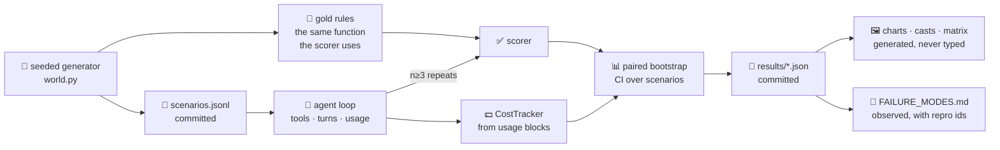
```mermaid
flowchart LR
  S["🎲 seeded generator<br/>world.py"] --> G["📏 gold rules<br/>the same function<br/>the scorer uses"]
  S --> SC["📄 scenarios.jsonl<br/>committed"]
  SC --> L["🤖 agent loop<br/>tools · turns · usage"]
  L -->|"n≥3 repeats"| SCORE["✅ scorer"]
  G --> SCORE
  L --> C["💵 CostTracker<br/>from usage blocks"]
  SCORE --> B["📊 paired bootstrap<br/>CI over scenarios"]
  C --> B
  B --> R["📁 results/*.json<br/>committed"]
  R --> A["🖼️ charts · casts · matrix<br/>generated, never typed"]
  R --> F["🐞 FAILURE_MODES.md<br/>observed, with repro ids"]
```

Ground truth comes from the **same function** the generator used, so scoring is exact
rather than judged. Every asset in every README is regenerated from `results/`, which is
why no chart in this repo can disagree with the eval behind it.

</details>

## Run a real model

```bash
# Real-model eval on a free tier — $0 actual spend
export MISTRAL_API_KEY=...
exception-triage-agent eval --backend mistral --repeats 3

# Or use any OpenAI-compatible endpoint/model
export OPENROUTER_API_KEY=...
exception-triage-agent eval --backend openrouter --model <model-id> --repeats 3
```

One OpenAI-compatible backend covers **Mistral · Groq · Gemini · Cerebras (GLM) ·
DeepSeek · Together · Fireworks**, plus a native `anthropic` backend — so every use
case can be verified on free tiers before anyone spends a dollar, and adding a new
model to the comparison is one flag.

## Cite this

```bibtex
@software{ahamed_awesome_agentic_usecases,
  author  = {Ahamed, Fnu Imran},
  title   = {{Awesome Agentic Use Cases: verified agentic AI use cases
             with evals, measured cost, and observed failure modes}},
  year    = {2026},
  version = {0.1.2},
  doi     = {10.5281/zenodo.21631852},
  url     = {https://doi.org/10.5281/zenodo.21631852}
}
```

Archived on Zenodo: [10.5281/zenodo.21631852](https://doi.org/10.5281/zenodo.21631852) — a concept DOI, so it always
resolves to the newest version. See [CITATION.cff](CITATION.cff). Every result carries its own provenance — the timestamp,
harness version, and the model the provider actually served — and results taken against
floating aliases say so.

## Contributing

```bash
pip install -e harness
aau-new-use-case --industry healthcare --name prior-auth-triage-agent --seed 41
```

That scaffolds a complete use case — seeded world, shared gold function, deterministic mock
with an engineered gap, and the tests that hold the bar in place — then installs it,
generates the scenarios, runs the tests and a mock eval, and only then prints your next
steps. Replace the placeholder domain; the rigor is already installed.

Starting from Studio instead? Download its evaluation brief and run:

```bash
aau forge aau-evaluation-brief.json --name my-workflow-eval
```

Forge preserves the closest verified evaluation contract and produces a runnable,
CI-protected adaptation without claiming that generated domain rules are production truth.
For the three compiled contracts, the graph and scorecard change with the brief; run
`aau forge doctor <generated-lab>` to see the remaining domain and evidence gaps.

New use cases are welcome if they clear the [verification bar](VERIFICATION.md) —
see [CONTRIBUTING.md](CONTRIBUTING.md). Link-list additions aren't a fit; this isn't
a link list.

If this repo saved you an eval harness, a ⭐ helps others find it.

---

<p align="center">Apache-2.0 · built by <a href="https://github.com/immu4989">@immu4989</a> · classic-ML companions: <a href="https://github.com/immu4989/Logistics_UseCases">Logistics_UseCases</a> · <a href="https://github.com/immu4989/retail-workforce-analytics">retail-workforce-analytics</a></p>
