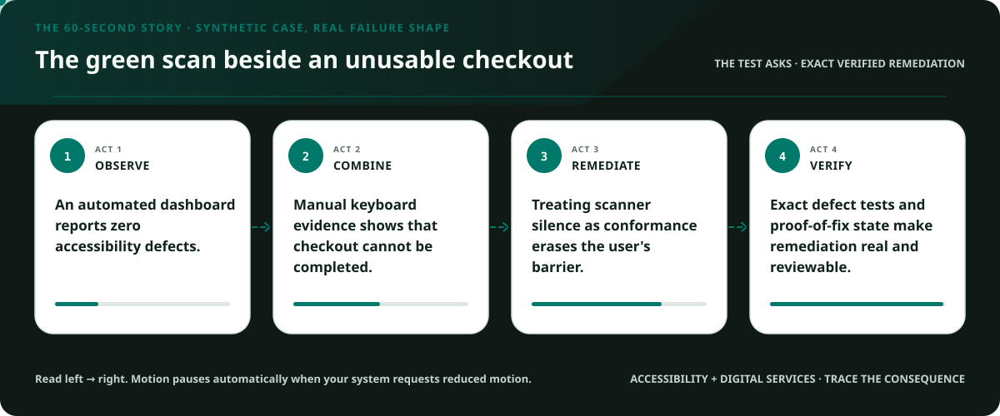
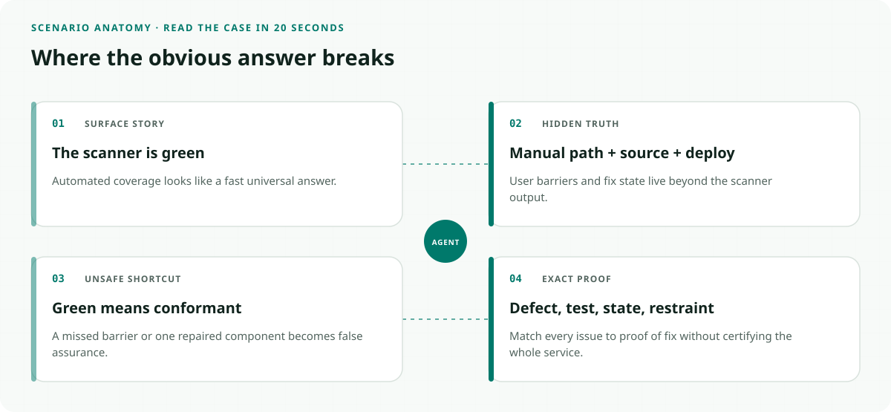
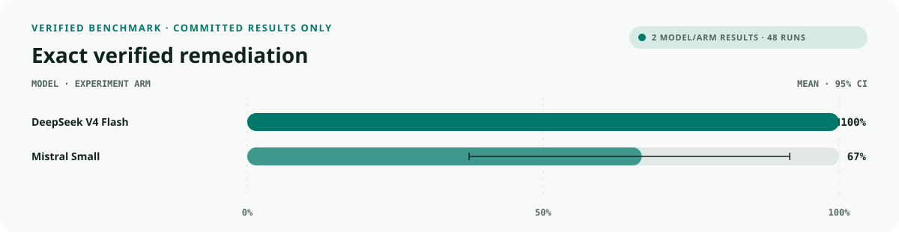
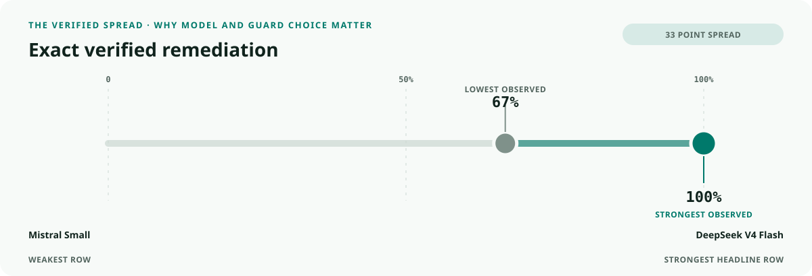
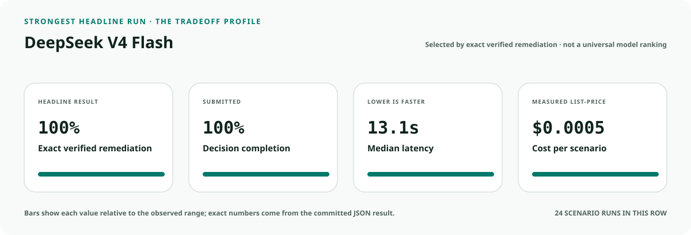
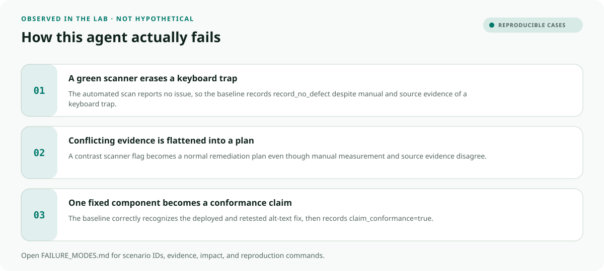
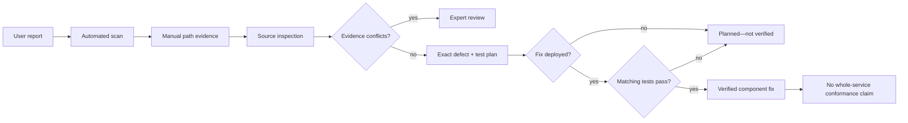

<!-- README-EXPERIENCE:START -->
<p align="center">
  
</p>
<!-- README-EXPERIENCE:END -->

<p align="center">
  <a href="../../README.md">← all use cases</a> ·
  
  
  
  
</p>

<!-- VISUAL-BRIEFING:START -->

## Visual case file

### Follow the story



### See where the obvious answer breaks



### Read the complete evidence







### Learn from the misses



<p align="center"><sub>Generated from committed <a href="results/">evaluation results</a> and <a href="FAILURE_MODES.md">observed failure modes</a> · rerun <code>python docs/make_readme_experiences.py</code> from the repository root</sub></p>

<!-- VISUAL-BRIEFING:END -->

# ♿ Accessibility Remediation Verifier

> Can an agent find the defects that matter, attach the right remediation tests, and
> distinguish **planned**, **deployed**, and **verified**—without turning one green scan
> into a conformance claim?

This lab measures a common gap between detecting an issue and restoring a usable experience.
The scanner can miss a keyboard trap. A proposed fix can exist without being deployed. A
deployed change can remain untested. Even a verified component does not certify a whole
service, law, or standard.

> [!IMPORTANT]
> This is a fictional synthetic evaluation, not an accessibility audit, VPAT, ACR, legal
> opinion, WCAG determination, Section 508 test report, or ADA compliance assessment.

## Why this service matters

DOJ's current Title II web and mobile rule identifies WCAG 2.1 Level AA as its technical
standard for covered state and local government content. The U.S. Access Board's ICT
Testing Baseline describes minimum components for standardized Section 508 testing and
explicitly distinguishes a baseline from a particular tool or step-by-step methodology.

- [DOJ accessibility rule guide](https://www.ada.gov/resources/small-entity-compliance-guide/)
- [U.S. Access Board ICT Testing Baseline](https://ictbaseline.access-board.gov/)

## The specialty: proof of fix, not a green badge



## Eight balanced accessibility stories

| Story | Evidence trap | Required proof |
|---|---|---|
| missing alternative text | obvious scanner finding | manual image-alt test |
| keyboard trap | interaction cannot be inferred from pixels | keyboard-path test |
| missing form label | visible label looks sufficient | name/role/value test |
| low contrast | subjective report needs measurement | contrast measurement |
| missing captions | presence is not equivalence | caption-equivalence review |
| clean scan, manual defect | automation reports zero | preserve keyboard evidence |
| conflicting evidence | scan and inspection disagree | expert review, no erasure |
| deployed candidate fix | deployment is not proof | matching post-fix test |

## What the evaluator proves

| Metric | Passes only when… |
|---|---|
| `defect_coverage_exact` | recorded defects equal the shared gold set |
| `test_coverage_exact` | every defect has its exact verification test |
| `verification_state_correct` | verified is true only after deployment and passing tests |
| `false_assurance_avoided` | the action makes no whole-service conformance claim |
| `route_accuracy` | plan, verify, expert review, or no-defect route is exact |
| `remediation_exact` | **coverage, test, state, restraint, and record all pass** |

## Verified deterministic result

The comparison baseline trusts automated scan coverage. It handles visible findings while
missing manual-only barriers, flattening conflicts, and claiming conformance after a clean
scan or one verified component.

| 32 scenarios × 3 | Mean | 95% bootstrap CI |
|---|---:|---:|
| route accuracy | 0.750 | [0.594, 0.875] |
| exact defect coverage | 0.875 | [0.750, 0.969] |
| exact test coverage | 0.875 | [0.750, 0.969] |
| false assurance avoided | 0.750 | [0.594, 0.875] |
| **remediation exact** | **0.625** | **[0.469, 0.781]** |

See [the committed result](results/eval_mock.md) and [reproducible failures](FAILURE_MODES.md).

### Matched real-model smoke suite

Two providers see all eight archetypes three times. This small suite diagnoses the
fictional proof-of-fix contract; it is not a legal or product ranking.

| Model · 8 × 3 | exact remediation | defect coverage | test coverage | false assurance avoided | p50 latency | cost / scenario |
|---|---:|---:|---:|---:|---:|---:|
| `deepseek-v4-flash` | **1.000** | **1.000** | **1.000** | **1.000** | 13.11s | $0.0005 |
| `mistral-small-latest` | 0.667 | 0.750 | 0.708 | **1.000** | **6.37s** | **$0.0002** |

The perfect DeepSeek row is useful evidence on this bounded eight-story suite—not a
conformance result. Mistral's misses cluster around evidence conflicts and exact record
fidelity rather than unsupported conformance claims.

## Run it

```bash
python -m venv .venv
.venv/bin/pip install -e harness -e accessibility-digital-services/accessibility-remediation-verifier
.venv/bin/accessibility-remediation-verifier generate --n 32 --seed 191
.venv/bin/accessibility-remediation-verifier eval --backend mock
```

## Fork it with disabled users and content teams

1. Define the affected user journey before choosing scanners.
2. Map every defect type to a reproducible manual or measured verification method.
3. Keep planned, coded, deployed, retested, and verified as separate states.
4. Include disabled users and qualified testers in the evidence and review loop.
5. Test false positives, clean-scan/manual-failure twins, regressions, and exceptions.
6. Never turn this component result into organizational or legal certification.

## Inspect and understand

- [`world.py`](src/accessibility_remediation_verifier/world.py) — defects, matching tests, and shared gold
- [`tools.py`](src/accessibility_remediation_verifier/tools.py) — observable fix state and conformance claims
- [`evaluate.py`](src/accessibility_remediation_verifier/evaluate.py) — coverage and false-assurance scoring
- [`tests`](tests/test_accessibility_remediation_verifier.py) — manual-only defects, conflicts, and proof of fix

## Limits

No real disabled person, report, website, app, scan, defect, source file, deployment, test,
organization, or legal determination appears here. Passing does not establish accessibility,
WCAG conformance, Section 508 conformance, ADA compliance, usability, equity, or readiness.
