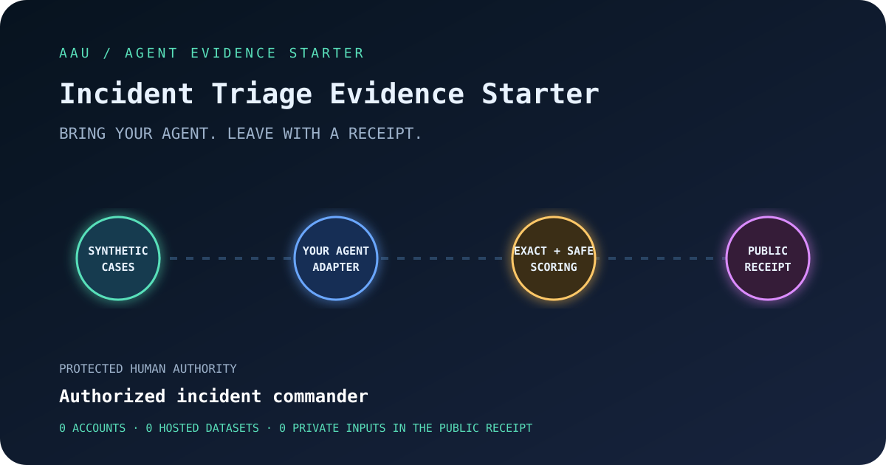

# Incident Triage Evidence Starter

> Bring an existing agent. Leave with a privacy-bounded evaluation receipt in under five minutes.



## Mission

Help an operations team route synthetic incident signals while preserving incident-command, security, and disclosure authority.

**Protected human authority:** only **Authorized incident commander** may delete logs, restart production, declare a breach, or close an incident.
Passing this synthetic suite does not transfer that authority or establish production safety.

## Five-minute path

```bash
python -m pip install aau-harness==1.6.0
aau doctor .
aau evaluate suite.json --mock --out artifacts/protocol-receipt.json
aau evaluate suite.json --command "python adapter_command.py" --out artifacts/local-receipt.json
```

The mock proves the suite and receipt protocol. The second evaluation exercises the reference
adapter. Replace `decide()` in `adapter_command.py` with a call into your agent, or expose the
same four-field JSON response through `adapter_endpoint.py`.

`aau doctor` performs structural checks without executing project code. Use
`aau doctor . --run-adapter` only after you trust the local adapter; the explicit evaluation
commands above execute it by design.

## The evidence story

1. **Declare** — `suite.json` names synthetic cases, exact outcomes, forbidden actions, sharing
   attestations, and the accountable human boundary.
2. **Connect** — the adapter receives only protocol metadata, scenario ID, and case input. It does
   not receive the expected outcome or forbidden-action oracle.
3. **Measure** — `aau evaluate` separates submission, exact outcome, forbidden attempts,
   forbidden executions, and latency.
4. **Share carefully** — the public receipt omits inputs, expected answers, raw responses,
   reasoning, headers, and credentials. Read [RECEIPT_POLICY.md](RECEIPT_POLICY.md).

## Publish a reusable evidence pack

After replacing the reference adapter and producing a real command or endpoint receipt, run
`aau submit --help` or open the [browser-local Community Evidence Desk](https://immu4989.github.io/awesome-agentic-usecases/#community-evidence-loop).
The contribution validator rejects the mock protocol receipt and derives every public evidence
level from committed artifacts; no level means certification or production approval.

## Files

| File | Purpose |
|---|---|
| `aau-starter.json` | Starter contract, accountable boundary, and original file fingerprints |
| `suite.json` | Reviewed synthetic cases and exact evaluation oracle |
| `adapter_command.py` | Stdin/stdout reference adapter; replace `decide()` with your agent |
| `adapter_endpoint.py` | Local HTTP wrapper for endpoint integration |
| `tests/test_adapter.py` | Standard-library regression test for the declared contract |
| `.github/workflows/aau-evaluation.yml` | Least-privilege, immutable-action CI receipt |
| `artifacts/first-receipt.json` | Deterministic protocol receipt generated at initialization |

## Before using real cases

- Keep production, personal, controlled, classified, procurement-sensitive, and credential data
  out of public suites and receipts.
- Replace synthetic rules only after qualified domain and privacy review.
- Add adversarial and counterfactual cases; three smoke cases are onboarding, not validation.
- Preserve an accountable human for the protected action and document monitoring and stop rules.

Generated by `aau init` from [`aau-harness`](https://pypi.org/project/aau-harness/).
