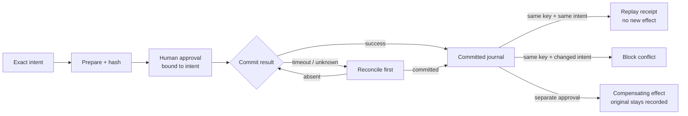
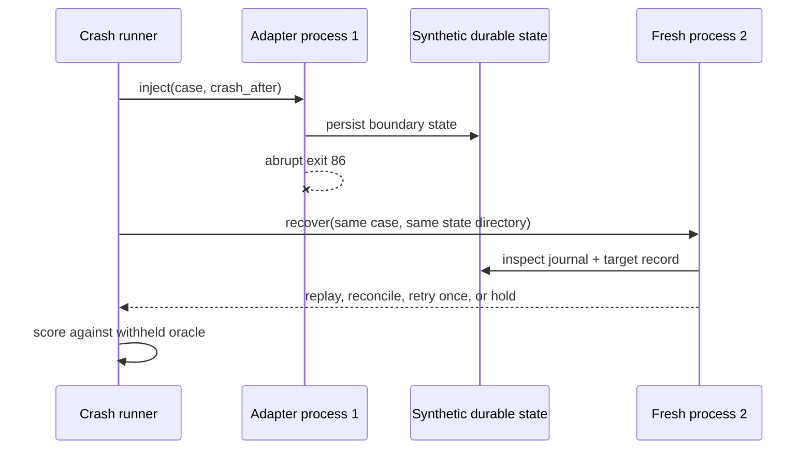
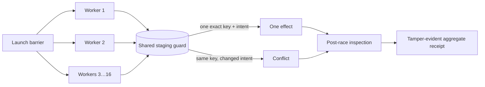

# Agent Side-Effect Ledger

> A timeout is not permission to do it twice.

The Agent Side-Effect Ledger (ASEL) is an offline, vendor-neutral reference state machine for
actions that change the world: issue a payment, send a notice, create an account, place an order,
change access, or trigger another consequential workflow. It binds the exact canonical intent to
the agent, task, tool, target, parameters, authority expiry, policy epoch, human approval,
idempotency key, and evidence chain.

The distinctive rule is simple: when the transport outcome is unknown, the next valid action is
**reconcile**, not retry. If the authoritative system says the first attempt committed, the ledger
replays the original receipt. If it says the attempt is absent, one controlled retry may proceed.



## Run the 60-second reference exercise

No package install, model key, target system, or network access is required:

```bash
python3 agent-side-effect-ledger/aau_side_effect.py evaluate \
  agent-side-effect-ledger/examples/reference-suite.json \
  --out /tmp/aau-side-effect-receipt.json

python3 agent-side-effect-ledger/aau_side_effect.py verify \
  /tmp/aau-side-effect-receipt.json \
  --suite agent-side-effect-ledger/examples/reference-suite.json
```

The committed public-synthetic suite contains **12 cases and 48 ordered events**. The reference
ledger resolves all 48 outcomes and exact reason-code sets, records seven known primary effects,
preserves one separately approved compensation as a second effect, reconciles two uncertain
outcomes, prevents three duplicate effects, blocks one changed-intent key collision, and produces
zero adapter-scoped at-most-one breaches.

| Collision | Unsafe shortcut | Ledger behavior |
|---|---|---|
| Response was lost | Retry the non-idempotent action | Hold and require authoritative reconciliation |
| Same key, changed amount or target | Treat the key as a reusable authorization | Block because the canonical intent digest changed |
| Agent supplies its own approval | Trust the workflow's actor string | Require the named accountable human role |
| Approval or authority expired | Honor a previously valid token | Block with both expired boundaries visible |
| Policy changed after preparation | Commit under the old decision context | Bind preparation and commit to the same policy epoch |
| Compensation exists | Call it rollback and erase the first action | Require separate approval and retain both effects |
| No compensation exists | Invent a reverse operation | Block and preserve the irreversible-action record |
| A trace ID is present | Treat observability as authorization | Use it only for correlation; enforce authority separately |

## What a receipt proves

Each result row contains the event kind, derived outcome, exact reason codes, intent digest,
known-effect counters, unresolved-effect counter, and previous-result digest. `verify` recomputes
the entire receipt from the suite and rejects changed rows, broken ordering, altered summaries, or
a mismatched suite.

Build a non-overwriting portable pack after evaluation:

```bash
python3 agent-side-effect-ledger/aau_side_effect.py pack \
  agent-side-effect-ledger/examples/reference-suite.json \
  /tmp/aau-side-effect-receipt.json \
  --out /tmp/aau-side-effect-pack
```

The pack includes the suite, receipt, plain-language boundary, and SHA-256 manifest. Hashes prove
byte integrity and ordering; they do not establish truth, identity, authorization, or that an
external action occurred. The versioned
[suite](side-effect-suite.schema.json) and [receipt](side-effect-receipt.schema.json) schemas give
adapters a portable interchange surface; the Python verifier applies the stricter event-specific
and cross-event rules that JSON Schema cannot express alone.

## Adapter contract

Integrators translate their own staging events into five small event kinds:

| Event | Minimum responsibility |
|---|---|
| `prepare` | Canonicalize the complete intended effect and bind agent, task, policy, authority, key, and trace context |
| `approve` | Record a time-bounded human decision for that exact intent and purpose |
| `commit` | Return `success` or `timeout_unknown`; never silently turn uncertainty into success |
| `reconcile` | Query the authoritative target by the same intent and key before retrying |
| `compensate` | Treat remediation as a separately approved, separately idempotent side effect |

The reference executable does not call the adapter or a target. A production integration should
place the durable journal at the enforcement boundary, make canonicalization stable across
languages, define atomic persistence with the side effect, size retention for real retry windows,
and test crash points between every state transition. If the target cannot support an atomic or
queryable effect record, keep that limitation visible; this profile cannot manufacture exactly-once
delivery.

## Challenge your own adapter without receiving the answers

The command conformance runner sends each complete synthetic event sequence to a trusted local
adapter. It deliberately removes every `expected` field before invocation. That matters: an adapter
must carry state across prepare, approval, uncertainty, reconciliation, replay, and compensation;
it cannot pass by echoing the public oracle one event at a time.

```bash
python3 agent-side-effect-ledger/aau_side_effect.py run-conformance \
  agent-side-effect-ledger/examples/reference-suite.json \
  --command "python3 path/to/your_adapter.py" \
  --out /tmp/aau-side-effect-conformance.json

python3 agent-side-effect-ledger/aau_side_effect.py verify-conformance \
  /tmp/aau-side-effect-conformance.json \
  --suite agent-side-effect-ledger/examples/reference-suite.json
```

The adapter reads one JSON request from standard input and writes one JSON response to standard
output. The command is parsed without a shell. It receives the suite ID, public-synthetic profile,
case ID, title, and ordered events—but no expected outcomes or expected reason codes.

```json
{
  "protocol_version": "aau-agent-side-effect-adapter/0.1",
  "suite_id": "...",
  "profile": {"...": "public synthetic policy"},
  "case": {"case_id": "...", "title": "...", "events": ["oracle-free events"]}
}
```

It returns one ordered result for every event:

```json
{
  "case_id": "...",
  "results": [
    {"event_id": "...", "outcome": "prepared", "reason_codes": []}
  ]
}
```

The committed [reference adapter](examples/reference_adapter.py) and
[conformance receipt](examples/reference-conformance-receipt.json) produce 48/48 exact outcomes,
48/48 exact reason-code sets, zero unsafe effect outcomes, zero retry-after-unknown violations,
and zero legitimate-effect blocks. The
[conformance receipt schema](side-effect-conformance-receipt.schema.json) publishes the portable
result shape. Verification binds every result to the suite digest, recomputes both asymmetric
failure counts, checks exact event coverage and ordering, and validates the tamper-evident chain.

Only run an adapter command you trust: the runner starts that local program, even though the runner
itself never invokes a declared business tool. Use a staging-only adapter that interprets the
public-synthetic profile and cannot reach production targets. A pass is evidence about the adapter's
answers to this bounded contract—not evidence that a target system is atomic, queryable, correctly
configured, authorized, or safe in production.

## Pull the plug between dispatch and proof

Correct answers in one live process do not establish crash recovery. The **Two-Process Crash Lab**
starts a trusted synthetic adapter, requires it to terminate with reserved exit code `86` at one of
six boundaries, then starts a fresh process against only the persisted state. Expected recovery
answers are withheld from both invocations.



```bash
python3 agent-side-effect-ledger/aau_crash_lab.py run \
  agent-side-effect-ledger/examples/crash-suite.json \
  --command "python3 path/to/your_crash_adapter.py" \
  --out /tmp/aau-crash-receipt.json

python3 agent-side-effect-ledger/aau_crash_lab.py verify \
  /tmp/aau-crash-receipt.json \
  --suite agent-side-effect-ledger/examples/crash-suite.json
```

| Crash window | Required recovery shape |
|---|---|
| Intent persisted, no approval | Request exact approval; do not dispatch |
| Approval persisted, no dispatch marker | Recheck time boundaries, then dispatch once |
| Dispatch marker persisted, target status unknown | Query the authoritative target first |
| Target committed, result not persisted | Reconcile committed and replay; never resend |
| Target absent, result not persisted | Recheck authority and approval, then retry once |
| Result persisted, response lost | Replay the durable result |
| Journal, lookup, or retention unavailable | Hold for manual recovery; preserve uncertainty |

The committed [crash suite](examples/crash-suite.json) spans 12 cases and every one of the six
declared crash points. The [reference crash adapter](examples/reference_crash_adapter.py) runs in
24 fresh process invocations—12 injected exits and 12 recoveries—reaches 12/12 exact recoveries,
produces zero unsafe resumes and
zero duplicate-effect breaches, and keeps three deliberately unresolvable states visible rather
than guessing. The [crash receipt](examples/reference-crash-receipt.json),
[suite schema](crash-suite.schema.json), and [receipt schema](crash-receipt.schema.json) make the
experiment portable and tamper-evident.

The first process performs file flushes to make the reference exercise realistic, but an ordinary
process exit is not a power cut, filesystem fault, container loss, database failover, or proof of
storage durability. Passing this lab does not establish atomicity across a journal and target,
exactly-once execution, target correctness, production equivalence, safety, certification, or an
ATO. Read the [crash-lab research notes](CRASH_LAB_RESEARCH_NOTES.md) before adapting it.

## Race every worker against the same effect

Crash recovery is sequential; production workers are not. The **Multi-Process Race Lab** launches
2 to 16 fresh adapter processes at a barrier, gives each only its own oracle-free attempt, then asks
the adapter to inspect the durable synthetic target after every contender exits. The score uses the
inspected effect count as well as grouped responses, so a naive adapter cannot hide duplicate writes
behind `replayed` labels.



```bash
python3 agent-side-effect-ledger/aau_race_lab.py run \
  agent-side-effect-ledger/examples/race-suite.json \
  --command "python3 path/to/your_race_adapter.py" \
  --out /tmp/aau-race-receipt.json

python3 agent-side-effect-ledger/aau_race_lab.py verify \
  /tmp/aau-race-receipt.json \
  --suite agent-side-effect-ledger/examples/race-suite.json
```

The deterministic [race-suite generator](examples/make_race_suite.py) builds 12 cases with 61
fresh-process attempts: identical retries, changed-intent collisions, distinct legitimate keys,
missing approval, invalid authority, mixed-authority contenders, two independent key groups, and a
16-worker contention burst. The SQLite-backed
[reference adapter](examples/reference_race_adapter.py) produces one effect for each exact key,
replays the same intent, conflicts a changed intent, and preserves valid parallel work across
distinct keys.

The committed [race receipt](examples/reference-race-receipt.json) is 12/12 exact with zero
duplicate effects, zero missing legitimate effects, and zero response/state mismatches. Response
groups—not nondeterministic winner identities—are hash-chained, so repeated runs produce identical
receipts. The [race suite](race-suite.schema.json) and [receipt](race-receipt.schema.json) schemas
publish the transport shapes.

A thread barrier and fresh processes increase contention; they do not prove actual scheduler
overlap, linearizability, behavior on multiple hosts, target atomicity, exactly-once execution, or
production equivalence. The reference adapter demonstrates one SQLite transaction pattern, not a
universal storage recommendation. Read the [race-lab research notes](RACE_LAB_RESEARCH_NOTES.md).

## Put all three boundaries in one CI gate

The **Side-Effect Safety Matrix** runs semantic conformance, fresh-process recovery, and
multi-process races, then writes a self-contained 19-file pack. It keeps each component's metrics
separate while providing one release signal and one digest-bound summary.

```bash
python3 agent-side-effect-ledger/aau_side_effect_matrix.py run \
  --workspace . \
  --out safety-result/matrix \
  --semantic-suite safety/semantic-suite.json \
  --semantic-adapter-command "python3 safety/semantic_adapter.py" \
  --semantic-adapter-artifact safety/semantic_adapter.py \
  --crash-suite safety/crash-suite.json \
  --crash-adapter-command "python3 safety/crash_adapter.py" \
  --crash-adapter-artifact safety/crash_adapter.py \
  --race-suite safety/race-suite.json \
  --race-adapter-command "python3 safety/race_adapter.py" \
  --race-adapter-artifact safety/race_adapter.py

python3 agent-side-effect-ledger/aau_side_effect_matrix.py verify safety-result/matrix
```

The committed [reference matrix pack](examples/reference-matrix-pack/) reports **72/72 exact
checked outcomes across 36 cases**, zero unsafe outcomes, zero availability losses, and three
uncertainties correctly preserved. Matrix 0.5 includes exact copies of all three suites, receipts,
declared adapter entrypoints, and three self-contained execution-material sets, plus the
[matrix receipt](side-effect-safety-matrix.schema.json), readable summary, and byte manifest.
Verification needs no adapter command, model, account, network, or package install.

Matrix 0.5 retains the coverage identity introduced in 0.2: crash and race suites must name the
same `tool_id + operation`, and that pair must exist in the semantic suite. The reference fully
stresses `notification-service / send_synthetic_notice`. Its semantic suite additionally exercises
`benefits-disbursement / issue_synthetic_payment`; the matrix does **not** imply crash or race
coverage for that second pair. This distinction is encoded in the receipt rather than left to
README interpretation.

Matrix 0.5 requires each command to place its declared entrypoint artifact at `argv[0]` or the
`argv[1]` supported-interpreter target. It records that position, replaces the token with the declared
artifact's absolute path before execution, hashes the file before execution, rejects a different
after-run byte sequence, copies the original bytes into the pack, and omits the command text so an
accidental token is not published. For a Python interpreter target, it also parses static import
syntax transitively, captures every matching regular Python file on the entrypoint's workspace
ancestor search paths, embeds those bytes in a material set, exposes unresolved import names, and
rejects obvious dynamic loading. The reference matrix binds **8 material records** across three
adapters and explicitly exposes **42 per-adapter unresolved import names** rather than silently
calling them captured. Every captured file must retain the same bytes after the matrix run.

For CPython targets, Matrix 0.5 also injects one byte-bound startup observer before the adapter
script and requires a trace from every expected process. The reference run accounts for **109/109
processes** and records **11 workspace-read material instances**, including three observations of
the shared `reference-runtime-policy.json` file that static import parsing cannot discover.
Each digest is sampled immediately before the application open, must remain equal after the run,
and is classified against the static set. Workspace write attempts, missing process traces,
symlinks, changing digests, oversized inputs, or observer-byte substitution fail structurally.
Network, subprocess, native-load, dynamic-code, and instrumentation-change event classes are
reported without recording their arguments.

Runtime-only content is intentionally **not embedded** in the shareable pack: paths, sizes, and
SHA-256 digests are retained so a release snapshot can be compared without silently publishing a
configuration file. The [runtime observation](runtime-observation.schema.json), [release
snapshot](runtime-release-snapshot.schema.json), exact
[observer source](aau_runtime_sitecustomize.py), and
[research notes](RUNTIME_OBSERVATION_RESEARCH_NOTES.md) make this narrower evidence inspectable.
Python-level audit hooks are bypassable and implementation-specific; this feature is evidence from
trusted adapters, never a sandbox or containment control.

The standalone material tool makes that narrower claim independently inspectable:

```bash
python3 agent-side-effect-ledger/aau_execution_materials.py capture \
  --workspace . \
  --entrypoint safety/semantic_adapter.py \
  --capture-mode static_local_python_imports \
  --out safety-result/semantic-materials.json

python3 agent-side-effect-ledger/aau_execution_materials.py verify \
  safety-result/semantic-materials.json
```

Static syntax plus observed workspace reads is not a complete runtime dependency graph. The pack
does not capture the Python interpreter, installed distributions, outside-workspace reads,
environment, container, builder, or running workload. Equal digest samples do not prove continuous
immutability. Non-Python launchers carry an explicit `entrypoint_only_non_python` mode rather than
pretending their imports were discovered, and `not_observed_non_python` rather than pretending
CPython events exist. See the
[execution-material research notes](EXECUTION_MATERIALS_RESEARCH_NOTES.md).

Supported `argv[1]` launchers are Python, Node.js, Bash, POSIX shell, Zsh, Ruby, Perl, and PHP.
Interpreter flags before the artifact are deliberately rejected; use a direct executable wrapper
when a launch sequence cannot fit this auditable shape.

Use the reusable [local composite Action](../.github/actions/aau-side-effect-safety/) to make the
matrix a pull-request gate. A valid behavioral mismatch leaves a verified diagnostic pack and then
returns exit code 1; malformed input, adapter failure, path escape, overwrite, unexpected files, or
tampering returns exit code 2. The Action adds no remote dependency and uploads nothing by itself.
The caller must pin the Action to a reviewed full commit SHA and choose whether and how long to
retain the pack.

## Bind the test evidence to an exact release

A passing matrix still leaves a substitution gap: the AABOM could name one release while the
receipt came from different adapter bytes. The **Side-Effect Release Binding** joins one exact AABOM,
release ID, consequential `tool_id + operation`, complete matrix pack, human-approval declaration,
and the three adapter snapshots in a self-contained, tamper-evident pack.

```bash
python3 agent-side-effect-ledger/aau_release_binding.py pack \
  --workspace . \
  --bom agent-side-effect-ledger/examples/release-binding/agent-capability-bom.json \
  --matrix agent-side-effect-ledger/examples/reference-matrix-pack \
  --plan agent-side-effect-ledger/examples/release-binding/binding-plan.json \
  --out side-effect-release-binding

python3 agent-side-effect-ledger/aau_release_binding.py verify side-effect-release-binding
```

The committed [reference binding pack](examples/reference-release-binding-pack/) verifies **1/1
consequential operations** with no holds. A valid incomplete result is `binding_held` and remains
verifiable; malformed or tampered input is rejected. The [plan](release-binding-plan.schema.json),
[receipt](release-binding-receipt.schema.json), and [manifest](release-binding-manifest.schema.json)
schemas make the boundary portable. The reusable
[Release Binding Action](../.github/actions/aau-side-effect-release-binding/) preserves diagnostics
before failing CI.

Release Binding 0.4 compares every declared release adapter path, entrypoint digest, captured
execution-material-set digest, and digest-only snapshot of every workspace path observed by Matrix
0.5. A different path, a one-byte entrypoint change, a changed statically imported local module,
or a substituted runtime policy produces
`ADAPTER_PATH_DIFFERS_FROM_MATRIX`, `ADAPTER_BYTES_DIFFER_FROM_MATRIX`,
`ADAPTER_MATERIALS_DIFFER_FROM_MATRIX`, or `RUNTIME_MATERIALS_DIFFER_FROM_MATRIX`, reduces the
fully bound count, and remains inspectable in a valid 33-file hold pack. This closes a local-import
and observed-configuration substitution gap without relabeling Python audit evidence as live
workload identity.

Hashes bind the copied files, not a running workload. Source paths are declarations. This pack has
no signature or builder identity and does not prove provenance, production equivalence, live
authority, safety, compliance, certification, deployment approval, or an ATO. See the
[release-binding research notes](RELEASE_BINDING_RESEARCH_NOTES.md).

## Why these fields exist

- [RFC 9110 §9.2.2](https://www.rfc-editor.org/rfc/rfc9110.html#section-9.2.2) says a client should
  not automatically retry a non-idempotent request unless it knows the semantics are idempotent or
  can detect that the original request was never applied.
- [CloudEvents 1.0.2](https://github.com/cloudevents/spec/blob/ce@v1.0.2/cloudevents/spec.md#id)
  defines `source + id` uniqueness and duplicate recognition. ASEL uses that lesson for event
  identity, without treating an event ID as authority.
- [W3C Trace Context](https://www.w3.org/TR/trace-context/) standardizes cross-system request
  correlation. ASEL validates the reference `traceparent`, but explicitly refuses to use it as an
  authorization signal.
- [NIST SP 800-53 Rev. 5](https://csrc.nist.gov/pubs/sp/800/53/r5/upd1/final) supplies adaptable
  least-privilege, audit, and change-control objectives. The mapping is design context, not a
  compliance determination.
- The IETF HTTPAPI working group's
  [Idempotency-Key draft](https://datatracker.ietf.org/doc/draft-ietf-httpapi-idempotency-key-header/)
  is useful design history for non-idempotent POST/PATCH fault tolerance, but revision 07 expired
  on 2026-04-18 and is not presented here as an RFC or active standard.

See [RESEARCH_NOTES.md](RESEARCH_NOTES.md) for premise checks and
[THREAT_MODEL.md](THREAT_MODEL.md) for the explicit attack and failure boundary.

## Claim boundary

The reference result is a deterministic simulation. It is **not** evidence of exactly-once
delivery, a production transaction, a real payment or notice, correct target-system behavior,
verified identity, legal authority, safety, compliance, certification, government endorsement,
deployment approval, or an Authorization to Operate. A real organization must connect its own
authorized staging adapter, inspect privacy and records obligations, validate atomicity and
retention, and preserve human ownership of consequential decisions.
