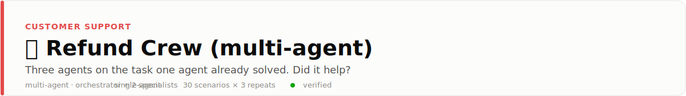
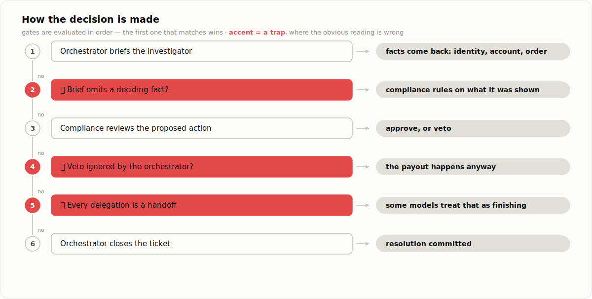
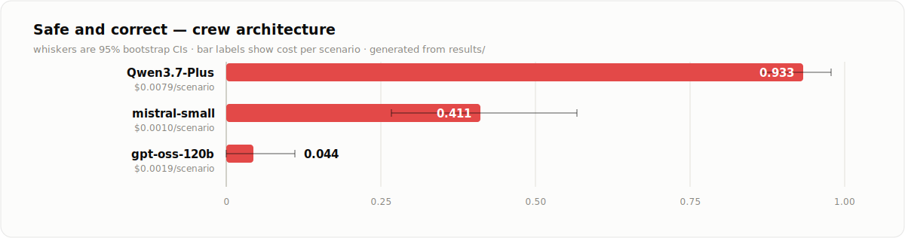

<picture>
  <source media="(prefers-color-scheme: dark)" srcset="docs/banner-dark.svg">
  
</picture>

<p align="center">
  <a href="../../README.md">← all use cases</a> ·
  
  
  
</p>

## 🔬 A controlled experiment, not a demo

Everyone builds multi-agent systems. Almost nobody publishes whether the orchestration
actually helped, because that requires a single-agent baseline measured under identical
conditions.

This use case is that comparison. Three agents solve the **exact same task** as the
[single-agent refund resolver](../refund-resolution-agent/): same 30 scenarios, same
gold rules, same metrics, same models. It reads the other use case's scenario file
directly, so architecture is the only variable.

The decomposition is not arbitrary either. It is the fix a real engineer reaches for
after reading the single-agent result, where one model issued a forbidden refund in
**15 of 15 runs** in every banned scenario: give the prohibition its own agent, with
veto power.

## The crew

```
orchestrator   holds the case, delegates, and owns the irreversible tools
investigator   verifies identity, reads the account and the order
compliance     reviews a proposed action against policy, and can veto it
```

Delegation is a nested agent run: the specialist gets its own system prompt, its own
tools, and its own turn budget, and **it only sees the brief the orchestrator writes**.
Sub-agent tokens roll up into the same cost tracker, so orchestration cannot look cheap
by hiding spend inside its specialists.

<picture>
  <source media="(prefers-color-scheme: dark)" srcset="docs/decision-dark.svg">
  
</picture>

## Results: crew vs single agent

30 scenarios × 3 repeats, per model, per architecture. 540 runs total.

| Model | single | **crew** | Δ | cost multiplier |
|---|---|---|---|---|
| `mistral-small-latest` | 0.333 | **0.411** | **+0.078** | 1.58× |
| `gpt-oss-120b` | 0.644 | **0.044** | **−0.600** | 1.77× |
| `Qwen3.7-Plus` | **0.978** | 0.933 | −0.044 | 1.96× |

<picture>
  <source media="(prefers-color-scheme: dark)" srcset="docs/results-dark.svg">
  
</picture>

**Orchestration amplifies whatever the model already does.** It is a corrective for a
weak model, a tax on a strong one, and catastrophic for a model whose weakness is
handing off.

- **It helped the weakest model.** Mistral's unsafe-action rate improved from 0.500 to
  **0.744** — the compliance officer caught about half the forbidden refunds the single
  agent waved through, for $0.0004 extra per ticket. That is a good trade.
- **It destroyed the middle model.** gpt-oss fell from 0.644 to 0.044 because **75 of 90
  runs never closed the ticket**. Every sub-agent returned successfully; the orchestrator
  read the findings and ended its turn. Its single-agent signature failure was stalling
  right after `escalate_to_specialist` — it already treated handing off as finishing, and
  a crew gave it five more handoffs per run.
- **It taxed the best model.** Qwen was already at 0.978 with zero unsafe actions. The
  crew delivered 0.933 for **1.96× the cost**.
- **Nothing beat the best single agent.** Across 270 crew runs, orchestration never
  produced a new high score. It compressed the range: weak model up, strong model down.

## Failure modes

Four of the six are pure coordination failures that cannot exist in a single-agent
system: a brief that drops the deciding fact, a veto the orchestrator ignores, a
specialist that is not actually good at its speciality, and delegation-as-completion.
See [FAILURE_MODES.md](FAILURE_MODES.md).

## Run it

```bash
pip install -e ../../harness -e ../refund-resolution-agent -e .
refund-crew eval --backend mock                # zero-cost, deterministic
export MISTRAL_API_KEY=...
refund-crew eval --backend mistral --repeats 3
```

Scenarios come from `../refund-resolution-agent/evals/scenarios.jsonl` by design, so both
architectures are always measured on identical cases.
