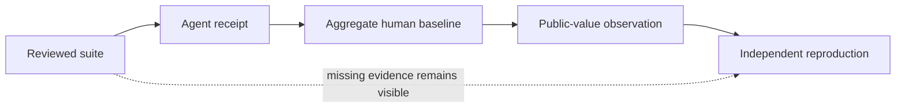

# AAU Evidence Commons

> From a synthetic score to a public, inspectable evidence chain—without a trust score.

The Evidence Commons links five things that are usually published separately: a reviewed task
set, an aggregate agent result, a privacy-bounded human comparator, a bounded public-value
observation, and an independent reproduction. Every file is hash-bound. Every missing layer stays
visible.

**[Open the live Evidence Commons](https://immu4989.github.io/awesome-agentic-usecases/#evidence-commons)**



## Three open partner pilots

| Capsule | Existing public evidence | First visible gap | Protected human authority |
|---|---|---|---|
| [FOIA routing](capsules/foia-routing-impact-pilot.json) | Eight synthetic scenarios and 24 model observations | Fresh hash-bound rerun, then an approved aggregate comparator | Disclosure, exemption, fee, expedition, and appeal decisions |
| [Accessibility remediation](capsules/accessibility-remediation-impact-pilot.json) | Eight synthetic defects and 24 model observations | Fresh hash-bound rerun, then disabled-user and expert context | Conformance, defect acceptance, and release approval |
| [Grant obligations](capsules/grant-obligation-impact-pilot.json) | Eight synthetic awards and 24 model observations | Fresh hash-bound rerun; the decision-gate metric is 0.75 | Allowability, payment, remedy, enforcement, and award decisions |

The historical model receipts predate the current 32-case suites and do not contain suite hashes.
The Commons therefore preserves eight scenario-ID snapshots and labels the binding
`scenario_ids_only`. It does **not** imply that the historical evaluated bytes were identical.

## Run the contract

```bash
python -m pip install aau-harness==1.5.0

aau evidence validate evidence-commons/capsules/foia-routing-impact-pilot.json
aau evidence compare evidence-commons/capsules/foia-routing-impact-pilot.json
aau evidence pack evidence-commons/capsules/foia-routing-impact-pilot.json \
  --out /tmp/foia-impact-pack
aau evidence verify /tmp/foia-impact-pack
```

The pack contains the capsule, a derived comparison, the referenced public artifacts, a README,
and a SHA-256 manifest. The manifest proves byte integrity only.

## Status is derived

| Status | Minimum public artifact state |
|---|---|
| `synthetic_reference` | Reviewed scenario artifact and aggregate agent result |
| `partner_sought` | The synthetic reference plus an open, bounded partner call |
| `study_reviewed` | A valid, suite-bound blinded protocol; institutional determination still required before observing people |
| `aggregate_published` | Aggregate report containing at least one observed human session |
| `independently_reproduced` | The aggregate evidence plus a public reproduction record with independence attested |

AAU does not verify the identity of contributors, the adequacy of institutional review, or the
independence of a reproducer. Those limits remain explicit in every status.

## Contracts

- [Impact Capsule schema](impact-capsule.schema.json)
- [Public-value observation schema](public-value-observation.schema.json)
- [Independent reproduction schema](reproduction.schema.json)
- [Partner guide](PARTNER_GUIDE.md)
- [Research and boundary notes](RESEARCH_NOTES.md)

## Privacy boundary

The Commons accepts public synthetic artifacts and aggregate reports only. Do not commit names,
emails, demographics, participant-level responses, production case records, credentials,
controlled information, dialogue logs, worker rankings, or employment decisions. A pattern scan
is a narrow safeguard; authorized human review remains required.

**Boundary:** The Commons is not a certification program, audit, human-subjects determination,
causal inference engine, vendor ranking, government endorsement, or deployment authority.
