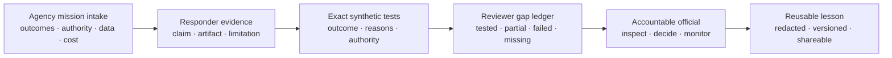

# Federal Pilot Kit v0.3

The **AAU Federal Pilot Kit** is an open, forkable evidence exchange for public-sector AI
pilots. An agency describes a mission and measurable gates, a responder binds each claim to
inspectable evidence and synthetic test results, and a reviewer recomputes the gaps without
ranking vendors or making an award recommendation.

**[Open the browser-local Pilot Desk](https://immu4989.github.io/awesome-agentic-usecases/#federal-pilot)**
or run the complete reference exchange locally in under a minute.

Version 0.3 adds the **Trust & Pilot Readiness layer**: a 30-day agency launch pack, explicit
threat model, hostile-input limits and tests, immutable CI dependencies, and deterministic
release bundles with SPDX inventory, checksums, and GitHub attestations.

> Independent evidence aid. This is not an official U.S. Government standard, solicitation,
> contract clause, endorsement, certification, Authority to Operate, compliance finding,
> source-selection decision, award recommendation, or legal conclusion. Accountable officials
> retain every acquisition, mission, operational, rights, safety, security, privacy, and
> risk-acceptance decision.

## The new handoff



Every layer remains separate. A polished claim is not evidence. Evidence is not a passing test.
A passing synthetic test is not deployment proof. None of those artifacts is an award decision.

## What ships

- [`agency-intake.schema.json`](agency-intake.schema.json) — mission outcomes, measurable
  requirements, protected authority, data boundaries, cost scenarios, exit, and monitoring.
- [`vendor-evidence-response.schema.json`](vendor-evidence-response.schema.json) — one claim per
  requirement, evidence references, disclosed limitations, exact test outputs, price, and terms.
- [`acceptance-test-manifest.schema.json`](acceptance-test-manifest.schema.json) — public or
  synthetic cases with exact outcomes, reason codes, human owners, and non-ranking scoring.
- [`aau_pilot.py`](aau_pilot.py) — dependency-free validation, assessment, packaging, semantic
  diff, and SHA-256 verification with bounded JSON parsing and safe-path checks. It makes no
  network calls.
- [`acquisition-review-prompts.json`](acquisition-review-prompts.json) — source-linked review
  questions, explicitly not boilerplate clauses or legal advice.
- Three complete reference exchanges: [benefits correspondence](examples/benefits-correspondence/),
  [FOIA and records routing](examples/foia-records-routing/), and
  [grant and invoice review](examples/grant-invoice-review/).
- [Federal Pilot Desk](https://immu4989.github.io/awesome-agentic-usecases/#federal-pilot) — a
  browser-local, zero-upload inspector for the same artifacts.
- [30-Day Agency Pilot Launch Pack](pilot-launch/) — executive brief, decision rights, security
  and privacy intake, weekly evidence plan, success gates, acquisition review, feedback, and an
  exit rehearsal.
- [`THREAT_MODEL.md`](THREAT_MODEL.md) — assets, trust boundaries, abuse cases, controls,
  residual risks, and machine-tested invariants.
- [`tools/build_release.py`](tools/build_release.py) and [`verify_release.py`](verify_release.py)
  — deterministic ZIP, exact release manifest, SPDX 2.3 SBOM, SHA-256 checks, archive-safety
  verification, and a workflow that adds build and SBOM attestations.

## Run the reference pilot

```bash
python federal-pilot-kit/aau_pilot.py assess \
  federal-pilot-kit/examples/benefits-correspondence/agency-intake.json \
  federal-pilot-kit/examples/benefits-correspondence/vendor-response.json \
  federal-pilot-kit/examples/benefits-correspondence/acceptance-tests.json
```

The benefits example deliberately preserves one visible accessibility gap. That demonstrates
the contract: the tool does not turn an incomplete packet into a badge.

Build and verify an 11-file exchange:

```bash
python federal-pilot-kit/aau_pilot.py pack \
  federal-pilot-kit/examples/benefits-correspondence/agency-intake.json \
  federal-pilot-kit/examples/benefits-correspondence/vendor-response.json \
  federal-pilot-kit/examples/benefits-correspondence/acceptance-tests.json \
  --out /tmp/aau-federal-pilot

python federal-pilot-kit/aau_pilot.py verify-pack /tmp/aau-federal-pilot
```

The manifest detects byte changes. It does not prove authorship, evidence quality, independent
reproduction, compliance, security authorization, or government approval.

Validate artifacts independently:

```bash
python federal-pilot-kit/aau_pilot.py validate agency path/to/agency-intake.json
python federal-pilot-kit/aau_pilot.py validate vendor path/to/vendor-response.json
python federal-pilot-kit/aau_pilot.py validate tests path/to/acceptance-tests.json
python federal-pilot-kit/aau_pilot.py diff old-response.json new-response.json
```

## Verify the software you run

Tagged releases contain a ZIP, an external SPDX 2.3 SBOM, and `SHA256SUMS`. The release workflow
attests the build provenance and the archive-to-SBOM binding. After downloading all release
assets, run:

```bash
python verify_release.py .
gh attestation verify aau-federal-pilot-kit-v0.3.0.zip \
  --repo immu4989/awesome-agentic-usecases
```

See the full [release verification procedure](RELEASE_VERIFICATION.md). Local verification proves
the shipped byte set and inventory; the GitHub check proves workflow provenance. Neither proves
that a mission should use the software.

## Fork it for a real mission

1. Complete the [30-Day Agency Pilot Launch Pack](pilot-launch/) with the authorized agency roles.
2. Copy the nearest reference directory and change its `pilot_id` everywhere.
3. Replace the mission with measurable outcomes and name every protected human decision.
4. Define public or synthetic intended-environment cases before collecting responder outputs.
5. Keep an independent reviewer’s test data unavailable to the responding system team where
   appropriate and authorized.
6. Require one response for every requirement, with limitations and declared evidence.
7. Run `assess`; investigate every visible gap and every mismatched exact field.
8. Use `pack` for an inspectable handoff and complete the lessons-learned record after each phase.
9. Rehearse exit and rollback before the Day-30 human decision.
10. Keep protected, procurement-sensitive, controlled, classified, and personal information in
   approved systems—not this public repository or website.

Use the [Federal Mission Assurance Profile](../federal-mission-assurance/) first when the mission,
impact, oversight, testing, and monitoring boundaries are not yet defined. The Pilot Kit begins
where that profile ends: it creates a reproducible agency → responder → reviewer exchange.

## Evidence states

| State | Meaning |
|---|---|
| `tested` | A supported claim has declared evidence and every linked submitted synthetic result matches the exact oracle. |
| `tested_with_failures` | Evidence exists, but at least one linked submitted result fails an exact field. |
| `evidenced_not_tested` | Evidence is referenced, but this manifest links no executed case to the requirement. |
| `partial` | The responder explicitly discloses partial support or an open limitation. |
| `unsupported` | The responder says the requirement is not supported. |
| `claimed_without_evidence` | A support claim has no usable declared evidence reference. |

There is no aggregate vendor score. The tool reports exact case counts and requirement states so
reviewers can inspect unlike risks without hiding a critical miss inside an average.

## Security and privacy boundary

The public examples use synthetic or public information. The CLI is dependency-free and makes no
network request. The browser desk processes files only in the tab, sends no telemetry, uses no
storage, and blocks common secret, PII, and non-public-data signals before exporting an assessment.
That narrow scan is a backstop—not a data-loss-prevention system.

Both parsers enforce byte and structure limits. Pack and release verification reject path escapes,
symbolic links, duplicate or unexpected files, digest/size mismatches, unsafe ZIP entries, and
manifest/SBOM drift. Repository workflows use immutable Action commit SHAs, explicit permissions,
CodeQL, dependency review, Scorecard, and reviewed Dependabot updates. Read the
[threat model](THREAT_MODEL.md) for residual risks and deployment responsibilities.

For feedback, use the repository’s **Propose a Federal Pilot** issue form with public or synthetic
details only. Do not post proposal contents, source-selection information, credentials, personal
records, controlled information, or classified information.
