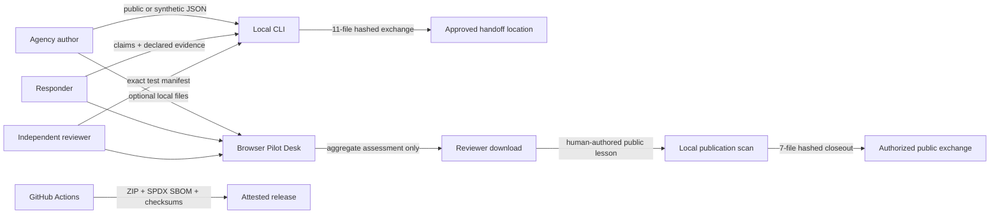

# Federal Pilot Kit threat model

Status: maintained for the public `v0.4` kit. Review after a trust boundary, parser, workflow,
release process, or data-handling promise changes.

> This model describes the open-source kit, not an agency deployment. It is not a FISMA
> assessment, FedRAMP authorization, Authority to Operate, compliance finding, or substitute
> for an agency system security plan and privacy review.

## System, data flow, and scope

Protect the integrity of requirements, oracles, evidence references,
authority boundaries, gap states, release files, and source provenance; the confidentiality of
any local input; and reviewers' ability to distinguish a claim from evidence, a passing
synthetic case from deployment proof, and repository output from an official decision.

## Trust boundaries and assumptions

| Boundary | Assumption | Required deployment decision |
|---|---|---|
| Public repository → local machine | Repository contents are untrusted until reviewed and verified. | Use a disposable environment; verify a tagged release and its attestation. |
| Local files → CLI or browser | Inputs may be malformed or hostile. | Use only public or synthetic content in this public kit. Apply agency controls before handling other data. |
| Responder → reviewer | Claims, evidence labels, prices, and submitted results may be incomplete or adversarial. | Independently reproduce important evidence and protect holdout tests. |
| Browser tab → downloaded assessment | The assessment is derived output, not an approval record. | Move it only through an approved records and access-control process. |
| Closeout source → public lesson | A scanner cannot determine disclosure, classification, procurement sensitivity, or records obligations. | Require authorized human redaction and publication review; publish only public or synthetic evidence. |
| GitHub-hosted workflow → release | Workflow dependencies and permissions affect provenance. | Inspect pinned actions and verify GitHub attestations against this repository. |

The browser desk intentionally has no backend, account, analytics, remote model call, or browser
storage. Its one `fetch` loads a repository-owned public fixture. The CLI makes no network call.
Those properties reduce exposure but do not turn a browser or workstation into an approved
environment.

## Abuse cases and controls

| Threat | Consequence | Repository control | Residual risk / owner |
|---|---|---|---|
| Oversized or deeply nested JSON | Resource exhaustion or an unresponsive review tool | CLI byte, depth, node, and string limits; browser byte and structure limits; hostile-input tests | Agency must set stricter platform limits for its environment. |
| Path traversal or symbolic-link substitution | Reading or blessing a file outside the exchange | Fixed pack allowlist, safe relative references, symlink rejection, ZIP path checks | Reviewer must protect the handoff directory and extraction process. |
| Manifest tampering or duplicate entries | False integrity receipt | Exact file set, unique paths, SHA-256 and byte-count verification | Hashes prove bytes, not authorship or truth. Verify release attestation separately. |
| Result or requirement ID injection | An omitted or fabricated gate disappears in aggregation | Unique IDs, exact cross-document set equality, no average vendor score | Independent reviewer still decides whether test coverage is sufficient. |
| HTML/script content in uploaded JSON | Stored or reflected script execution | DOM construction uses `textContent`/`replaceChildren`; no uploaded value is assigned to `innerHTML` | Browser extensions and compromised origins remain outside this control. |
| Secret, PII, controlled-data, or procurement-data submission | Disclosure through a public issue, fork, or exported file | Public/synthetic-only contract, narrow local scan, blocked assessment export, issue warnings | The scan is not DLP. Users and agency data owners retain responsibility. |
| Scanner receipt repeats a suspected sensitive value | The safety tool causes a second disclosure | CLI receipts emit a finding code, JSON field path, and short digest only; browser receipts emit labels only | Field paths can still reveal document structure; handle receipts through an approved process. |
| One lesson is reused as universal guidance | A bounded result is applied in the wrong mission, policy, data, or authority context | Required prerequisites, limitations, non-transfer conditions, policy dependencies, review dates, and transfer test | Accountable domain and acquisition owners must validate every reuse. |
| Failed or discontinued pilot is hidden | Other teams repeat a known unsafe design | `stopped` is a first-class lesson outcome; the reference exchange publishes an exact protected-action stop | Real sharing still depends on authorization and safe redaction. |
| Poisoned workflow dependency | Release or CI compromise | Every Action is commit-SHA pinned; Dependabot proposes reviewed updates; least-privilege permissions | GitHub and action maintainers remain upstream dependencies. |
| Forged or replayed release | Consumer runs untrusted bytes | Deterministic ZIP, SPDX SBOM, SHA256SUMS, GitHub build and SBOM attestations, local verifier | Consumers must bind verification to this repository and intended tag/revision. |
| Passing synthetic cases treated as authorization | Unsafe automation or procurement decision | Non-ranking/non-certifying claims are machine-checked and repeated in every artifact | Accountable officials must enforce operational and acquisition authority. |

## Security invariants

- The kit never ranks vendors, recommends an award, certifies compliance, issues an ATO, or
  accepts risk.
- A critical requirement with any linked exact-test failure remains a visible critical gap.
- A release manifest and SPDX inventory cover the exact shipped payload.
- A pack or release verifier rejects unexpected files, duplicates, path escapes, symlinks, and
  byte mismatches.
- Uploaded browser values are rendered as text, never executable markup.
- A public lesson must pass structural checks, explicit negative sharing attestations, and the
  narrow scanner before the CLI packages it; this never substitutes for human release authority.
- Lesson closeouts omit source exchange documents, retain their canonical digests, and preserve
  non-ranking, non-award, non-certification, and non-universal claims in the manifest.
- Workflow credentials are not persisted by checkout, and jobs receive only stated permissions.

CI tests these invariants in `federal-pilot-kit/tests/`, `docs/check_federal_pilot.py`, the
CodeQL workflow, dependency review, and OpenSSF Scorecard. Report a suspected weakness through
the repository's [private security-advisory route](../SECURITY.md).

## Out of scope

Production hosting, identity and access management, agency records schedules, privacy impact
assessments, classified or controlled environments, vendor background checks, independent
penetration testing, model training, and deployment authorization are intentionally outside this
public kit. Forks must document their own architecture, data flows, owners, controls, and residual
risks.
