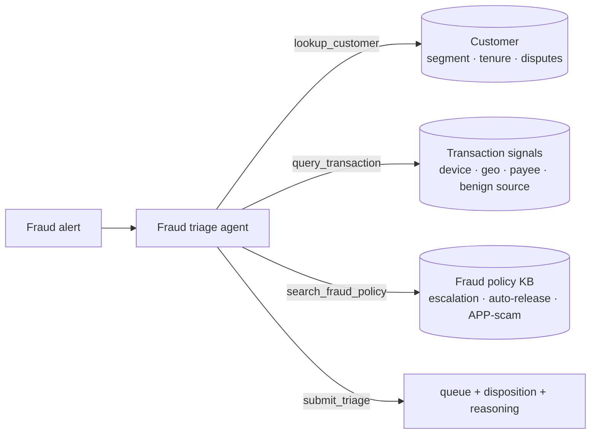

# 🚩 Fraud Alert Triage Agent

`investigate` `decide` · `single-agent` · Financial Services & Fraud

## Problem

A transaction-fraud alert fires. Someone has to assign it to the right queue (card-fraud,
account-takeover, app-scam, false-positive) and the right disposition (allow, hold for
review, block and notify, or escalate to the fraud team now) — and fraud alerts deceive
in **both directions**. A foreign charge on a new device looks like a stolen card, but
the customer filed a travel notice that matches. An authorized push payment rides the
customer's own device and login — every classic fraud signal absent — yet it's a scam
they were tricked into approving. This agent verifies against the customer record, the
transaction signals, and fraud policy before committing.

## Architecture

One agent, four tools, pluggable model backend (CI runs the deterministic mock at $0):



Two deceptions in opposite directions, plus a compound clause:

- **Looks like fraud, isn't:** a travel notice on file explains the foreign charge — it's
  a false positive. Trusting the alert's "foreign + new device" framing gets it wrong.
- **Looks fine, is fraud:** an APP scam is authorized by the customer, so device, login,
  and velocity are all normal. The only signal is a freshly added mule beneficiary.
  Clearing it because the device is trusted gets it wrong.
- **Compound clause:** benign activity auto-releases — *unless* the customer is
  private-banking or the amount is above the regulatory review threshold, which are held
  for manual review even when benign. All three rules live in the policy KB, not the prompt.

## Results

30 scenarios × 3 repeats per model. Free-tier rows cost $0 to reproduce.

| Model | queue acc | disposition acc | exact match | submitted | $/scenario | p50 latency |
|---|---|---|---|---|---|---|
| `kimi-k2p6` (Fireworks) | 0.889 | **0.867** | **0.844** | 0.978 | $0.0090 | 19.0s |
| `gpt-oss-120b` (Fireworks) | 0.789 | 0.700 | 0.600 | 0.911 | $0.0013 | 10.5s |
| `mistral-small-latest` (free tier) | **0.967** | 0.500 | 0.500 | 1.000 | $0.0004 | 6.0s |
| `mock` (pipeline check, CI) | 0.800 | 0.800 | 0.800 | 1.000 | $0 | — |

Three findings, none of which a single accuracy number would show:

- **Every model is biased toward "it's fraud."** All eight of kimi's queue misses are
  *benign* transactions filed as fraud; gpt-oss makes the same error nine times. No model
  in this repo ever mistook fraud for benign at the queue level — the error is entirely
  one-directional, and in production every instance is a legitimate customer blocked.
- **The two weaker models fail on opposite deceptions.** `gpt-oss-120b` trusts the alert
  framing and files travel-notice charges as card fraud; `mistral-small` clears the
  authorized-but-fraudulent APP scams that gpt-oss catches.
- **Best router ≠ best agent.** Mistral routes almost perfectly (queue **0.967**, better
  than kimi) but gets the disposition right only half the time — it softens
  `block_and_notify` on confirmed fraud into the gentler `hold_for_review` 22 times.
  Queue accuracy completely hides it.

## Failure modes

See [FAILURE_MODES.md](FAILURE_MODES.md). Each entry has a reproducing scenario id.

## Run it

```bash
pip install -e ../../harness -e .
fraud-alert-triage-agent eval --backend mock        # zero-cost, deterministic
export MISTRAL_API_KEY=...
fraud-alert-triage-agent eval --backend mistral --repeats 3
```

Regenerate scenarios (seeded, committed): `fraud-alert-triage-agent generate --n 30 --seed 17`
