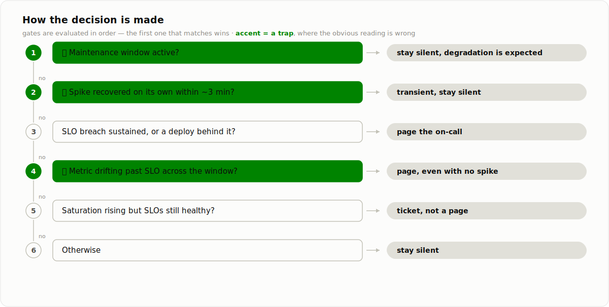
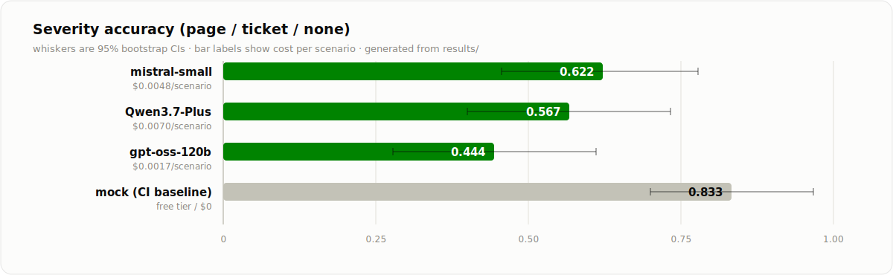

<picture>
  <source media="(prefers-color-scheme: dark)" srcset="docs/banner-dark.svg">
  
</picture>

<p align="center">
  <a href="../../README.md">← all use cases</a> ·
  
  
  
  
</p>

## ⏱️ This one can't see the future

Every other agent in this repo gets a complete case file and answers it. This one gets a
clock. Telemetry arrives one minute at a time, `next_tick` is the only way forward, and
there is no way to look ahead.

So to find out whether a spike is a real regression or a blip that heals itself, the
agent has to **spend a tick waiting**. Deciding early means deciding on less. That turns
patience from a virtue into a cost, and makes alert fatigue something you can measure
instead of something you complain about.

The trap that follows: two archetypes are *identical* at the moment the metrics go bad.
A deploy regression and an upstream blip both open with the same error spike. One is
sustained with a deploy behind it, the other is back under the SLO three minutes later.
And the slow burn never spikes at all — latency drifts past the SLO across twenty
minutes with no single alarming sample.

## Problem

You are on watch for one service. Error rate, p99 latency, saturation and request rate
stream in per minute. At some point you have to commit: page the on-call engineer, file
a ticket for working hours, or stay silent. Waking someone at 3am for a transient has a
real cost. So does sleeping through an outage.

## How it decides

Four tools: service context, `next_tick`, runbook search, and the terminal
`raise_alert`. The paging thresholds, the transient guidance, the deploy rule, and
maintenance suppression all live in the runbook rather than the prompt. Three of the six
gates are traps.

<picture>
  <source media="(prefers-color-scheme: dark)" srcset="docs/decision-dark.svg">
  
</picture>

## Results

30 scenarios × 3 repeats per model. 20 ticks of telemetry per scenario.

<picture>
  <source media="(prefers-color-scheme: dark)" srcset="docs/results-dark.svg">
  
</picture>

<details>
<summary><b>Exact numbers</b> (all metrics, cost, latency)</summary>
<br>

| Model | severity acc [95% CI] | caught incident | no false page | patience | ticks watched | $/scenario | p50 latency |
|---|---|---|---|---|---|---|---|
| `mistral-small-latest` (free tier) | **0.622** [0.456, 0.778] | **1.000** | 0.867 | **0.978** | **19.2** | $0.0048 | 43.5s |
| `Qwen3.7-Plus` (Together) | 0.567 [0.400, 0.733] | 0.722 | 1.000 | 0.556 | 5.8 | $0.0070 | 51.1s |
| `gpt-oss-120b` (Fireworks) | 0.444 [0.278, 0.611] | 0.667 | 1.000 | 0.433 | 3.6 | $0.0017 | 12.4s |
| `mock` (pipeline check, CI) | 0.833 | 1.000 | 0.833 | 0.533 | — | $0 | — |

</details>

**The headline is about measurement, not models.**

Two of the three models scored a **perfect 1.000 on the alert-fatigue metric** — they
never once paged a window that deserved silence. Both also missed roughly a third of the
real incidents.

The tick counter explains why. gpt-oss watched an average of **3.6 ticks** and Qwen
**5.8**, on every archetype, when the evidence needs 8 to 19. They were not being
careful. They stopped watching before anything had gone wrong, then reported quiet. They
never cried wolf because they were not there when the wolf arrived.

That generalises past this page: **any "did it avoid the bad action" metric is passed
perfectly by an agent that does nothing.** Restraint and absence are indistinguishable
unless you also measure whether the agent looked. That is what `patience_ok` is for, and
it reads 0.433 and 0.556 for the two models whose fatigue score is flawless.

Three more results:

- **Patience alone is not judgement.** `mistral-small` watched 19.2 of 20 ticks and
  caught **every** genuine incident. It also filed 13 tickets and 2 pages during planned
  maintenance, where the context settles the question at tick zero, and paged 10
  transients that recovered while it was watching.
- **On a watch task, cost measures whether the agent did the job.** gpt-oss is the
  cheapest and fastest model here ($0.0017, 12.4s) precisely *because* it stopped
  looking. Every efficiency dashboard would rank it first.
- **Nobody solved it.** The best severity accuracy is 0.622. `Qwen3.7-Plus` solves the
  [refund task](../../customer-support/refund-resolution-agent/) at 0.978 with zero
  unsafe actions, and scores 0.567 here. Knowing *when you have seen enough* is a
  separate capability from knowing what the evidence means.

## Failure modes

See [FAILURE_MODES.md](FAILURE_MODES.md). Each entry has a reproducing archetype.

## Run it

```bash
pip install -e ../../harness -e .
oncall-watch-agent eval --backend mock              # zero-cost, deterministic
export MISTRAL_API_KEY=...
oncall-watch-agent eval --backend mistral --repeats 3
```

Regenerate scenarios (seeded, committed): `oncall-watch-agent generate --n 30 --seed 29`
