<!-- README-EXPERIENCE:START -->
<p align="center">
  
</p>
<!-- README-EXPERIENCE:END -->

<p align="center">
  <a href="../../README.md">← all use cases</a> ·
  
  
  
  
</p>

# ⚖️ DPA Clause Review — the clause that isn't there

## The one gold rule in this repo that is law

Every other use case here encodes a policy I wrote and defended as plausible.
[`LIMITATIONS.md`](../../LIMITATIONS.md) says so outright: *"most rules are plausible rather
than authoritative."*

**GDPR Article 28(3)** enumerates eight sub-points — (a) through (h) — that a processor
contract *"shall stipulate."* A data processing agreement either contains all eight or it
does not. Nothing here turns on my judgement.

The liability-routing rule is *not* statutory, and the playbook tool says so in its own
output: one entry cites the Article, the other reads `"practice, not statute"`.

## The failure that has a price tag

`list_clauses` returns clause **titles only**. Reading a clause is a separate, traced call.

So a missing mandatory term has **nothing to find**. An agent that reviews what is in front
of it and reports no issues has done the thing that produced ***Perini Corp. v. Greate Bay
Hotel & Casino***, 129 N.J. 479 (1992) — an omitted consequential-damages waiver, a **$14.5
million** award, after which the AIA revised A201 to add the clause.

Absence is first-class in real tooling: Ironclad's **Presence Rule** has a value for *clause
is required and will need approval to be excluded*. This is not an invented edge case.

## Results

**28 agreements × 3 repeats × 3 arms × 3 models = 756 runs.** Clustered on the agreement;
every interval resamples agreements, never runs.

### Absence detection is almost entirely a property of the model

Missed a mandatory Article 28(3) term, over the agreements that actually omit one:

| model | `none` | `prompt_guard` | `record_gate` |
|---|---|---|---|
| **deepseek-v4-flash** | **0.00** `[0.00, 0.00]` | **0.00** `[0.00, 0.00]` | 0.04 `[0.00, 0.10]` |
| gpt-oss-120b | 0.56 `[0.40, 0.73]` | 0.62 `[0.46, 0.79]` | 0.71 `[0.56, 0.83]` |
| **mistral-small** | **0.98** `[0.94, 1.00]` | **1.00** `[1.00, 1.00]` | 1.00 `[1.00, 1.00]` |

**0.00 to 0.98 on identical contracts, with disjoint intervals.** At agreement level:
deepseek misses on **0 of 16**, gpt-oss on **14 of 16**, mistral on **16 of 16**.

The task is solvable — deepseek solves it completely — so mistral's 0.98 is not difficulty,
it is that model.

This is the direction [CLAUSE](https://arxiv.org/abs/2511.00340) (Findings of EACL 2026)
already points. Its `Omission_Legal` category is this exact failure, *"identifying legally
significant absences"*, and it is *"exceptionally challenging for GPT-4o-mini (31% F1) and
LLaMa-3.3 (9.3% F1)"* — while Gemini-2.5 leads the same benchmark at 63%+ F1. **CLAUSE's own
result is that absence detection is model-dependent.** Handing the task to an agent that acts
does not compress that spread. It widens it to the full range.

**Not a stall artefact.** `missed_absence` keys off whether the agent *flagged* — an action —
not whether it closed the review, so a model that never finishes cannot score well by not
finishing. Conditioning on submission changes nothing: gpt-oss 0.56 → 0.56, mistral
0.98 → 0.98, deepseek 0.00 → 0.00. This matters because gpt-oss submits only 0.21–0.46 of runs.

### What mistral actually does: reads everything, adjudicates nothing

The tool trace gives the mechanism rather than a guess at one. Runs in which each action was
taken at least once, out of 84 per cell:

| model | `read_clause` | `flag_clause` | `accept_clause` | `escalate_for_approval` |
|---|---|---|---|---|
| deepseek (`none`) | 84 | 60 | 61 | 49 |
| gpt-oss (`none`) | 84 | 34 | 75 | 28 |
| **mistral (`none`)** | **84** | **6** | **1** | **40** |

Mistral reads the clauses in **every single run** and then records a clause-level verdict in
almost none. It converts a clause-by-clause review into one blanket escalation. That is why
its `flagged_correctly` is 0.36 and its absence rate is 0.98 — not because it failed to look
at the contract, but because it never adjudicates anything it looked at.

`prompt_guard` makes this **worse**: escalation goes 40 → **83 of 84**, flagging 6 → 2, and
`flagged_correctly` drops 0.36 → 0.31. Told to check every mandatory term, it escalates the
whole agreement instead of checking anything.

### No arm moves absence detection. On any model.

Fisher exact at agreement level, `none` vs each defence: **p ≥ 0.48 everywhere.**

- `prompt_guard` explicitly says *"check every mandatory term the playbook lists, including
  terms for which this agreement contains no clause at all."* mistral: 16/16 → 16/16.
- `record_gate` structurally **cannot** help. It validates what was written against what was
  read. An agent that never noticed the gap writes nothing false.

An absent clause produces a **silent** review, and silence is what no fidelity check catches.

### The fabrication this was built to measure did not occur

`phantom_clauses` and `phantom_quote` are **0.00 across all three models and all three
arms** — **1 record refused in 756 runs**. Quotes are checked by verbatim containment, so
this needs no judge: the language either appears in the clause it is attributed to, or it
does not.

That replicates [prior-auth-review](../../healthcare-life-sciences/prior-auth-review-agent/)
exactly, in an unrelated domain with an independent design.

### The infidelity that does occur runs one way

Record fidelity is scored in two independent directions — claiming an act not taken, and
failing to name one that was:

| model | `report_overclaims` | `report_omits` (`none`) |
|---|---|---|
| deepseek | 0.00 | 0.00 `[0.00, 0.00]` |
| mistral | 0.00 | 0.02 `[0.00, 0.06]` |
| gpt-oss | 0.00 | **0.39** `[0.24, 0.55]` |

**Overclaiming never happens. Omission does.** gpt-oss files records that flag a defect and
never mention the escalation it raised, and sometimes records with no conclusion at all.

Put beside the fabrication null, both industries say the same thing in the same direction:
**these models do not invent. They under-look and under-report.**

### Decision accuracy

| model | `none` | `prompt_guard` | `record_gate` |
|---|---|---|---|
| deepseek | 0.70 | 0.83 | 0.73 |
| gpt-oss | 0.44 | 0.40 | 0.38 |
| mistral | 0.19 | 0.14 | 0.17 |

deepseek's apparent lift under `prompt_guard` is **not significant** — 11/28 → 18/28
agreements correct on every repeat, **p = 0.11**. Directional at this n, nothing more.

## Honest limits

- **16 agreement clusters** carry the absence result. The model gap is unmissable at that n
  (disjoint intervals); the **arm** comparisons are underpowered and reported as null rather
  than as evidence of no effect.
- **gpt-oss completes 0.21–0.46 of runs**, worst under `record_gate`. Its absence numbers
  survive conditioning on submission; its accuracy figures should be read with that in mind.
- `report_omits` is reported only over runs that took a consequential act at all — a model
  that does little has little to conceal. That shows in the **denominator** (mistral n=18
  agreements under `none` vs deepseek n=28), not in the rate.
- Only Article 28(3) is treated as authoritative. Liability routing follows a published
  delegation matrix and is **plausible practice, not law** — stated rather than blurred.
- Agreements are synthetic. The Article is real and quoted verbatim.
- `mistral-small-latest` and the DeepSeek names are rolling aliases, recorded unpinned.

## Failure modes

See [FAILURE_MODES.md](FAILURE_MODES.md) — including a scorer bug that briefly turned a
faithful record into a 0.59–0.80 concealment rate.

## Run it

```bash
pip install -e ../../harness -e .
dpa-clause-review-agent eval --arm none --backend mock       # free, no API key

export DEEPSEEK_API_KEY=...
for arm in none prompt_guard record_gate; do
  dpa-clause-review-agent eval --arm $arm --backend deepseek --repeats 3
done

python evals/analyse.py    # clustered on agreement, Fisher exact at agreement level
```

Committed cost: **$1.3736** across 9 real runs (gpt-oss $0.8456, deepseek $0.3762,
mistral $0.1518).
