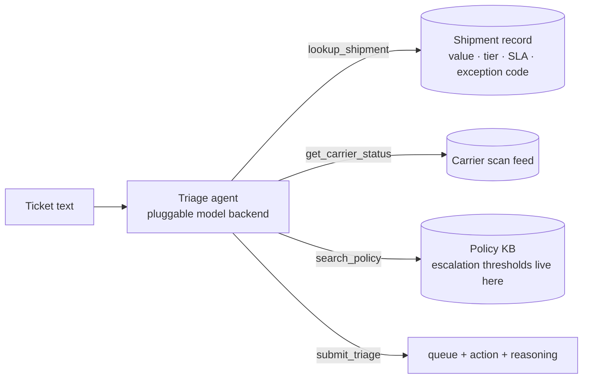

# 🎫 Exception Triage Agent

`investigate` `decide` · `single-agent` · Logistics & Supply Chain

## Problem

Every parcel network generates a stream of stuck-shipment tickets — customs holds,
invalid addresses, damage, refusals — and someone has to route each one to the right
resolution team, decide which can close themselves, and catch the ones that policy says
need a human *now*. Ticket text alone is unreliable: customers say "lost" when the
shipment is sitting in customs. This agent investigates each ticket with tools before
committing to a decision.

## Architecture

One agent, four tools, manual tool-use loop (pluggable backends so CI runs the entire
pipeline on a deterministic mock at zero cost):



Backends: `anthropic` (claude-opus-4-8, adaptive thinking), any OpenAI-compatible
provider (`mistral`, `groq`, `gemini`, `cerebras` — which hosts GLM — `deepseek`),
and `mock` (deterministic, $0, used by CI). Free tiers mean the full eval below
costs nothing to reproduce.

Design choices that make the eval mean something:

- **The ticket underdetermines the answer.** Exception code, value, tier, and SLA are
  only reachable via `lookup_shipment`; complaints are sometimes wrong about what
  happened. An agent that skips investigation scores at chance.
- **Escalation thresholds live in the policy KB, not the prompt.** The agent has to
  retrieve policy to get the action right — which is also where it fails (see below).
- **Ground truth is programmatic.** The scenario generator's own rules
  (`world.gold_triage`) are the answer key, so scoring is exact and auditable.

## Results

30 scenarios × 3 repeats per model. "$/scenario" prices measured token usage at list
rates — the free-tier rows cost $0 in actual spend to reproduce.

| Model | queue acc | action acc [95% CI] | exact match | submitted | $/scenario | p50 latency |
|---|---|---|---|---|---|---|
| `kimi-k2p6` (Fireworks) | **1.000** | **1.000** [1.000, 1.000] | **1.000** | 1.000 | $0.0051 | 17.2s |
| `gpt-oss-120b` (Fireworks) | 0.933 | 0.778 [0.656, 0.889] | 0.778 | 0.933 | $0.0007 | 6.8s |
| `mistral-small-latest` (free tier) | 1.000 | 0.700 [0.533, 0.844] | 0.700 | 1.000 | $0.0004 | 5.9s |
| `Llama-3.3-70B-Instruct-Turbo` (Together) | 0.844 | 0.167 [0.056, 0.289] | 0.156 | 0.967 | $0.0012 | 4.5s |
| `mock` (pipeline check, CI) | 1.000 | 0.967 | 0.967 | 1.000 | $0 | — |

Full per-run details: [`results/`](results/). The mock's misses are engineered (it
ignores the Platinum-SLA escalation clause) so the reporting pipeline always exercises a
nonzero error rate; its row validates the harness, not any model.

**The headline findings:**

- The eval discriminates hard — action accuracy spans 0.167 to 1.000 across four real
  models — and it is *solvable*: `kimi-k2p6` scores a perfect 90/90, so every failure
  below it is a real deficiency, not an impossible task.
- The solver's mechanism is visible in the transcripts: kimi searched the policy KB
  **twice** on 71/90 runs (escalation thresholds + the exception-specific rule) — exactly
  the two-clause retrieval whose absence explains most of Mistral's misses. It buys that
  reliability at 13x the cost and 3x the latency of `gpt-oss-120b`.
- The failing models fail in *disjoint* ways: `mistral-small-latest` investigates then
  misjudges (it cites the escalation policy it then violates); `Llama-3.3-70B` submits
  malformed tool arguments (66/90 runs missing the required `action` field) and skips
  investigation entirely in 17/90; `gpt-oss-120b` occasionally investigates everything
  and never commits. Aggregate accuracy would rank these models; only the failure-mode
  breakdown tells you what you'd actually be deploying. See
  [FAILURE_MODES.md](FAILURE_MODES.md).

Adding a row is one command per backend:

```bash
exception-triage-agent eval --backend cerebras --repeats 3    # zai-glm-4.7, free tier
exception-triage-agent eval --backend anthropic --repeats 3   # claude-opus-4-8, ~$15
```

## Failure modes

See [FAILURE_MODES.md](FAILURE_MODES.md). Each entry has a reproducing scenario id.

## Run it

```bash
pip install -e ../../harness -e .
exception-triage-agent eval --backend mock            # zero-cost, deterministic
pip install -e .[anthropic]
export ANTHROPIC_API_KEY=...
exception-triage-agent eval --backend anthropic --repeats 3
```

Regenerate scenarios (seeded, committed): `exception-triage-agent generate --n 30 --seed 7`
