<!-- README-EXPERIENCE:START -->
<p align="center">
  
</p>
<!-- README-EXPERIENCE:END -->

<p align="center">
  <a href="../../README.md">← all use cases</a> ·
  
  
  
</p>

# 🪞 Exception Triage Drift — the same agent, in a world that lies

## The gap this closes

The dominant enterprise-agent story of mid-2026 is not a breach. It is the gap between
evals and production:
[85% of enterprises are piloting agents and 5% have shipped](https://thelocalnews.news/2026/07/07/why-ai-agents-fail-in-production-governance-orchestration-and-reliability/),
half of surveyed companies shipped an agent that **passed internal evals and then failed
real customers**, and
[Amazon's AGI director says reliability, not capability, is the blocker](https://venturebeat.com/technology/amazon-agi-director-says-ai-agent-reliability-not-capability-is-blocking-enterprise-deployment-at-vb-transform-2026).
The named failure mode is agents **acting confidently on stale or incorrect context**.

That indicts this repo's own method, which is why it was worth building. Every other use
case here hands the agent a world that is truthful, complete, and internally consistent.
Production hands it a cache from Tuesday, two systems that disagree, and a service that
answers with half its fields missing. **A perfect eval score can mean the eval never lied
to the agent.**

So this takes the one task a model actually *solved* — kimi-k2p6 scored **1.000, 90 of 90**
on [exception triage](../exception-triage-agent/) — and changes nothing except whether the
tools tell the truth. Same 30 scenarios, same gold, same prompt.

## How the world lies

Gold is never recomputed: `gold_triage(true_shipment)` stays the answer in every arm, so any
change is the world's doing. Each corruption targets a field the gold rule actually reads
and is built to flip the decision — a corruption that leaves the answer alone measures
nothing.

| Archetype | What the tools serve | Detectable? | Recoverable? |
|---|---|---|---|
| `CLEAN` | the truth | — | control |
| `STALE_SNAPSHOT` | a cached record whose value sits on the other side of the escalation threshold | yes — old `as_of`, `cached: true` | `refresh=true` |
| `SOURCE_CONFLICT` | a shipment record that disagrees with the carrier scan history | yes — if you read both | policy makes the carrier feed authoritative |
| `DEGRADED_PARTIAL` | success response, decision-critical fields `null` | yes — visibly missing | retry |
| `SILENT_WRONG` | a wrong field, no marker, no conflict, refresh returns the same lie | **no** | **no** |

`SILENT_WRONG` is deliberate. Without it the tool-layer arm would look like a silver
bullet; with it, this use case can say where agent engineering stops and upstream data
quality begins.

## Results

30 scenarios × 3 repeats per arm. **Read the conditional column**, and read a model's clean
score before reading its drift score — see the caveats below.

| Model | world | accuracy | submitted | **accuracy \| submitted** | refresh rate |
|---|---|---|---|---|---|
| **kimi-k2p6** | clean | 1.000 `[1.00,1.00]` | 1.000 | **1.000** | 0.00 |
| | **drift** | 0.611 `[0.43,0.78]` | 1.000 | **0.611** | 0.20 |
| **Qwen3.7-Plus** | clean | 0.978 `[0.94,1.00]` | 0.978 | **1.000** | 0.58 |
| | **drift** | 0.667 | 1.000 | **0.667** | 0.52 |
| **gpt-oss-120b** | clean | 0.800 | 0.833 | **0.960** | 1.00 |
| | **drift** | 0.767 | 0.922 | **0.831** | 1.00 |
| **mistral-small** | clean | 0.744 | 1.000 | **0.744** | 0.42 |
| | **drift** | 0.716 | 0.978 | **0.716** | 0.41 |

### Every model collapses. The best one collapses hardest.

**kimi-k2p6 goes from a perfect 1.000 to 0.611** — 39 points — on the identical eval it had
solved. Not a harder task. Not a different metric. The same 30 tickets, with a cache from
last Tuesday.

### How much it collapses is predicted by one habit

Line the three models up by how often they re-read the record before deciding:

| Model | clean | refresh rate | accuracy lost to the unreliable world |
|---|---|---|---|
| kimi-k2p6 | 1.000 | 0.20 | **−39 points** |
| Qwen3.7-Plus | 1.000 | 0.52 | **−33 points** |
| gpt-oss-120b | 0.960 | 1.00 | **−13 points** |
| *mistral-small* | *0.744* | *0.41* | *−3 points* |

Among the three models that actually solve the clean task, the ordering is monotonic across
three vendors, and it shows up exactly where it should — accuracy on the stale-cache
archetype tracks the same order: kimi **0.22**, Qwen **0.33**, gpt-oss **0.89**.

### The fourth model breaks the rule, and the reason matters more than the rule

`mistral-small` looks like the most robust model here: it loses **3 points**, less than a
quarter of gpt-oss's loss, on a middling refresh rate of 0.41. Taken at face value it
falsifies the pattern.

It isn't robustness. On the **clean** arm, mistral scores **0 of 6 on escalation cases** and
answers `route_to_queue` 78 times out of 90. It does not use the value threshold when the
value is correct, so corrupting the value cannot change an answer that never depended on it.
Its stale-cache score of 0.61 is the same effect: you cannot mislead a model with a number
it was ignoring.

**A small drop is not evidence of resilience.** It is equally consistent with an agent that
never read the field you corrupted — which is the same trap as
[safety by inaction](../../FAILURE_TAXONOMY.md#safety-by-inaction), one metric down. The
corrected claim: *among agents that actually use the data, robustness tracks how often they
re-read it.* Check the clean arm before reading a drift result as strength.

### What they all handle, and what none of them do

The corruption they *all* survive is the one that is visibly contradictory: on
`SOURCE_CONFLICT`, where the shipment record disagrees with the carrier scan history, all
three score **1.00**. Given two sources that plainly disagree, every model reads both and
follows the authoritative one.

The corruption they all die on is the one that looks like ordinary data. Nobody is fooled
by a contradiction; everybody is fooled by a confident, self-consistent record that happens
to be out of date.

**The ranking is the inverse of clean-world skill.** kimi is the only model that ever scored
a perfect 90/90 here and it is the most fragile. gpt-oss is the weakest on truthful data and
by far the most robust on realistic data.

### And the winning habit isn't judgment — it's a reflex

gpt-oss doesn't detect staleness and react to it. It passes `refresh=true` on **100% of
runs, including the clean arm**, where there is nothing to refresh. It never decides when to
re-read; it just always does. That thoughtless habit is worth more than kimi's obviously
superior reasoning, because the failure was never about reasoning — it was about **what the
agent assumed it could trust**.

kimi isn't lazy, either: it scores **1.00 on `SOURCE_CONFLICT`**, cross-checking the carrier
feed perfectly every time. It simply assumes the record it was handed is current.

### The floor nothing reaches

`SILENT_WRONG` — wrong data with no tell — costs **kimi and Qwen 100% of those scenarios**
(0.00 each). No prompt and no tool layer can fix it, by construction. gpt-oss scores 0.67
there, but that is not a defence: it applies the value threshold less precisely, so
corrupting the value less reliably changes its answer. Being imprecise is not robustness.

### The defences help, and neither gets you home

Full four-arm ladder on gpt-oss, conditional on submitting:

| arm | accuracy \| submitted |
|---|---|
| clean world | **0.960** |
| drift, undefended | 0.831 |
| `prompt_guard` | 0.856 |
| `freshness_gate` | **0.871** |

The tool-layer gate beats the prompt notice, consistent with the rest of this repo — but
the gap is small here, and neither arm comes close to the clean world. That ceiling is
`SILENT_WRONG` doing exactly what it was built to do: the gate repairs only what it can
detect, so the undetectable corruption survives every defence.

<details>
<summary><b>⚠️ Why the conditional column, and two findings it killed</b></summary>
<br>

`gpt-oss` stalls — it reaches no decision on some runs — and stalls suppress accuracy
without being wrong answers. Raw accuracy therefore mixes "got it wrong" with "never
answered", and on this wave that produced two conclusions that were **artifacts**:

- Raw made the drift damage look small for gpt-oss (0.800 → 0.767, −3). Conditionally it is
  **0.960 → 0.831, −13** — because gpt-oss stalled *more* in the clean arm, suppressing the
  clean score.
- The `prompt_guard` arm scored **0.856 raw, above its own clean-world 0.800** — which would
  have contradicted this repo's standing "environment beats prompt" finding. It was the
  stall confound: the guard pushed `submitted` from 0.833 to 1.000. Conditionally it is
  0.856, still far below clean's 0.960. **The prompt guard never beat the clean world.**

The repo's own [failure taxonomy](../../FAILURE_TAXONOMY.md#commit-stall) says to read
`submitted` before any accuracy metric. That rule caught both.

A third artifact came from a bug in this use case rather than the model. The first version
picked the conflicting exception code with Python's built-in `hash()`, which is salted per
process — so the scenarios would have differed on every run, silently breaking the
determinism this repo promises — and it could pick a code routing to the *same* queue,
corrupting the record without moving the answer. A test caught both. Every `drift`,
`prompt_guard` and `freshness_gate` result was re-run after the fix; the `clean` arms were
unaffected, since they never call that code. The headline moved from 0.578 to 0.611 and the
refresh-rate ordering held.

</details>

## Failure modes

See [FAILURE_MODES.md](FAILURE_MODES.md).

## Run it

```bash
pip install -e ../../harness -e ../exception-triage-agent -e .
exception-triage-drift eval --arm clean --backend mock     # deterministic, $0
export FIREWORKS_API_KEY=...
exception-triage-drift eval --arm clean --backend fireworks --repeats 3
exception-triage-drift eval --arm drift --backend fireworks --repeats 3
```

Scenarios come from `../exception-triage-agent/evals/scenarios.jsonl`, so every arm is
measured on exactly the cases the baseline was.

**Scope, stated plainly.** Two providers failed during this wave — an expired Mistral key
(401) and an exhausted Together balance (402), each of which produced a complete eval of
zeros before a [harness guard](../../harness/src/aau_harness/runner.py) was added to refuse
saving them. The four-arm defence ladder was therefore run on gpt-oss only; kimi and Qwen ran
`clean` and `drift`, which is the comparison this wave is about. Total spend $1.88, including the re-runs.
