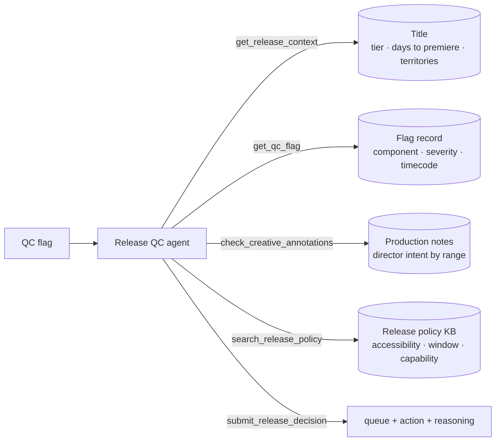
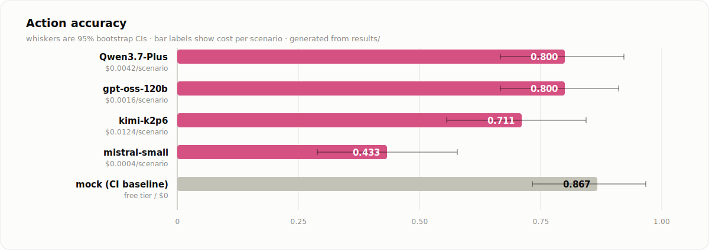

<picture>
  <source media="(prefers-color-scheme: dark)" srcset="docs/banner-dark.svg">
  
</picture>

<p align="center">
  <a href="../../README.md">← all use cases</a> ·
  
  
  
</p>

## 🪤 Three traps

**Looks broken, is fine:** 22 seconds of digital silence — covered exactly by a
director-intent annotation. Not a defect.

**Looks minor, is blocking:** an ~800 ms subtitle drift is cosmetic by severity, but a caption
defect in a CVAA-covered territory can *never* be waived.

**Don't over-generalize:** that same caption defect outside a covered territory is ordinary again.

Plus distractor annotations covering the *wrong* timecode, punishing any agent that reads
"annotations exist" as "waive."


## Problem

A title is days from premiere and automated quality control flags a delivered asset.
Someone in content operations has to decide who owns the defect and what happens to the
release: ship it, send the package back to the vendor, fix it in house, move the
premiere, or take it to the release board. The flag itself never determines the answer —
some flags describe intentional creative choices, and some cosmetic-looking flags are
legally blocking. This agent investigates the release context, the production
annotations, and the policy before committing.

The agent **triages already-flagged defects — it does not detect them**. Detection is
what the QC pipeline upstream already did, and real detectors do it far better than any
language model would.

## Architecture

One agent, five tools, pluggable model backend (CI runs the deterministic mock at $0):



Modelled on the publicly documented streaming delivery pipeline — package validation,
spec inspection, then automated QC — and on US accessibility law. Three traps, pointing
in different directions:

- **Looks broken, is fine:** a flagged 22-second audio dropout that a director-intent
  annotation covers exactly. Not a defect.
- **Looks minor, is blocking:** an ~800 ms subtitle drift is cosmetic by severity, but a
  caption defect in a CVAA-covered territory can never be waived — the CVAA and the
  NAD v. Netflix consent decree require full caption coverage on streaming programming.
- **Don't over-generalize:** that same caption defect outside a covered territory is an
  ordinary minor defect again.

Plus distractor annotations: production notes that exist but cover a *different*
timecode range, punishing an agent that reads "annotations exist" as "waive."

## Results

30 scenarios × 3 repeats per model. Free-tier rows cost $0 to reproduce.

<picture>
  <source media="(prefers-color-scheme: dark)" srcset="docs/results-dark.svg">
  
</picture>

<details>
<summary><b>Exact numbers</b> (all metrics, cost, latency)</summary>
<br>

| Model | queue acc | action acc [95% CI] | exact match | submitted | $/scenario | p50 latency |
|---|---|---|---|---|---|---|
| `gpt-oss-120b` (Fireworks) | **0.978** | **0.800** [0.667, 0.911] | **0.800** | 0.978 | $0.0016 | 13.9s |
| `Qwen3.7-Plus` (Together) | 0.956 | 0.800 [0.667, 0.922] | 0.800 | 0.967 | $0.0042 | 40.1s |
| `kimi-k2p6` (Fireworks) | 0.967 | 0.711 [0.556, 0.844] | 0.711 | 0.967 | $0.0124 | 28.2s |
| `mistral-small-latest` (free tier) | 0.856 | 0.433 [0.289, 0.578] | 0.367 | 1.000 | $0.0004 | 5.4s |
| `mock` (pipeline check, CI) | 1.000 | 0.867 | 0.867 | 1.000 | $0 | — |

</details>

**The headline finding is about how you write policy, not which model you pick.**

Across every model tested, the caption rule was obeyed **without a single violation** —
zero waivers on covered-territory caption defects, including by the model that got
almost everything else in its vicinity wrong. Meanwhile the ordinary operational
thresholds sitting beside it in the same knowledge base — the release window, in-house
repair capability, the vendor SLA — account for nearly every action error in the table.

The difference between those rules is how they are *written*. The caption clause is
phrased as a legal obligation with a named statute and a consequence; the others are
phrased as thresholds. That is a control you can apply deliberately when authoring agent
policy, and it costs nothing.

Two further results:

- **The failure directions are opposite and model-specific.** Mistral over-escalates to
  the release board (16 cases). The other three pull work the other way, into the
  in-house queue — mildly for gpt-oss and Qwen (6 and 7 cases), almost totally for
  `kimi-k2p6`, where **22 of 23 action errors are the same substitution**: whatever the
  policy prescribed, fix it in house. Sometimes that asserts a repair capability
  RQ-FIX-04 explicitly denies. A deployment tuned for one model's bias is mistuned for
  every other's.
- **The most expensive model finished last.** `kimi-k2p6` costs **7.7× more per scenario
  than `gpt-oss-120b`** and scores lower on every metric (0.711 vs 0.800 action). One
  full eval on it costs $1.11 against $0.14 — the clearest price/quality decoupling in
  the repo, and the opposite of the logistics exemplar where kimi was the only model to
  score a perfect 90/90.

## Failure modes

See [FAILURE_MODES.md](FAILURE_MODES.md). Each entry has a reproducing archetype or
scenario id.

## Run it

```bash
pip install -e ../../harness -e .
release-qc-agent eval --backend mock                # zero-cost, deterministic
export MISTRAL_API_KEY=...
release-qc-agent eval --backend mistral --repeats 3
```

Regenerate scenarios (seeded, committed): `release-qc-agent generate --n 30 --seed 19`

