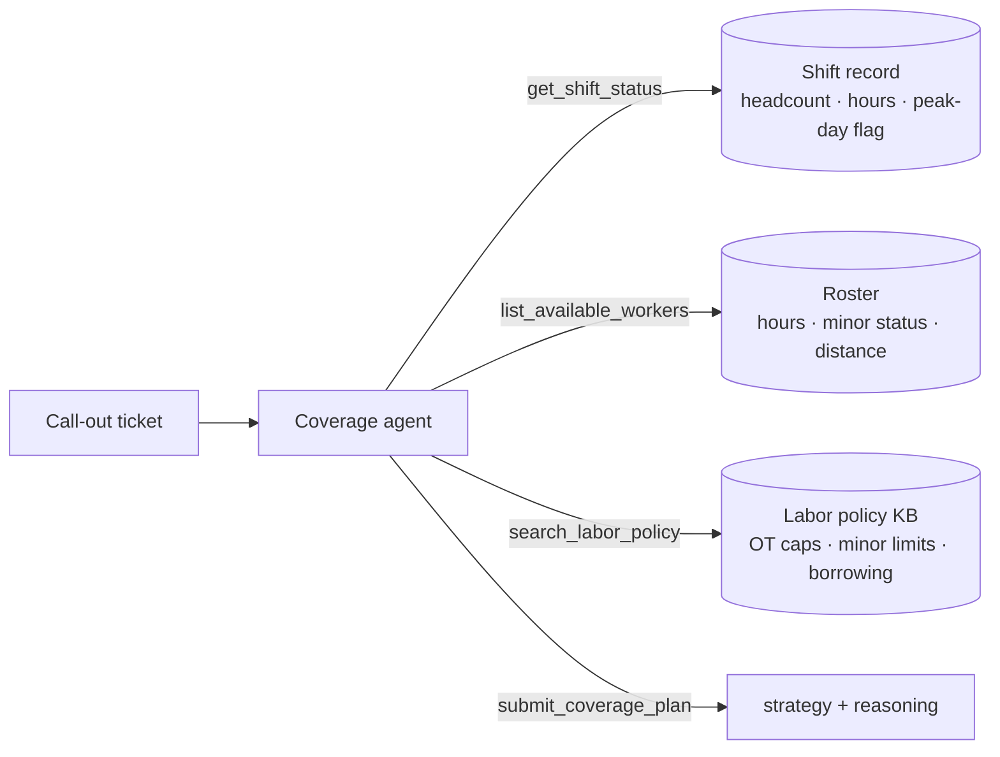

# 🧑‍🍳 Shift Coverage Triage Agent

`investigate` `decide` · `single-agent` · Retail & Workforce

## Problem

A store manager reports call-outs for tomorrow's shift. Someone has to decide the fill:
offer overtime to home-store staff, borrow from a nearby store, run the shift short, or
escalate to the district manager — and get it right under labor law. The manager's
message never contains the facts that decide the answer (who's available, their weekly
hours, whether anyone's a minor, whether tomorrow is a peak day), and the compliance
caps live in policy, not intuition. This agent pulls the roster and the labor-policy KB,
then commits a compliant strategy.

## Architecture

One agent, four tools, pluggable model backend (CI runs the deterministic mock at $0):



The compliance trap: overtime is the *preferred* fill, but only if a home-store adult
stays under the weekly-hours cap; a worker one shift away from the cap looks eligible and
isn't. Peak days forbid reduced coverage even when the gap is small. The agent has to
reconstruct these clauses from the KB — the system prompt deliberately doesn't state them.

## Results

30 scenarios × 3 repeats per model. Metric is **strategy accuracy** (exact match to the
compliant fill). Free-tier rows cost $0 to reproduce.

| Model | strategy acc [95% CI] | submitted | $/scenario | p50 latency |
|---|---|---|---|---|
| `kimi-k2p6` (Fireworks) | **0.822** [0.689, 0.933] | 0.956 | $0.0128 | 24.9s |
| `gpt-oss-120b` (Fireworks) | 0.667 [0.522, 0.811] | 0.889 | $0.0016 | 12.1s |
| `mistral-small-latest` (free tier) | 0.644 [0.500, 0.778] | 1.000 | $0.0004 | 6.2s |
| `mock` (pipeline check, CI) | 0.600 | 1.000 | $0 | — |

**Nobody solved it.** Unlike the logistics exemplar — where the top model scored a
perfect 90/90 — the best model here tops out at 0.822, and it gets there by
*over-escalating*: 11 of its misses hand a perfectly fillable shift to the district
manager rather than work the overtime math. The compound weekly-hours cap is genuinely
hard, and that's the finding.

## Failure modes

See [FAILURE_MODES.md](FAILURE_MODES.md). Each entry has a reproducing scenario id.

## Run it

```bash
pip install -e ../../harness -e .
shift-coverage-agent eval --backend mock            # zero-cost, deterministic
export MISTRAL_API_KEY=...
shift-coverage-agent eval --backend mistral --repeats 3
```

Regenerate scenarios (seeded, committed): `shift-coverage-agent generate --n 30 --seed 11`
