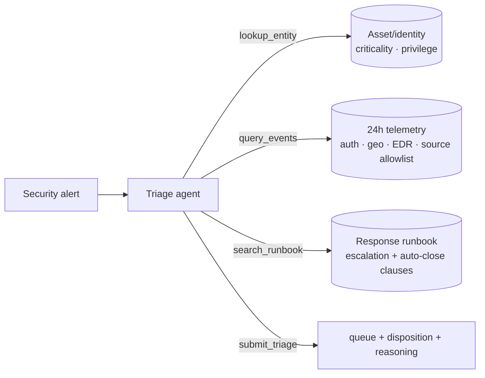

# 🚨 Alert Triage Agent

`investigate` `decide` · `single-agent` · Security Operations

## Problem

A SOC alert fires. Someone has to assign it to the right queue (phishing, malware,
credential-abuse, false-positive) and the right disposition (auto-close, route to an
analyst, or escalate to incident response now) — and the alert text is a detection's
first guess, not the truth. A brute-force pattern from an authorized scanner is noise; a
quiet login on an admin account is an incident. This agent verifies against the asset
record, the 24h telemetry, and the response runbook before committing.

## Architecture

One agent, four tools, pluggable model backend (CI runs the deterministic mock at $0):



Two traps. **The deception:** one scenario is 2,100 failed logins against a crown-jewel
host — textbook brute force, except the telemetry notes the source is an *authorized
vulnerability scanner*. Trusting the alert text over the allowlist gets it wrong. **The
compound clause:** benign activity auto-closes — *unless* the target is a crown-jewel
asset or a privileged identity, in which case it routes to an analyst. Both live in the
runbook, not the prompt.

## Results

30 scenarios × 3 repeats per model. Free-tier rows cost $0 to reproduce.

| Model | queue acc | disposition acc | exact match | submitted | $/scenario | p50 latency |
|---|---|---|---|---|---|---|
| `gpt-oss-120b` (Fireworks) | 0.967 | **1.000** | **0.967** | 1.000 | $0.0010 | 8.0s |
| `kimi-k2p6` (Fireworks) | 0.978 | 0.956 | 0.956 | 0.978 | $0.0046 | 21.0s |
| `mistral-small-latest` (free tier) | 0.967 | 0.833 | 0.811 | 0.989 | $0.0003 | 5.7s |
| `mock` (pipeline check, CI) | 1.000 | 0.967 | 0.967 | 1.000 | $0 | — |

**The expensive model didn't win.** `gpt-oss-120b` edges out `kimi-k2p6` on exact match
(0.967 vs 0.956) at **1/5th the cost and 1/3rd the latency** — a real deployment result
that a "use the biggest model" heuristic would get backwards. Queue routing is near-solved
across the board; the disposition compound-clause is where the models separate.

## Failure modes

See [FAILURE_MODES.md](FAILURE_MODES.md). Each entry has a reproducing scenario id.

## Run it

```bash
pip install -e ../../harness -e .
alert-triage-agent eval --backend mock              # zero-cost, deterministic
export MISTRAL_API_KEY=...
alert-triage-agent eval --backend mistral --repeats 3
```

Regenerate scenarios (seeded, committed): `alert-triage-agent generate --n 30 --seed 13`
